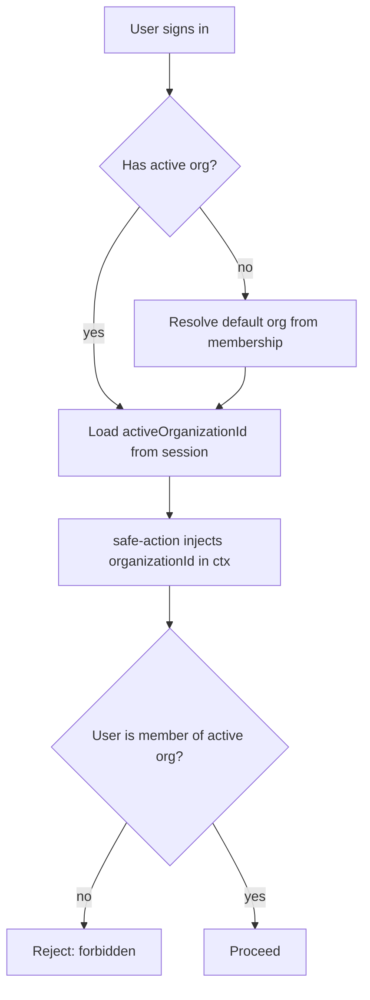

# Instruction: Phase 1 - Org foundation

## Feature

- **Summary**: Enable Better Auth `organization` plugin, add org/member/invitation schema, expose active org in session, enforce membership at the action layer.
- **Stack**: `Next.js 16.1.1, Better Auth 1.6.19, Prisma 7.8.0 (Neon), TypeScript strict, Zod 4, next-safe-action`
- **Branch name**: `feat/b2b-organizations`
- **Parent Plan**: `2026_06_18-b2b-organizations-master.md`
- **Sequence**: `1 of 6`
- Confidence: 9/10
- Time to implement: ~1.5 day

## Architecture projection

### Files to modify

- `prisma/schema.prisma` - add Organization, Member, Invitation models + `session.activeOrganizationId`
- `lib/auth.ts` - enable `organization()` plugin + access-control roles
- `lib/auth-client.ts` - add `organizationClient()` plugin
- `lib/session.ts` - expose activeOrganizationId + membership helpers
- `lib/safe-action.ts` - inject organizationId in ctx + membership middleware

### Files to create

- `features/organizations/constants/organization-roles.constant.ts` - access-control statements + owner/admin/member matrix
- `features/organizations/schemas/organization.schema.ts` - create/update org schemas
- `features/organizations/services/get-organization.service.ts` - fetch org + member count (membership-checked)
- `features/organizations/services/get-user-organizations.service.ts` - list orgs for a user (switcher)
- `features/organizations/services/create-organization.service.ts` - create org with founder as owner
- `features/organizations/services/update-active-organization.service.ts` - set activeOrganizationId

### Files to delete

- none

## Applicable rules

| Tool   | Name       | Path                          | Why it applies                          |
| ------ | ---------- | ----------------------------- | --------------------------------------- |
| claude | feature    | `.claude/rules/feature.md`    | New `features/organizations/` structure |
| claude | security   | `.claude/rules/security.md`   | Membership middleware, userId scoping   |
| claude | action     | `.claude/rules/action.md`     | safe-action context changes             |
| claude | code-style | `.claude/rules/code-style.md` | Global style                            |

## User Journey

## Risk register

| Risk                                      | Impact             | Mitigation                                              |
| ----------------------------------------- | ------------------ | ------------------------------------------------------- |
| cookieCache 60s vs activeOrganizationId   | Stale active org   | disableCookieCache on sensitive reads; integration test |
| Better Auth model names vs Prisma mapping | Migration mismatch | Generate via Better Auth schema shapes; verify @@map    |

## Implementation phases

### Phase 1: Foundation

> Multi-tenant primitives wired and enforced.

#### Tasks

1. Add `organization()` server plugin in `lib/auth.ts` with access-control (owner/admin/member statements).
2. Add `organizationClient()` in `lib/auth-client.ts`.
3. Extend `prisma/schema.prisma`: Organization, Member, Invitation + `Session.activeOrganizationId`; run migration.
4. Add `session.create.before` hook to set a default activeOrganizationId from membership.
5. Expose activeOrganizationId + membership helper in `lib/session.ts`.
6. Add membership middleware + organizationId in ctx in `lib/safe-action.ts`.
7. Create foundation services (get-organization, get-user-organizations, create-organization, update-active-organization), all membership-scoped.

#### Acceptance criteria

- [ ] `pnpm prisma migrate deploy` applies cleanly
- [ ] A manually created org is readable only by its members
- [ ] `activeOrganizationId` present on the session after sign-in
- [ ] safe-action rejects a non-member with a forbidden error
- [ ] `pnpm build` succeeds

## Amendments

## Log

## Validation flow demonstration

1. Run migration, create an org + member row manually.
2. Sign in, confirm session carries activeOrganizationId.
3. Call a foundation service as a member (ok) and as a non-member (forbidden).
