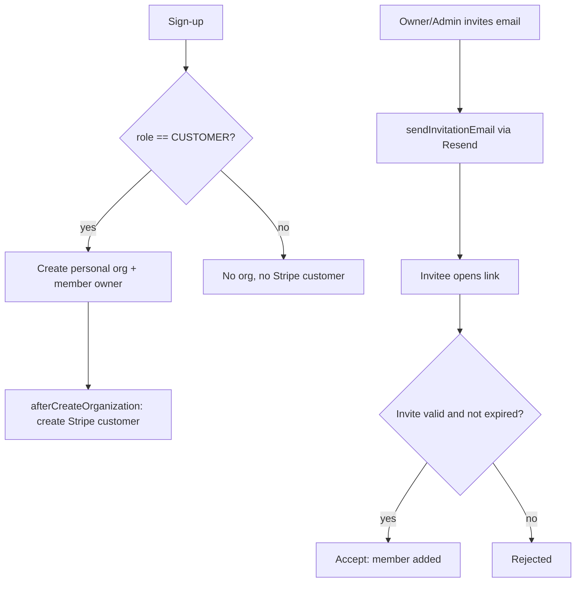

# Instruction: Phase 2 - Onboarding & invitations

## Feature

- **Summary**: Auto-create a personal org for CUSTOMER signups, create the org's Stripe customer on org creation, and wire Resend-based invitations with 48h expiry.
- **Stack**: `Next.js 16.1.1, Better Auth 1.6.19, Prisma 7.8.0, Stripe 20.4.1, React Email + Resend, Zod 4`
- **Branch name**: `feat/b2b-organizations`
- **Parent Plan**: `2026_06_18-b2b-organizations-master.md`
- **Sequence**: `2 of 6`
- Confidence: 9/10
- Time to implement: ~1.5 day

## Architecture projection

### Files to modify

- `lib/auth.ts` - `user.create` hook creates personal org if `role === CUSTOMER`; `afterCreateOrganization` creates Stripe customer; remove Stripe sync from `afterEmailVerification`; wire `sendInvitationEmail`
- `features/auth/actions/sign-up.action.ts` - return org context for redirect
- `features/auth/pages/sign-up-page.tsx` - reflect org-ready state

### Files to create

- `features/organizations/actions/invite-member.action.ts` - invite (owner/admin only)
- `features/organizations/actions/accept-invitation.action.ts` - accept invite link
- `features/organizations/services/send-invitation-email.service.ts` - Resend send
- `features/organizations/emails/organization-invitation-email.tsx` - React Email template
- `features/organizations/schemas/invitation.schema.ts` - invite/accept schemas

### Files to delete

- none

## Applicable rules

| Tool   | Name       | Path                          | Why it applies                  |
| ------ | ---------- | ----------------------------- | ------------------------------- |
| claude | feature    | `.claude/rules/feature.md`    | organizations feature additions |
| claude | action     | `.claude/rules/action.md`     | invite/accept server actions    |
| claude | security   | `.claude/rules/security.md`   | role gating on invite           |
| claude | code-style | `.claude/rules/code-style.md` | Global style                    |

## User Journey

## Risk register

| Risk                                | Impact                     | Mitigation                                 |
| ----------------------------------- | -------------------------- | ------------------------------------------ |
| Stripe customer created for non-org | Polluted Stripe data       | Gate creation on `afterCreateOrganization` |
| Removed afterEmailVerification sync | Email not synced to Stripe | Sync at org creation + on checkout         |

## Implementation phases

### Phase 2: Onboarding

> CUSTOMER signups land in an org; invitations work end to end.

#### Tasks

1. In `lib/auth.ts` `user.create.before/after`, create personal org + owner member only when `role === CUSTOMER`.
2. Implement `afterCreateOrganization` to create the org's Stripe customer (name + metadata.organizationId).
3. Remove Stripe sync from `afterEmailVerification`.
4. Wire `sendInvitationEmail` plugin option -> `send-invitation-email.service.ts` (Resend) with React Email template; set invite expiry 48h.
5. Add invite/accept actions + schemas; invite restricted to owner/admin.
6. Update sign-up action/page to redirect to the new org context.

#### Acceptance criteria

- [ ] Sign-up as CUSTOMER creates exactly one org with the user as owner
- [ ] Sign-up as ADMIN creates no org and no Stripe customer
- [ ] Invitation email is delivered (Resend) with a valid link
- [ ] Accepting a valid invite adds the member; expired invite is rejected
- [ ] `pnpm build` succeeds

## Amendments

## Log

## Validation flow demonstration

1. Register a new CUSTOMER; confirm one org + Stripe customer exist.
2. Invite a second email; open the link in a fresh session; accept; confirm membership.
3. Expire an invite (or set short expiry) and confirm rejection.
