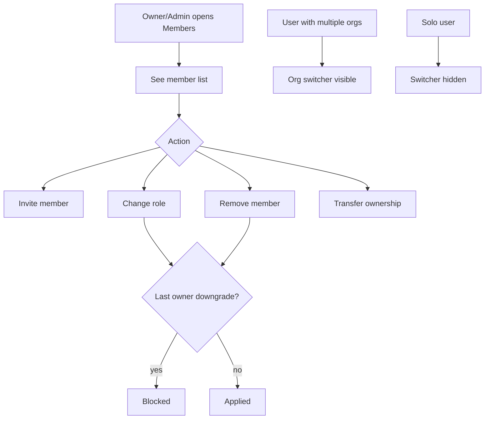

# Instruction: Phase 3 - Members & roles

## Feature

- **Summary**: Team management UI and actions: list members, invite, change role, remove, transfer ownership, with last-owner protection and an org switcher hidden while solo.
- **Stack**: `Next.js 16.1.1, Better Auth 1.6.19, TanStack Form, TanStack Table, Shadcn/ui, next-safe-action, Zod 4`
- **Branch name**: `feat/b2b-organizations`
- **Parent Plan**: `2026_06_18-b2b-organizations-master.md`
- **Sequence**: `3 of 6`
- Confidence: 9/10
- Time to implement: ~2 days

## Architecture projection

### Files to modify

- `components/protected/dashboard/dashboard-sidebar.tsx` - org switcher (hidden if solo) + org name
- `app/(protected)/dashboard/layout.tsx` - pass active org + membership

### Files to create

- `features/organizations/pages/members-page.tsx` - members list + actions
- `features/organizations/pages/members-loading.tsx` - skeleton
- `features/organizations/components/org-switcher.tsx` - org dropdown + create
- `features/organizations/components/members-table.tsx` - TanStack Table
- `features/organizations/components/forms/invite-form.tsx` - email + role
- `features/organizations/components/forms/role-form.tsx` - change role
- `features/organizations/components/modals/invite-modal.tsx` - invite modal
- `features/organizations/actions/change-member-role.action.ts` - owner/admin only
- `features/organizations/actions/remove-member.action.ts` - owner/admin only
- `features/organizations/actions/transfer-ownership.action.ts` - owner only
- `features/organizations/services/get-organization-members.service.ts` - paginated
- `features/organizations/services/is-last-owner.service.ts` - sole-owner check
- `features/organizations/constants/members-filters.constant.ts` - sort/filter params
- `app/(protected)/dashboard/organisation/page.tsx` - route shim
- `app/(protected)/dashboard/organisation/loading.tsx` - loading shim

### Files to delete

- none

## Applicable rules

| Tool   | Name       | Path                          | Why it applies                       |
| ------ | ---------- | ----------------------------- | ------------------------------------ |
| claude | feature    | `.claude/rules/feature.md`    | feature structure                    |
| claude | form       | `.claude/rules/form.md`       | invite/role TanStack Forms           |
| claude | filter     | `.claude/rules/filter.md`     | members table sort/filter/pagination |
| claude | page       | `.claude/rules/page.md`       | members page + loading               |
| claude | action     | `.claude/rules/action.md`     | role/remove/transfer actions         |
| claude | security   | `.claude/rules/security.md`   | role gating + last-owner guard       |
| claude | code-style | `.claude/rules/code-style.md` | Global style                         |

## User Journey

## Risk register

| Risk                          | Impact              | Mitigation                             |
| ----------------------------- | ------------------- | -------------------------------------- |
| Last owner removed/downgraded | Orphan org, lockout | `is-last-owner` guard on remove + role |
| Member sees admin actions     | Privilege confusion | Role-gate UI + server actions          |

## Implementation phases

### Phase 3: Members & roles

> Full team management with guardrails.

#### Tasks

1. Build org switcher (hidden if user has a single org) + wire active org in dashboard layout.
2. Members page + table (name, email, role, actions), owner/admin gated.
3. Invite modal/form (email + role) reusing Phase 2 invite action.
4. Change-role and remove-member actions with `is-last-owner` guard.
5. Transfer-ownership action (owner only): swap roles atomically.
6. Add route shims under `/dashboard/organisation`.

#### Acceptance criteria

- [ ] Owner/admin can invite, change role, remove; member cannot
- [ ] Last owner cannot be removed or downgraded without transfer
- [ ] Ownership transfer swaps roles atomically
- [ ] Switcher hidden at 1 org, visible at >=2
- [ ] `pnpm build` succeeds

## Amendments

## Log

## Validation flow demonstration

1. As owner, invite a member; change their role to admin; remove them.
2. Attempt to remove/downgrade the sole owner -> blocked.
3. Transfer ownership to another member; verify roles swapped.
4. Create a second org; confirm switcher appears and switches context.
