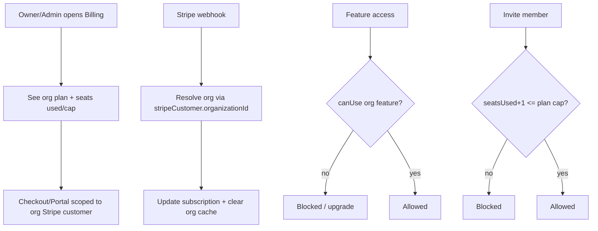

# Instruction: Phase 4 - Billing org + feature gating

## Feature

- **Summary**: Move Stripe billing from user to organization, add declarative plan config with `canUse(org, feature)`, enforce per-plan seat cap via Better Auth `membershipLimit`, restrict billing to owner/admin.
- **Stack**: `Next.js 16.1.1, Better Auth 1.6.19, Stripe 20.4.1, Prisma 7.8.0, Upstash Redis, Zod 4`
- **Branch name**: `feat/b2b-organizations`
- **Parent Plan**: `2026_06_18-b2b-organizations-master.md`
- **Sequence**: `4 of 6`
- Confidence: 8/10
- Time to implement: ~2 days

## Architecture projection

### Files to modify

- `prisma/schema.prisma` - StripeCustomer keyed to organizationId (drop userId @unique); add Plan + seatsUsed to Organization
- `features/billing/services/get-billing.service.ts` - `getBilling(organizationId)` + membership check
- `features/billing/actions/create-checkout.action.ts` - inject organizationId from ctx
- `features/billing/services/stripe/create-checkout-session.service.ts` - org customer + metadata
- `features/billing/services/stripe/create-portal-session.service.ts` - org-scoped
- `features/billing/services/stripe/handle-webhook.service.ts` - lookups via organizationId; clear org cache
- `features/billing/services/cleanup-billing.service.ts` - cleanup by organizationId (org delete cascade)
- `features/billing/guards/require-customer-plan.ts` - `requireCustomerPlan(organizationId, ...)`, role in {owner,admin}
- `features/billing/constants/plan.constant.ts` - seatsIncluded + features per plan
- `lib/cache-keys.ts` - org-scoped billing keys
- `app/(protected)/dashboard/facturation/page.tsx` - pass organizationId, owner/admin gate

### Files to create

- `features/organizations/services/can-use.service.ts` - `canUse(organizationId, feature)`
- `features/organizations/constants/feature-config.constant.ts` - feature -> plans matrix
- `features/organizations/guards/require-organization-feature.ts` - feature guard
- `features/organizations/services/check-seat-capacity.service.ts` - seatsUsed+1 <= cap
- `features/organizations/actions/update-organization.action.ts` - update org (owner/admin)
- `features/billing/pages/organization-billing-page.tsx` - plan, renewal, seats used/cap
- `features/billing/pages/organization-billing-loading.tsx` - skeleton

### Files to delete

- none

## Applicable rules

| Tool   | Name       | Path                          | Why it applies                   |
| ------ | ---------- | ----------------------------- | -------------------------------- |
| claude | feature    | `.claude/rules/feature.md`    | billing/organizations changes    |
| claude | api        | `.claude/rules/api.md`        | Stripe webhook handler re-wiring |
| claude | action     | `.claude/rules/action.md`     | checkout/update-org actions      |
| claude | cache      | `.claude/rules/cache.md`      | org-scoped cache keys            |
| claude | page       | `.claude/rules/page.md`       | org billing page + loading       |
| claude | security   | `.claude/rules/security.md`   | owner/admin gate + org scoping   |
| claude | code-style | `.claude/rules/code-style.md` | Global style                     |

## User Journey

## Risk register

| Risk                                 | Impact                      | Mitigation                                      |
| ------------------------------------ | --------------------------- | ----------------------------------------------- |
| Webhook keyed to userId still around | Subscription not updated    | Migrate lookups to organizationId; test webhook |
| Seat cap race on concurrent invites  | Over cap                    | Check at accept time; rely on membershipLimit   |
| Member reaching billing              | Unauthorized billing change | owner/admin gate on guard + page                |

## Implementation phases

### Phase 4: Billing org + gating

> Org is the billing entity; tiering and seats enforced.

#### Tasks

1. Migrate schema: StripeCustomer.organizationId @unique; Plan + seatsUsed on Organization.
2. Re-scope billing services/actions to organizationId + membership + owner/admin gate.
3. Re-wire webhook + cleanup to resolve org via stripeCustomer.organizationId; org cache keys.
4. Add plan config (seatsIncluded + features), `can-use`, feature guard.
5. Enforce seat cap via `membershipLimit` function + `check-seat-capacity` at accept.
6. Build org billing page (plan, renewal, seats used/cap).

#### Acceptance criteria

- [ ] Checkout creates/links the org subscription; member cannot reach billing
- [ ] Webhook updates the correct org's subscription
- [ ] `canUse` blocks a feature not in the org's plan
- [ ] Invitation refused beyond the plan seat cap
- [ ] `pnpm build` succeeds

## Amendments

- 🤖 2026-06-18: Seat cap enforced at the action layer (`checkSeatCapacity` in invite-member + accept-invitation actions, `seatsUsed` synced on accept/remove) instead of via Better Auth `membershipLimit`. Rationale: action-layer guard gives full control over French error messages and covers all app flows. GAP: the Better Auth direct `accept-invitation` plugin endpoint bypasses this guard — `membershipLimit` defense-in-depth is DEFERRED to Phase 5 (security hardening) where lib/auth.ts and isolation tests live.

## Log

## Validation flow demonstration

1. As owner, checkout a plan; confirm subscription on the org.
2. Trigger a Stripe webhook (stripe listen) and confirm the org subscription updates.
3. Gate a feature behind PRO; verify FREE org is blocked.
4. Fill seats to cap; confirm the next invite is refused.
