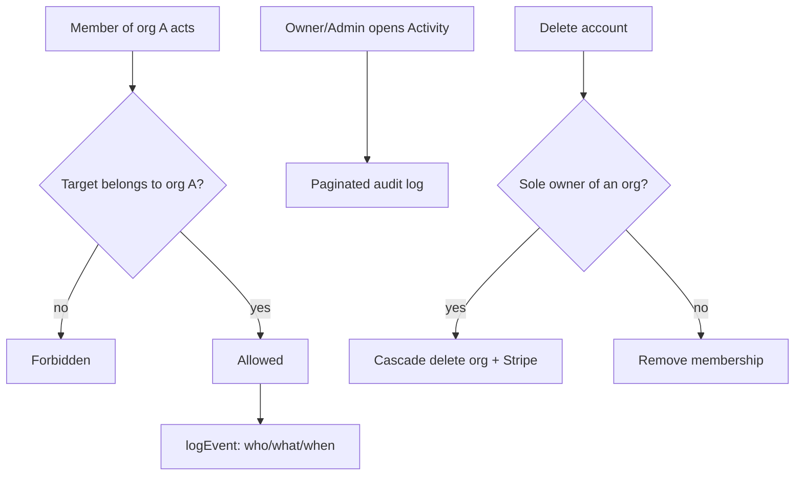

# Instruction: Phase 5 - Security re-scoping + audit log

## Feature

- **Summary**: Migrate every user-scoped service to organizationId + membership check, harden account deletion (org cascade / last-owner), add an audit log, and prove cross-org isolation with blocking tests.
- **Stack**: `Next.js 16.1.1, Prisma 7.8.0, Better Auth 1.6.19, Vitest, next-safe-action`
- **Branch name**: `feat/b2b-organizations`
- **Parent Plan**: `2026_06_18-b2b-organizations-master.md`
- **Sequence**: `5 of 6`
- Confidence: 9/10
- Time to implement: ~2 days

## Architecture projection

### Files to modify

- `prisma/schema.prisma` - add AuditLog model (organizationId, userId, action, entityType, entityId, metadata, createdAt + indexes)
- `features/account/services/delete-account.service.ts` - org cascade / member removal / last-owner guard + audit
- `features/projects/**` services - userId -> organizationId + membership check
- `features/account/**` services - scope to active org where relevant
- `features/billing/**` services - confirm org scoping (from Phase 4)
- `lib/cache-keys.ts` - org-scoped keys for members/projects
- `lib/safe-action.ts` - ensure membership middleware covers all scoped actions
- `prisma/seed.ts` - seed demo orgs/members

### Files to create

- `features/organizations/services/audit-log.service.ts` - `logEvent(...)`
- `features/organizations/constants/audit-actions.constant.ts` - audit action enum
- `features/organizations/services/get-audit-log.service.ts` - paginated fetch
- `features/organizations/pages/audit-log-page.tsx` - activity view (owner/admin)
- `app/(protected)/dashboard/organisation/audit/page.tsx` - route shim
- `app/(protected)/dashboard/organisation/audit/loading.tsx` - loading shim
- `features/organizations/services/organization-isolation.test.ts` - cross-org IDOR tests (BLOCKING)
- `features/billing/services/billing-org-scope.test.ts` - billing scope tests (BLOCKING)
- `features/organizations/services/seat-cap.test.ts` - seat cap tests (BLOCKING)

### Files to delete

- none

## Applicable rules

| Tool   | Name       | Path                          | Why it applies                         |
| ------ | ---------- | ----------------------------- | -------------------------------------- |
| claude | security   | `.claude/rules/security.md`   | CRITICAL - IDOR re-scoping + isolation |
| claude | feature    | `.claude/rules/feature.md`    | audit log feature                      |
| claude | cache      | `.claude/rules/cache.md`      | org-scoped cache keys                  |
| claude | page       | `.claude/rules/page.md`       | audit page + loading                   |
| claude | seed       | `.claude/rules/seed.md`       | seed orgs/members                      |
| claude | code-style | `.claude/rules/code-style.md` | Global style                           |

## User Journey

## Risk register

| Risk                                | Impact              | Mitigation                                    |
| ----------------------------------- | ------------------- | --------------------------------------------- |
| Missed userId filter in a service   | Cross-org data leak | Blocking isolation tests as gate; rule review |
| Audit log misses a sensitive action | Incomplete trail    | Centralize logEvent + audit-actions enum      |
| Account delete leaves orphan org    | Dangling data       | Last-owner guard + cascade + test             |

## Implementation phases

### Phase 5: Security + audit

> Prove isolation, then trust it.

#### Tasks

1. Re-scope all user-scoped services to organizationId + membership check.
2. Harden delete-account: org cascade if sole owner, else remove membership; audit it.
3. Add AuditLog model + `logEvent()` + audit-actions enum; call at sensitive actions (invite, role, remove, billing, project delete, org delete).
4. Build audit-log page + route shims (owner/admin).
5. Write BLOCKING isolation tests: org A cannot read/write org B (projects, billing, members), billing scope, seat cap.
6. Update seed with demo orgs/members.
7. 🤖 Carried from Phase 4: wire Better Auth `membershipLimit` (function form reading the org plan) in lib/auth.ts as defense-in-depth so the direct accept-invitation plugin endpoint also enforces the seat cap; add a test that the direct path is capped.

#### Acceptance criteria

- [ ] Cross-org isolation test suite is GREEN (blocking gate)
- [ ] No service reads/writes data outside the active org membership
- [ ] Sensitive actions appear in the audit log
- [ ] Account deletion handles sole-owner cascade and membership removal
- [ ] `pnpm build` succeeds

## Amendments

## Log

## Validation flow demonstration

1. Seed two orgs with distinct data.
2. As a member of org A, attempt to read org B's projects/billing/members -> forbidden (covered by tests).
3. Perform invite/role/remove and confirm audit entries.
4. Delete a sole-owner account and confirm org + Stripe cascade.
