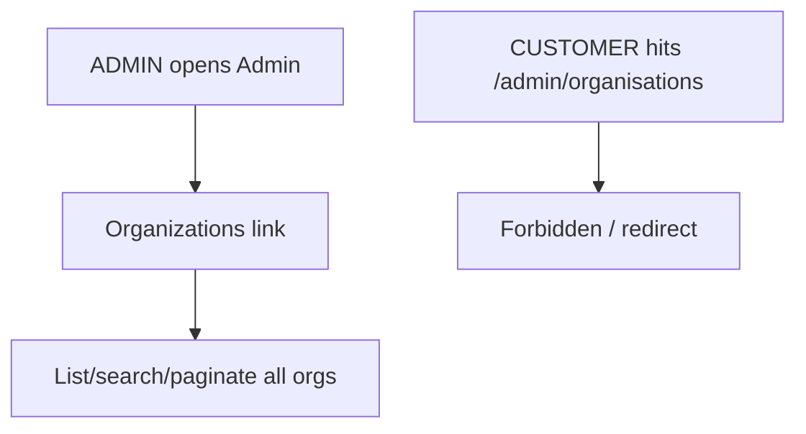

# Instruction: Phase 6 - Admin platform orgs view

## Feature

- **Summary**: Back-office view for platform admins to list/search/paginate all organizations (no membership filter, access guaranteed by admin entry point).
- **Stack**: `Next.js 16.1.1, Prisma 7.8.0, TanStack Table, Shadcn/ui`
- **Branch name**: `feat/b2b-organizations`
- **Parent Plan**: `2026_06_18-b2b-organizations-master.md`
- **Sequence**: `6 of 6`
- Confidence: 9/10
- Time to implement: ~1 day

## Architecture projection

### Files to modify

- `app/(protected)/admin/page.tsx` - add Organizations section/link

### Files to create

- `features/admin/pages/organizations-page.tsx` - list all orgs
- `features/admin/pages/organizations-loading.tsx` - skeleton
- `features/admin/services/get-organizations.service.ts` - admin-only, no membership filter
- `features/admin/components/organizations-table.tsx` - name, owner, members, plan, created
- `app/(protected)/admin/organisations/page.tsx` - route shim
- `app/(protected)/admin/organisations/loading.tsx` - loading shim

### Files to delete

- none

## Applicable rules

| Tool   | Name       | Path                          | Why it applies                           |
| ------ | ---------- | ----------------------------- | ---------------------------------------- |
| claude | feature    | `.claude/rules/feature.md`    | admin feature additions                  |
| claude | filter     | `.claude/rules/filter.md`     | orgs table sort/filter/pagination        |
| claude | page       | `.claude/rules/page.md`       | admin orgs page + loading                |
| claude | security   | `.claude/rules/security.md`   | admin-only entry point, no userId filter |
| claude | code-style | `.claude/rules/code-style.md` | Global style                             |

## User Journey

## Risk register

| Risk                             | Impact           | Mitigation                                                |
| -------------------------------- | ---------------- | --------------------------------------------------------- |
| Admin service leaks to non-admin | Data exposure    | requireAdmin entry point; no membership filter only there |
| findMany without select+take     | Performance/leak | Always select + take + $transaction count                 |

## Implementation phases

### Phase 6: Admin orgs view

> Platform-level visibility on all orgs.

#### Tasks

1. Admin-only `get-organizations` service (select + take + count via $transaction).
2. Orgs table (name, owner email, member count, plan, created).
3. Admin orgs page + route shims under `/admin/organisations`.
4. Link from the admin dashboard.

#### Acceptance criteria

- [ ] An ADMIN can list/search/paginate all orgs
- [ ] A CUSTOMER cannot access `/admin/organisations`
- [ ] Service uses select + take + $transaction
- [ ] `pnpm build` succeeds and full suite is green

## Amendments

## Log

## Validation flow demonstration

1. As ADMIN, open `/admin/organisations`, search and paginate.
2. As CUSTOMER, attempt access -> forbidden/redirect.
