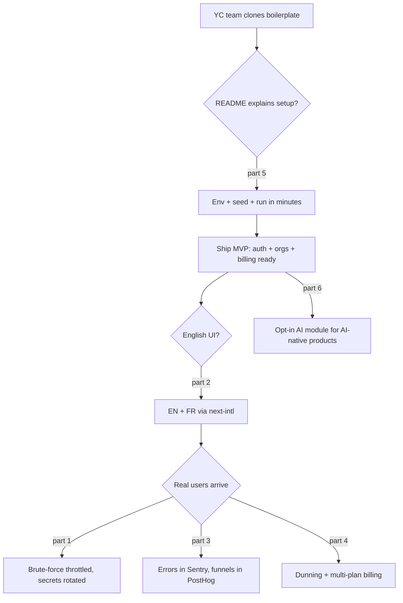

# Master Plan: Audit boilerplate for YC-grade SaaS + remediation

## Overview

- **Goal**: Determine whether this boilerplate fits the need "launch SaaS MVPs for Y Combinator-grade projects" and plan every required change.
- **Risk Score**: 8/10 (i18n route restructure = breaking public URLs +3, 5+ modules affected +3, new external dependencies +2)
- **Branch**: `chore/yc-readiness/`

---

# AUDIT REPORT

## Verdict

**Technically excellent, not yet YC-ready as-is.** The foundation (multi-tenancy, seat billing, security discipline, up-to-date stack, tests, CI) is above the average commercial boilerplate. What blocks a YC/anglophone context: no i18n (all-French UI), no observability/analytics, a default create-next-app README, two hot security items, and no AI scaffolding in a market where ~60% of YC 2026 startups are AI-native.

## 1. Stack freshness (verified via web research, July 2026)

| Package      | Installed                 | Latest stable           | Verdict                                             |
| ------------ | ------------------------- | ----------------------- | --------------------------------------------------- |
| Next.js      | 16.1.1                    | 16.2.x LTS              | Current                                             |
| React        | 19.2.3 (+ React Compiler) | 19.2.7                  | Current                                             |
| Prisma       | 7.8.0 (Rust-free client)  | 7.7–7.8                 | Current                                             |
| Better Auth  | 1.6.23                    | 1.6                     | Current (≥1.6 required for Prisma 7 peer deps — OK) |
| Tailwind CSS | 4.3.2                     | 4.3                     | Current                                             |
| Zod          | 4.4.3                     | 4                       | Current                                             |
| Stripe SDK   | 20.4.1                    | API `2026-06-24.dahlia` | Pin API version explicitly                          |
| Vitest       | 4.1.9                     | 3–4.x                   | Current                                             |

- No package is behind; no forced major migration on the horizon.
- Neon+Prisma and Better Auth are sound but minority choices vs the YC mainstream (Supabase ~9% of 2025-26 MVPs, backend of 1000+ YC companies; Clerk-then-migrate pattern). Deliberate, defensible bet — not a mistake. Watch Drizzle momentum (overtook Prisma in npm downloads, Apr 2026).
- Better Auth is production-ready in 2026 (~2.3M weekly downloads, YC alum); Auth.js is effectively in maintenance mode — avoiding it was correct.

## 2. Feature completeness

**Present and real** (above typical boilerplates): organizations multi-tenancy, invitations, roles (owner/admin/member), seat caps (tested, race-safe via Better Auth `membershipLimit`), audit log, plan-based feature gating, Stripe checkout/portal/webhooks with Redis idempotency, admin panel (users + orgs), transactional emails (React Email + Resend), R2 file uploads, GDPR cookie consent, 5 legal pages, rate limiting (Upstash), SEO/JSON-LD, maintenance mode, 44 test files, GitHub Actions CI, env validation (@t3-oss/env-nextjs), seeds, husky/lint-staged/knip.

**Missing for a typical SaaS**: i18n, observability (Sentry), product analytics (PostHog), programmatic API/API keys (`api_access` flag exists with no implementation), in-app notifications, background jobs/cron, 2FA/passkeys/magic links, usage-based billing, multi-plan (only `pro` wired), example domain entity (`features/projects/` is a page-only stub, no Prisma model).

## 3. Security audit (evidence-based)

No exploitable IDOR or auth-bypass found. Conventions (userId-scoped services, separated admin services, Zod everywhere, error hierarchy) genuinely followed. Findings, most severe first:

| #     | Severity | Finding                                                                                                                                                                                                                                                                                   |
| ----- | -------- | ----------------------------------------------------------------------------------------------------------------------------------------------------------------------------------------------------------------------------------------------------------------------------------------- |
| H1    | HIGH     | Live-looking secrets in working-tree `.env` (Neon, Better Auth secret, Google OAuth, Upstash, Stripe). Gitignored and never committed, but must be rotated before sharing the repo. `CRON_SECRET` is dead (unused, undeclared in `lib/env.ts`).                                           |
| H2    | HIGH     | Login/signup/reset rate limiting likely bypassed: forms use server actions calling `auth.api.*` in-process, skipping Better Auth's HTTP path-based limiter. No `checkRatelimit` in the 4 auth actions → brute-force surface effectively unthrottled.                                      |
| M1    | MED      | Org mutation actions unthrottled; `inviteMemberAction` sends an email per call → email-bomb/spam vector.                                                                                                                                                                                  |
| M2    | MED      | `getOrganizationMembers` receives `userId` but never uses it; `getBilling` takes no userId. Safety depends on page-level parallel checks, violating the "services always filter by userId" rule. Fragile, not exploitable today.                                                          |
| M3    | MED      | `invoice.payment_failed` only busts cache — no dunning, no notification, no downgrade path.                                                                                                                                                                                               |
| M4    | MED      | Seat cap enforced on add only; no reconciliation when an org downgrades below its member count (flag as conscious product decision).                                                                                                                                                      |
| L1-L6 | LOW      | Webhook idempotency has a benign concurrency window (handlers idempotent); middleware is optimistic-cookie by design with real guards at page/action layer (verified complete); error handling leak-free; strong CSP/HSTS headers; validation complete; security tests real and thorough. |

**Production verdict at ~1000 users**: fundamentally shippable after H1/H2/M1/M2.

## 4. i18n (answers the "is international easy?" question)

- Current state: zero i18n infra. ~60–95 of ~281 source files carry hardcoded French (components, Zod messages, email subjects, SEO metadata, env messages, Better Auth error map). French URLs (`/connexion`, `/tarifs`, `/dashboard/facturation`).
- 2026 standard: **next-intl** + `[locale]` route segment + middleware negotiation (App Router has no built-in i18n).
- Effort: mechanically straightforward but broad — route restructure touches every route; string extraction touches ~1/3 of the codebase. Gotcha: `setRequestLocale` needed in every page/layout or static generation silently breaks. Cost grows with every feature added → do it early. Decision taken: **bilingual EN + FR** (part 2).

## 5. DX / credibility gaps

- `README.md` is the untouched create-next-app default — zero human-facing docs (architecture lives only in `.claude/rules/`, invisible to a human evaluating the boilerplate).
- Committed artifacts: `coverage/`, `tsconfig.tsbuildinfo` (3 MB).
- `features/projects/` stub means no reference domain showing "how to build YOUR feature here".
- No Docker, no `vercel.json` (acceptable for Vercel-by-convention).
- Minor: `Organization.updatedAt` nullable (inconsistent), two coexisting billing pages.

## 6. Strategic gap: AI scaffolding

~60% of YC 2026 batches are AI companies; W26 is the most agent-heavy cohort yet. A 2026 SaaS boilerplate with zero LLM/streaming/agent primitives is an outlier for the stated audience. Recommendation: opt-in AI module (part 6).

---

## Applicable rules

| Tool   | Name       | Path                          | Why it applies                                              |
| ------ | ---------- | ----------------------------- | ----------------------------------------------------------- |
| claude | security   | `.claude/rules/security.md`   | Parts 1, 4 touch services and IDOR conventions              |
| claude | action     | `.claude/rules/action.md`     | Parts 1, 4, 6 add/modify server actions and rate limits     |
| claude | feature    | `.claude/rules/feature.md`    | Parts 2, 5, 6 create/modify feature slices                  |
| claude | page       | `.claude/rules/page.md`       | Part 2 restructures pages/SEO; part 5 builds projects pages |
| claude | code-style | `.claude/rules/code-style.md` | All parts                                                   |
| claude | cache      | `.claude/rules/cache.md`      | Parts 3, 4 touch Redis keys and cached services             |
| claude | form       | `.claude/rules/form.md`       | Parts 2, 5 touch forms                                      |
| claude | api        | `.claude/rules/api.md`        | Parts 4, 6 touch API routes                                 |
| claude | filter     | `.claude/rules/filter.md`     | Part 5 projects list filters                                |
| claude | seed       | `.claude/rules/seed.md`       | Part 5 seeds the Project model                              |

## User Journey

## Child Plans

| #   | Plan                                               | File                                          | Status                                                                                                                          | Validated |
| --- | -------------------------------------------------- | --------------------------------------------- | ------------------------------------------------------------------------------------------------------------------------------- | --------- |
| 1   | Security hardening (H1, H2, M1, M2)                | `./2026_07_05-audit-boilerplate-yc-part-1.md` | done (PR #1 merged; manual secrets rotation still pending)                                                                      | [x]       |
| 2   | i18n EN+FR via next-intl                           | `./2026_07_05-audit-boilerplate-yc-part-2.md` | done (PR #3 merged)                                                                                                             | [x]       |
| 3   | Observability & analytics                          | `./2026_07_05-audit-boilerplate-yc-part-3.md` | in-progress (Phase 0 dependency-free groundwork in PR #5; Sentry/PostHog activation deferred, runbook in docs/OBSERVABILITY.md) | [ ]       |
| 4   | Billing completeness                               | `./2026_07_05-audit-boilerplate-yc-part-4.md` | done (PR #4 merged; manual `stripe trigger invoice.payment_failed` smoke test pending)                                          | [x]       |
| 5   | Credibility & DX (README, cleanup, example domain) | `./2026_07_05-audit-boilerplate-yc-part-5.md` | done (PR #2 merged)                                                                                                             | [x]       |
| 6   | Opt-in AI module                                   | `./2026_07_05-audit-boilerplate-yc-part-6.md` | deferred (user decision 2026-07-06: not needed for now; plan stays ready to execute)                                            | [ ]       |

<!-- Status values: pending, in-progress, done, blocked -->
<!-- Parts are INDEPENDENT: any part can run without the others. Recommended order: 1 → 5 → 2 → 3 → 4 → 6 (security first, credibility fast-win second, i18n before the codebase grows). -->

## Validation Protocol

1. Execute a child plan, run its `success_condition`
2. [ ] Checkpoint per part: user confirms
3. [ ] Final: `pnpm lint && pnpm typecheck && pnpm test && pnpm build` green on main

## Estimations

- **Confidence**: 9/10
  - ✓ Every finding is evidence-based (file:line) from three independent audits (inventory, security, web research)
  - ✓ Stack claims verified against July 2026 sources
  - ✓ Parts are independent and each has a runnable success condition
  - ✗ H2 (rate-limit bypass) needs empirical confirmation against Better Auth 1.6.23 before coding
  - ✗ i18n effort estimate (~60–95 files) is grep-based, not exhaustive
- **Duration**: parts 1+5 ≈ 1–2 days each; part 2 ≈ 3–5 days; parts 3+4 ≈ 1–2 days each; part 6 ≈ 2–3 days
