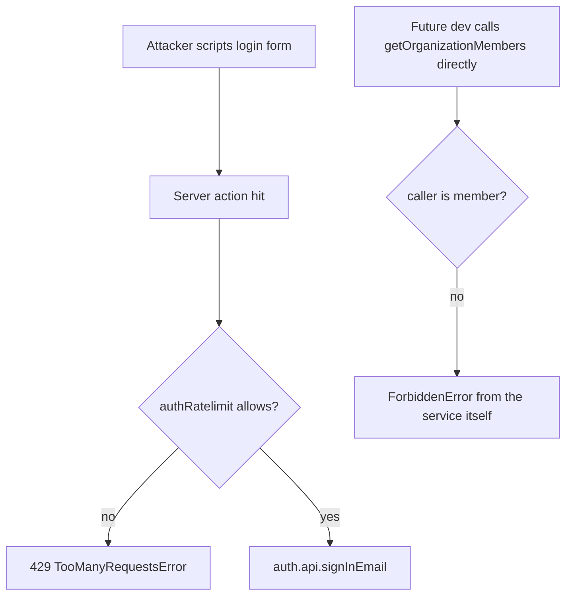

# Instruction: Security hardening (audit findings H1, H2, M1, M2)

## Feature

- **Summary**: Close the four actionable security findings from the YC-readiness audit: rotate live secrets, throttle auth server actions, throttle invitations, move membership checks into services.
- **Stack**: Next.js 16.1, Better Auth 1.6.23, @upstash/ratelimit 2.0.8, Prisma 7.8, Vitest 4
- **Branch name**: `fix/security-hardening`
- **Parent Plan**: `./2026_07_05-audit-boilerplate-yc-master.md`
- **Sequence**: 1 of 6
- Confidence: 9/10
- Time to implement: 1–2 days

## Architecture projection

### Files to modify

- `lib/ratelimit.ts` - add `authRatelimit` (strict IP-based limiter for sign-in/up/reset) and reuse identifier helpers
- `features/auth/actions/sign-in.action.ts` - add `checkRatelimit(authRatelimit, ip)` before `auth.api.signInEmail`
- `features/auth/actions/sign-up.action.ts` - same guard
- `features/auth/actions/forgot-password.action.ts` - same guard (stricter window)
- `features/auth/actions/reset-password.action.ts` - same guard
- `features/organizations/actions/invite-member.action.ts` - add authenticated ratelimit (email-bomb vector)
- `features/organizations/services/get-organization-members.service.ts` - enforce caller membership in the service (use `userId` in a membership check, not just accept it)
- `features/billing/services/get-billing.service.ts` - add `userId` param + membership enforcement inside the service
- `app/(protected)/dashboard/facturation/page.tsx` - pass userId to hardened `getBilling`
- `lib/env.ts` - declare or drop `CRON_SECRET` (currently dead + unvalidated)

### Files to create

- `__tests__/features/auth/actions/auth-ratelimit.test.ts` - assert the 4 auth actions throttle
- `__tests__/features/organizations/services/get-organization-members-authorization.test.ts` - assert non-member is rejected by the service alone

### Files to delete

- none

## Applicable rules

| Tool   | Name       | Path                          | Why it applies                               |
| ------ | ---------- | ----------------------------- | -------------------------------------------- |
| claude | security   | `.claude/rules/security.md`   | Services must self-enforce userId scoping    |
| claude | action     | `.claude/rules/action.md`     | Rate limiting belongs at action entry points |
| claude | code-style | `.claude/rules/code-style.md` | All edits                                    |

## User Journey

## Risk register

| Risk                                                             | Impact                 | Mitigation                                                                                |
| ---------------------------------------------------------------- | ---------------------- | ----------------------------------------------------------------------------------------- |
| H2 assumption wrong (Better Auth does throttle `auth.api` calls) | Wasted double-throttle | Task 1 verifies empirically before coding; if throttled, keep only invite throttle + M2   |
| Rotation breaks running envs                                     | Downtime               | Rotate provider-side first, update Vercel env, then local `.env`                          |
| Ratelimit on shared IPs (offices) locks users out                | Support burden         | Sliding window keyed IP+email for sign-in; generous limits mirroring `lib/auth.ts` config |

## Implementation phases

### Phase 1: Verify H2 empirically

> Confirm whether direct `auth.api.signInEmail` calls bypass Better Auth's rate limiter in v1.6.23.

#### Tasks

1. Write a throwaway test hitting `signInAction` 10x rapidly; observe absence/presence of throttling
2. Record the result in this plan's Log

#### Acceptance criteria

- [x] Bypass confirmed or refuted with evidence in Log

### Phase 2: Secrets rotation (manual, ops)

> Treat the checked-out `.env` as compromised.

#### Tasks

1. Rotate: Neon password, `BETTER_AUTH_SECRET`, Google OAuth secret, Upstash token, Stripe keys
2. Update deployment env vars, then local `.env`
3. Remove `CRON_SECRET` from `.env` or declare it in `lib/env.ts`

#### Acceptance criteria

- [ ] All five credentials rotated and app boots (`pnpm dev` + login works)
- [ ] No env var exists outside the `lib/env.ts` schema

### Phase 3: Throttle auth actions + invitations

> Close the brute-force and email-bomb surfaces.

#### Tasks

1. Add `authRatelimit` to `lib/ratelimit.ts` (sliding window, IP+email key, limits mirroring `lib/auth.ts:47-93`)
2. Guard the 4 auth actions; throw `TooManyRequestsError`
3. Guard `invite-member.action.ts` with an authenticated limiter
4. Tests: throttled path returns the 429 error, happy path unaffected

#### Acceptance criteria

- [x] 6th rapid sign-in attempt from same IP+email is rejected
- [x] Invitation spam capped
- [x] `pnpm test` green

### Phase 4: Service-level membership enforcement (M2)

> Services stop trusting their callers.

#### Tasks

1. `getOrganizationMembers`: verify `userId` is a member of `organizationId` (single indexed query) before listing; throw `ForbiddenError`
2. `getBilling`: add `userId` param, same membership check; update call sites
3. Tests for both rejection paths

#### Acceptance criteria

- [x] Calling either service with a non-member userId throws `ForbiddenError` with no data query executed
- [x] `pnpm test && pnpm typecheck` green

## Amendments

None required — the H2 assumption (direct `auth.api.*` calls bypass Better Auth's rate limiter) is confirmed correct by source inspection (see Log #1). Per the risk register, this means Phase 3 keeps its full original scope (all 4 auth actions + invite throttle); it does NOT shrink to invite-only.

## Log

### #1 - 2026-07-05T00:00:00Z

Tried: static inspection of the installed `better-auth@1.6.23` source (node_modules/better-auth/dist) to trace whether `auth.api.signInEmail(...)` (as called from `features/auth/actions/sign-in.action.ts:20-26` and the other 3 auth actions) passes through the same rate-limit middleware as HTTP requests hitting `auth.handler`. Chose source inspection over a throwaway Vitest test because it gives a definitive, version-pinned answer without needing to mock Redis/DB.

Evidence trail:

- `lib/auth.ts:48-91` — `rateLimit.customRules` for `/sign-in/email`, `/sign-up/email`, `/reset-password`, `/forget-password`, backed by a Redis `customStorage`.
- `node_modules/better-auth/dist/api/rate-limiter/index.mjs:332-348` — the only rate-limit enforcement point is `onRequestRateLimit(req, ctx)`, which resolves the matching rule and calls `storage.consume(key, rule)`.
- `node_modules/better-auth/dist/api/rate-limiter/index.mjs:386` and `node_modules/better-auth/dist/api/index.mjs:4` — `onRequestRateLimit` has exactly one call site in the whole package.
- `node_modules/better-auth/dist/api/index.mjs:163-169` — that single call site lives inside the `onRequest` hook passed to `createRouter(...)` (the `better-call` router), i.e. it only runs when a request is dispatched through that router.
- `node_modules/better-auth/dist/auth/base.mjs:7-35` — `createBetterAuth` builds two separate things from the same `authContext`: (1) `api` = `getEndpoints(authContext, options).api` (returned as `auth.api`, used directly by server actions), and (2) `handler` = an async function that, only when invoked (i.e. only for real HTTP requests to `/api/auth/[...all]`), calls `router(handlerCtx, options)` and runs the request through it. `api` is constructed once at the top, entirely independent of `router` — it is never passed through `router`'s `onRequest`.
- `node_modules/better-auth/dist/api/to-auth-endpoints.mjs:28-33` (doc comment on `toAuthEndpoints`) confirms the design intent: "Wraps each raw endpoint so a router or `auth.api.*` call runs it through the configured hook pipeline" — the hook pipeline is `dispatchAuthEndpoint` (before/after hooks), a completely different mechanism from the router's `onRequest` rate-limit check. `auth.api.signInEmail(...)` calls `api[key]`, defined at `to-auth-endpoints.mjs:37-51`, which never references `onRequestRateLimit` or `router`.

Result: ✓ Bypass CONFIRMED. `auth.api.signInEmail`/`signUpEmail`/`resetPassword`/`forgetPassword` called directly from `features/auth/actions/*.action.ts` never reach `onRequestRateLimit`. Better Auth's `rateLimit.customRules` in `lib/auth.ts` only protect requests that traverse `auth.handler` (the `/api/auth/[...all]` HTTP route), which this app's server actions do not use — they call `auth.api.*` in-process. The 4 auth server actions are currently unthrottled.

→ Next step: proceed to Phase 3 as originally scoped (no amendment shrinking it to invite-only) — implement `authRatelimit` in `lib/ratelimit.ts` and guard all 4 auth actions plus `invite-member.action.ts`, per the existing plan.

## Validation flow demonstration

1. Run `pnpm test` — new ratelimit + authorization tests pass
2. `pnpm dev`, fail login 6x fast → French 429 message shown
3. Invite 11 members rapidly → throttled
4. Log in as user of org A, force-call members service with org B id → ForbiddenError

### #2 - 2026-07-05T00:00:00Z

Tried: implemented Phase 3 as scoped. Added four named limiters to `lib/ratelimit.ts` — `authSignInRatelimit` (5/10s), `authSignUpRatelimit` (3/10s), `authPasswordRatelimit` (3/60s, shared by forgot- and reset-password), and `invitationRatelimit` (10/10min, authenticated) — each mirroring the corresponding `lib/auth.ts` `customRules` window/max. Guarded `sign-in.action.ts`, `sign-up.action.ts`, and `forgot-password.action.ts` with a `.use()` middleware that reads `clientInput.email` (available pre-validation per next-safe-action's "middleware runs before input validation" contract) and calls `checkRatelimit(limiter, \`${ip}:${email}\`)`, keyed by IP+email as specified. `reset-password.action.ts`has no email field in its input (only`token`), so it is keyed by IP alone. `invite-member.action.ts`is guarded with`checkRatelimit(invitationRatelimit, ctx.userId)`since it already runs behind`orgActionClient` (authenticated + membership-checked).

Verified next-safe-action (v8.5.5) resolves errors thrown in `.use()` middleware through `handleServerError` into `result.serverError` rather than rejecting the returned promise — confirmed by inspecting `node_modules/next-safe-action/dist/index.mjs` (`handleExecutionError` → `middlewareResult.serverError = await args.handleServerError(error, ...)`). Tests therefore assert on `result.serverError` rather than a rejected promise.

Added `__tests__/features/auth/actions/auth-ratelimit.test.ts` (9 tests: throttled + happy path for all 4 actions, plus an IP+email key assertion for sign-in) and `__tests__/features/organizations/actions/invite-member-ratelimit.test.ts` (3 tests: throttled, key-by-userId assertion, happy path). Both mock `checkRatelimit`, `@/lib/auth`, `@/lib/prisma`/`@/lib/ratelimit`, and `next/headers` at the module boundary, following the existing pattern in `__tests__/app/api/avatar/route.test.ts` and `__tests__/features/organizations/services/seat-cap.test.ts`.

Result: ✓ `pnpm typecheck` exits 0. ✓ `pnpm test` — 46 files, 538 tests, all green (12 new). Acceptance criteria for Phase 3 met: 6th rapid sign-in attempt (same IP+email) is rejected with the French 429 message; invitation spam is capped per-user; full suite green.

→ Next step: Phase 4 (service-level membership enforcement, M2) is out of scope for this pass — not started.

### #3 - 2026-07-05T00:00:00Z

Tried: implemented Phase 4 as scoped. `getOrganizationMembers` (`features/organizations/services/get-organization-members.service.ts`) now runs a `prisma.member.findFirst({ where: { organizationId, userId }, select: { id: true } })` membership check before the existing `$transaction` (findMany + count) and throws `ForbiddenError("Vous n'êtes pas membre de cette organisation")` — the exact message/pattern mirrored from `get-organization.service.ts` and `get-audit-log.service.ts`. Kept it as a distinct query rather than restructuring the paginated/filtered/sorted list query to double as a membership probe — the list query's `where` clause is dynamic (search/role filters) and reusing it for authorization would couple correctness of the security check to filter state; a separate cheap indexed lookup (`organizationId` + `userId`, matching the `@@unique` member index) is clearer and matches the established pattern used by the two sibling services.

`getBilling` (`features/billing/services/get-billing.service.ts`) changed signature from `getBilling(organizationId: string)` to `getBilling(input: { organizationId: string; userId: string })`, matching the object-input convention used by `getOrganization`/`getAuditLog`/`getOrganizationMembers`. The same `member.findFirst` membership check runs first, before the Redis-cached `fetchInvoices`/`fetchSubscriptions` paths and before any Stripe customer lookup — a non-member throws before touching cache or Stripe, and Redis cache keys stay org-scoped (`billingInvoicesCacheKey`/`billingSubscriptionsCacheKey`, unchanged, still keyed by `organizationId` only). Updated the sole call site, `app/(protected)/dashboard/facturation/page.tsx`, to pass `{ organizationId, userId: session.user.id }`; its existing owner/admin role check (`prisma.member.findFirst` with `role: { in: ["owner", "admin"] }`) is left intact and unchanged — `getBilling`'s new check is a plain membership gate (defense in depth), not a role gate, so the two checks are complementary, not redundant.

Updated existing tests that called the old positional `getBilling(organizationId)` signature to the new object form, adding a `prisma.member.findFirst` mock (default: resolves to a membership) to each: `__tests__/lib/get-billing.test.ts` and `__tests__/features/organizations/services/billing-org-scope.test.ts` (also added a new rejection-path test there — non-member throws `ForbiddenError` with zero Stripe/Redis/Prisma-customer calls). Updated `__tests__/features/organizations/services/organization-isolation.test.ts`'s `getOrganizationMembers` describe block to seed `mockMemberFindFirst` with a valid membership in `beforeEach` (it already declared but did not use that mock, since the audit-log tests below it needed it). Created `__tests__/features/organizations/services/get-organization-members-authorization.test.ts` (4 tests): non-member → `ForbiddenError`, no `$transaction`/`findMany`/`count` call when rejected, membership check uses both `organizationId` AND `userId`, and the happy path still lists members when the caller is a member.

Result: ✓ `pnpm test` — 47 files, 543 tests, all green (5 net new: 4 in the new authorization file + 1 new rejection test in `billing-org-scope.test.ts`). ✓ `pnpm typecheck` exits 0. Acceptance criteria for Phase 4 met: both services throw `ForbiddenError` for a non-member `userId` with no data query executed, full suite green.

→ Next step: Phase 4 complete. Remaining part-1 scope is Phase 2 (secrets rotation, manual ops — explicitly out of scope for this pass per instruction).
