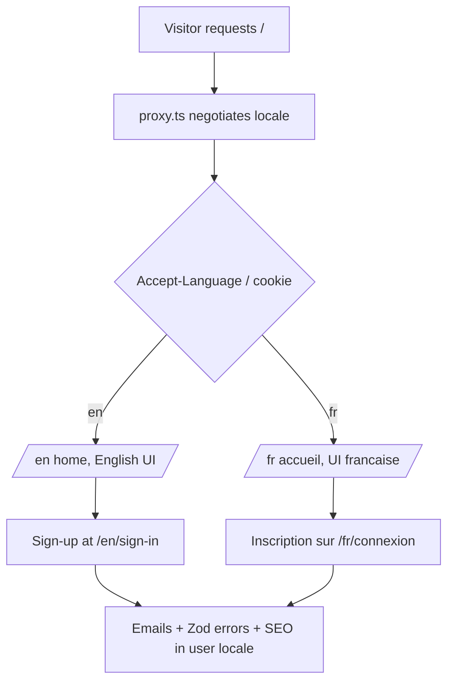

# Instruction: i18n EN+FR via next-intl

## Feature

- **Summary**: Retrofit next-intl into the App Router: `[locale]` segment, middleware negotiation, extraction of ~60–95 files of hardcoded French into `en.json`/`fr.json`, localized Zod messages, emails, SEO, sitemap and URL pathnames.
- **Stack**: Next.js 16.1 App Router, next-intl (latest), Zod 4, React Email 6, Better Auth 1.6 (@better-auth/i18n already present)
- **Branch name**: `feat/i18n-next-intl`
- **Parent Plan**: `./2026_07_05-audit-boilerplate-yc-master.md`
- **Sequence**: 2 of 6
- Confidence: 9/10
- Time to implement: 3–5 days

## Architecture projection

### Files to modify

- `next.config.ts` - wrap with `createNextIntlPlugin`
- `proxy.ts` - add next-intl locale negotiation alongside existing auth/CSP logic
- `app/layout.tsx` + `app/providers.tsx` - move under `[locale]`, add `NextIntlClientProvider`, `setRequestLocale`
- `app/(public)/**` and `app/(protected)/**` - every route moves under `app/[locale]/`; every page/layout calls `setRequestLocale`
- `app/sitemap.ts`, `app/robots.ts` - emit per-locale URLs with alternates
- `features/*/components/**`, `features/*/pages/**` (~60–95 files) - replace hardcoded French with `useTranslations`/`getTranslations`
- `features/*/schemas/**` - Zod error messages via translation keys (error map)
- `features/*/emails/**` + `lib/auth.ts` email subjects - locale-aware templates
- `features/*/constants/*-seo*` - localized metadata
- `lib/auth.ts` - keep @better-auth/i18n map, add EN catalog
- `lib/env.ts` - English internal messages (dev-facing)

### Files to create

- `i18n/routing.ts` - locales `["en","fr"]`, defaultLocale `en`, `pathnames` map (`/connexion` ↔ `/sign-in`, `/tarifs` ↔ `/pricing`, etc.)
- `i18n/request.ts` - next-intl request config
- `messages/en.json`, `messages/fr.json` - catalogs, namespaced per feature
- `__tests__/i18n/messages-parity.test.ts` - en/fr key parity check

### Files to delete

- none (routes are moved, not deleted)

## Applicable rules

| Tool   | Name       | Path                          | Why it applies                                         |
| ------ | ---------- | ----------------------------- | ------------------------------------------------------ |
| claude | page       | `.claude/rules/page.md`       | Every page/loading/SEO file is touched                 |
| claude | feature    | `.claude/rules/feature.md`    | Feature slices restructured for translations           |
| claude | form       | `.claude/rules/form.md`       | Form labels/errors move to catalogs                    |
| claude | code-style | `.claude/rules/code-style.md` | All edits                                              |
| claude | cache      | `.claude/rules/cache.md`      | `setRequestLocale` interacts with static rendering/PPR |

## User Journey

## Risk register

| Risk                                      | Impact                                       | Mitigation                                                                                                              |
| ----------------------------------------- | -------------------------------------------- | ----------------------------------------------------------------------------------------------------------------------- |
| Missing `setRequestLocale` in a page      | Silent fallback to dynamic rendering in prod | Parity test + build-output check of static routes; checklist per page                                                   |
| French URL slugs break existing links/SEO | 404s, lost ranking                           | `pathnames` map keeps `/fr/connexion` while adding `/en/sign-in`; 301 redirects from legacy unprefixed URLs in proxy.ts |
| proxy.ts already dense (CSP + auth)       | Middleware conflicts                         | Compose next-intl middleware first, then existing logic; route matcher tests                                            |
| Catalog drift between en/fr               | Untranslated UI                              | `messages-parity.test.ts` fails CI on missing keys                                                                      |
| Better Auth server-side error messages    | Mixed-language errors                        | Locale-aware error map replacing the static French map in `lib/auth.ts`                                                 |

## Implementation phases

### Phase 1: Infrastructure

> next-intl wired, routes moved, both locales render the home page.

#### Tasks

1. Install next-intl; create `i18n/routing.ts` + `i18n/request.ts`; wrap `next.config.ts`
2. Move `app/(public)` and `app/(protected)` under `app/[locale]/`; add `setRequestLocale` everywhere
3. Integrate locale negotiation into `proxy.ts`; legacy-URL 301 redirects
4. `NextIntlClientProvider` in root layout

#### Acceptance criteria

- [x] `/en` and `/fr` render; unprefixed legacy URLs 301
- [x] `pnpm build` green, protected routes still guarded

### Phase 2: String extraction — public + auth

> Home, pricing, contact, legal, auth forms, cookie consent.

#### Tasks

1. Extract to namespaced catalogs (`home`, `pricing`, `auth`, `legal`, `cookieConsent`)
2. Localized `pathnames` for all public slugs
3. Localized SEO constants + sitemap alternates

#### Acceptance criteria

- [ ] No hardcoded French remains in the covered features (grep check)
- [ ] Both locales fully render public + auth pages

### Phase 3: String extraction — dashboard, orgs, billing, admin

> Protected surface, largest volume.

#### Tasks

1. Extract dashboard, organizations (members table, invitations, audit labels), billing, account, admin
2. Zod schemas: translation-key error map
3. `Record<Enum, label>` constants become locale-aware lookups

#### Acceptance criteria

- [ ] Dashboard fully bilingual including table columns, filters, toasts
- [ ] Zod errors render in the active locale

### Phase 4: Emails + server messages

> Emails, Better Auth errors, action error messages in user locale.

#### Tasks

1. Locale param on email templates + senders (store/derive user locale)
2. EN catalog for the Better Auth error map in `lib/auth.ts`
3. Server action user-facing messages via `getTranslations`

#### Acceptance criteria

- [ ] Reset-password email arrives in the requester's locale
- [ ] `pnpm build && pnpm test` green; parity test passes

## Amendments

- 🤖 Decision (user-validated, 2026-07-05): NO binary locale logic anywhere (`locale === "fr" ? ... : ...` is forbidden). All locale-dependent values (BCP47 `inLanguage`, `og:locale`, hreflang tags) live in a single `i18n/locale-metadata.constant.ts` keyed `satisfies Record<Locale, LocaleMetadata>` so the typecheck fails when a new locale is added without its metadata. URLs are always resolved via next-intl `getPathname` (never hand-built), and hreflang maps are generated by iterating `routing.locales`, never enumerated. Adding a locale must only touch: `routing.locales`, `LOCALE_METADATA`, `messages/<locale>.json`.
- 🤖 Decision (user-validated, 2026-07-05): route folders are RENAMED TO ENGLISH during Phase 1 (`connexion/` → `sign-in/`, `tarifs/` → `pricing/`, `facturation/` → `billing/`, etc.). English paths become the canonical internal pathnames; French URLs are served exclusively through the `pathnames` map (`/sign-in` → fr `/connexion`). All internal `<Link>` hrefs use the English canonical key. Rationale: folder names are internal identifiers once `pathnames` exists, and English aligns with the existing code-in-English convention (`sign-in-page.tsx`, `sign-in.action.ts`) and the anglophone target audience.

## Log

### #1 - 2026-07-05T00:00:00Z

Phase 1 (Infrastructure) implemented and validated:

- Installed `next-intl@4.13.1`. Created `i18n/routing.ts` (locales `en`/`fr`, `defaultLocale: "en"`, `localePrefix: "always"`, full `pathnames` map for every route incl. legacy French slugs), `i18n/navigation.ts` (`createNavigation` wrappers), `i18n/request.ts`, `i18n/locale-metadata.constant.ts` (`LOCALE_METADATA satisfies Record<Locale, LocaleMetadata>`), `i18n/legacy-redirects.ts` (derives legacy French unprefixed-path patterns from `routing.pathnames`, single source of truth), `i18n/revalidate-localized-path.ts` (revalidates a canonical path across every locale). Added `messages/en.json` + `messages/fr.json` minimal shells. Wrapped `next.config.ts` with `createNextIntlPlugin`.
- Moved every route under `app/[locale]/` via `git mv` (history preserved), renaming French folders to English canonical names per the amendment (`connexion`→`sign-in`, `inscription`→`sign-up`, `mot-de-passe-oublie`→`forgot-password`, `nouveau-mot-de-passe`→`reset-password`, `tarifs`→`pricing`, `plan-du-site`→`sitemap-page`, `mentions-legales`→`legal-notice`, `conditions-de-vente`→`terms-of-sale`, `conditions-d-utilisation`→`terms-of-service`, `politique-de-confidentialite`→`privacy-policy`, `politique-des-cookies`→`cookie-policy`, `dashboard/facturation`→`dashboard/billing`, `dashboard/organisation`→`dashboard/organization`, `dashboard/parametres`→`dashboard/settings`, `dashboard/projets`→`dashboard/projects`, `admin/organisations`→`admin/organizations`, `admin/parametres`→`admin/settings`, `admin/utilisateurs`→`admin/users`). Added `setRequestLocale` to every page/layout under `[locale]`; `generateStaticParams` on `app/[locale]/layout.tsx`.
- `app/layout.tsx` kept as the true root (`<html>`/`<body>`, required since `app/api`, `app/maintenance`, and the error/not-found/forbidden/unauthorized boundaries live outside `[locale]`) — kept fully **static** (no dynamic API calls) to satisfy `cacheComponents`; `app/[locale]/layout.tsx` calls `setRequestLocale` + wraps `children` in `
` for correct per-locale `lang`, and exports `generateMetadata` overriding `openGraph.locale` via `LOCALE_METADATA` (derived from the statically-known route param, no dynamic API).
- `proxy.ts`: composed next-intl's `createMiddleware(routing)` around the existing maintenance/CSP/auth logic — maintenance and `/api`+asset paths bypass locale negotiation entirely (unchanged behavior); legacy French unprefixed paths (e.g. `/connexion`, `/tarifs`) 301-redirect straight to `/fr/...` via `isLegacyFrenchPath` (bypassing generic accept-language negotiation, which could otherwise resolve to `/en` and 404); the nonce is injected as a request header via a cloned `NextRequest` _before_ calling `handleI18nRouting` so it survives next-intl's internal rewrite; protected-route auth checks operate on the locale-stripped pathname and redirect to the locale-correct `/sign-in` (looked up from `routing.pathnames`, never a `locale === "fr"` branch).
- `NextIntlClientProvider` added in `app/[locale]/layout.tsx`.
- Updated every internal `<Link>`/`redirect()`/`router.push()`/`revalidatePath()` call (~40 files across `app/`, `components/`, `features/`) to the English canonical hrefs via `@/i18n/navigation` wrappers; `lib/session.ts` and `features/billing/guards/require-customer-plan.ts` now redirect to the locale-aware sign-in/pricing/settings paths using `getLocale()` + the i18n `redirect()`. Global boundary components reachable outside the `[locale]` segment (`not-found-page`, `forbidden-page`, `unauthorized-page`, `too-many-requests-page`) use the i18n `Link` (safe — Server Components read locale from the request-scoped config, not React context); the client `"use client"` `error-page.tsx` keeps a plain `next/link` to `/` since the error boundary can unmount the `[locale]` layout's `NextIntlClientProvider`.
- `app/sitemap.ts` now emits one entry per `routing.locales` via `getPathname`; `app/robots.ts` unchanged (already locale-agnostic).
- Verified with a production server (`next build && next start`): `/` → 307 → `/en`; `/connexion` → 301 → `/fr/connexion`; `/tarifs` → 301 → `/fr/tarifs`; `/fr/connexion` and `/en/sign-in` → 200; `/en/dashboard` (unauthenticated) → 307 → `/en/sign-in`; `/fr/dashboard` (unauthenticated) → 307 → `/fr/connexion`; CSP + `X-Frame-Options` headers present with a fresh nonce on every response.
- `pnpm typecheck`, `pnpm lint`, `pnpm build`, `pnpm test` (577 tests) all green. Updated two unit test files (`__tests__/lib/session.test.ts`, `__tests__/features/billing/guards/require-customer-plan.test.ts`, `__tests__/features/account/services/update-profile.test.ts`) to mock the new `@/i18n/navigation` / `next-intl/server` / `@/i18n/revalidate-localized-path` dependencies instead of `next/navigation`/`next/cache` directly.
- Not in scope for this phase (deferred to Phase 2/3/4 per the plan): hardcoded French UI strings in components/pages remain untouched; per-page SEO metadata (`alternates.canonical`, `openGraph.url`, titles) still uses the new English path as a static string rather than a fully locale-aware `getPathname` call — full localized SEO alternates are explicitly Phase 2 work.

## Validation flow demonstration

1. Visit `/` with `Accept-Language: en` → English home at `/en`
2. Full sign-up in English at `/en/sign-up`; verification email in English
3. Switch to `/fr` → French UI everywhere including validation errors
4. Legacy `/connexion` → 301 to `/fr/connexion`
5. `pnpm build` — locale routes statically generated
