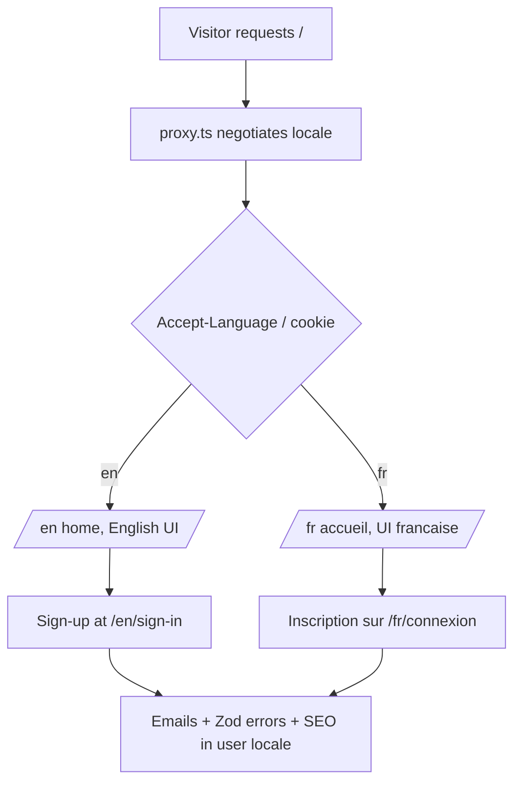

# Instruction: i18n EN+FR via next-intl

## Feature

- **Summary**: Retrofit next-intl into the App Router: `[locale]` segment, middleware negotiation, extraction of ~60–95 files of hardcoded French into `en.json`/`fr.json`, localized Zod messages, emails, SEO, sitemap and URL pathnames.
- **Stack**: Next.js 16.1 App Router, next-intl (latest), Zod 4, React Email 6, Better Auth 1.6 (@better-auth/i18n already present)
- **Branch name**: `feat/i18n-next-intl`
- **Parent Plan**: `./2026_07_05-audit-boilerplate-yc-master.md`
- **Sequence**: 2 of 6
- Confidence: 9/10
- Time to implement: 3–5 days

## Architecture projection

### Files to modify

- `next.config.ts` - wrap with `createNextIntlPlugin`
- `proxy.ts` - add next-intl locale negotiation alongside existing auth/CSP logic
- `app/layout.tsx` + `app/providers.tsx` - move under `[locale]`, add `NextIntlClientProvider`, `setRequestLocale`
- `app/(public)/**` and `app/(protected)/**` - every route moves under `app/[locale]/`; every page/layout calls `setRequestLocale`
- `app/sitemap.ts`, `app/robots.ts` - emit per-locale URLs with alternates
- `features/*/components/**`, `features/*/pages/**` (~60–95 files) - replace hardcoded French with `useTranslations`/`getTranslations`
- `features/*/schemas/**` - Zod error messages via translation keys (error map)
- `features/*/emails/**` + `lib/auth.ts` email subjects - locale-aware templates
- `features/*/constants/*-seo*` - localized metadata
- `lib/auth.ts` - keep @better-auth/i18n map, add EN catalog
- `lib/env.ts` - English internal messages (dev-facing)

### Files to create

- `i18n/routing.ts` - locales `["en","fr"]`, defaultLocale `en`, `pathnames` map (`/connexion` ↔ `/sign-in`, `/tarifs` ↔ `/pricing`, etc.)
- `i18n/request.ts` - next-intl request config
- `messages/en.json`, `messages/fr.json` - catalogs, namespaced per feature
- `__tests__/i18n/messages-parity.test.ts` - en/fr key parity check

### Files to delete

- none (routes are moved, not deleted)

## Applicable rules

| Tool   | Name       | Path                          | Why it applies                                         |
| ------ | ---------- | ----------------------------- | ------------------------------------------------------ |
| claude | page       | `.claude/rules/page.md`       | Every page/loading/SEO file is touched                 |
| claude | feature    | `.claude/rules/feature.md`    | Feature slices restructured for translations           |
| claude | form       | `.claude/rules/form.md`       | Form labels/errors move to catalogs                    |
| claude | code-style | `.claude/rules/code-style.md` | All edits                                              |
| claude | cache      | `.claude/rules/cache.md`      | `setRequestLocale` interacts with static rendering/PPR |

## User Journey

## Risk register

| Risk                                      | Impact                                       | Mitigation                                                                                                              |
| ----------------------------------------- | -------------------------------------------- | ----------------------------------------------------------------------------------------------------------------------- |
| Missing `setRequestLocale` in a page      | Silent fallback to dynamic rendering in prod | Parity test + build-output check of static routes; checklist per page                                                   |
| French URL slugs break existing links/SEO | 404s, lost ranking                           | `pathnames` map keeps `/fr/connexion` while adding `/en/sign-in`; 301 redirects from legacy unprefixed URLs in proxy.ts |
| proxy.ts already dense (CSP + auth)       | Middleware conflicts                         | Compose next-intl middleware first, then existing logic; route matcher tests                                            |
| Catalog drift between en/fr               | Untranslated UI                              | `messages-parity.test.ts` fails CI on missing keys                                                                      |
| Better Auth server-side error messages    | Mixed-language errors                        | Locale-aware error map replacing the static French map in `lib/auth.ts`                                                 |

## Implementation phases

### Phase 1: Infrastructure

> next-intl wired, routes moved, both locales render the home page.

#### Tasks

1. Install next-intl; create `i18n/routing.ts` + `i18n/request.ts`; wrap `next.config.ts`
2. Move `app/(public)` and `app/(protected)` under `app/[locale]/`; add `setRequestLocale` everywhere
3. Integrate locale negotiation into `proxy.ts`; legacy-URL 301 redirects
4. `NextIntlClientProvider` in root layout

#### Acceptance criteria

- [x] `/en` and `/fr` render; unprefixed legacy URLs 301
- [x] `pnpm build` green, protected routes still guarded

### Phase 2: String extraction — public + auth

> Home, pricing, contact, legal, auth forms, cookie consent.

#### Tasks

1. Extract to namespaced catalogs (`home`, `pricing`, `auth`, `legal`, `cookieConsent`)
2. Localized `pathnames` for all public slugs
3. Localized SEO constants + sitemap alternates

#### Acceptance criteria

- [x] No hardcoded French remains in the covered features (grep check)
- [x] Both locales fully render public + auth pages

### Phase 3: String extraction — dashboard, orgs, billing, admin

> Protected surface, largest volume.

#### Tasks

1. Extract dashboard, organizations (members table, invitations, audit labels), billing, account, admin
2. Zod schemas: translation-key error map
3. `Record<Enum, label>` constants become locale-aware lookups

#### Acceptance criteria

- [x] Dashboard fully bilingual including table columns, filters, toasts
- [x] Zod errors render in the active locale

### Phase 4: Emails + server messages

> Emails, Better Auth errors, action error messages in user locale.

#### Tasks

1. Locale param on email templates + senders (store/derive user locale)
2. EN catalog for the Better Auth error map in `lib/auth.ts`
3. Server action user-facing messages via `getTranslations`

#### Acceptance criteria

- [x] Reset-password email arrives in the requester's locale
- [x] `pnpm build && pnpm test` green; parity test passes

## Amendments

- 🤖 Decision (user-validated, 2026-07-05): NO binary locale logic anywhere (`locale === "fr" ? ... : ...` is forbidden). All locale-dependent values (BCP47 `inLanguage`, `og:locale`, hreflang tags) live in a single `i18n/locale-metadata.constant.ts` keyed `satisfies Record<Locale, LocaleMetadata>` so the typecheck fails when a new locale is added without its metadata. URLs are always resolved via next-intl `getPathname` (never hand-built), and hreflang maps are generated by iterating `routing.locales`, never enumerated. Adding a locale must only touch: `routing.locales`, `LOCALE_METADATA`, `messages/<locale>.json`.
- 🤖 Decision (user-validated, 2026-07-05): route folders are RENAMED TO ENGLISH during Phase 1 (`connexion/` → `sign-in/`, `tarifs/` → `pricing/`, `facturation/` → `billing/`, etc.). English paths become the canonical internal pathnames; French URLs are served exclusively through the `pathnames` map (`/sign-in` → fr `/connexion`). All internal `<Link>` hrefs use the English canonical key. Rationale: folder names are internal identifiers once `pathnames` exists, and English aligns with the existing code-in-English convention (`sign-in-page.tsx`, `sign-in.action.ts`) and the anglophone target audience.

## Log

### #1 - 2026-07-05T00:00:00Z

Phase 1 (Infrastructure) implemented and validated:

- Installed `next-intl@4.13.1`. Created `i18n/routing.ts` (locales `en`/`fr`, `defaultLocale: "en"`, `localePrefix: "always"`, full `pathnames` map for every route incl. legacy French slugs), `i18n/navigation.ts` (`createNavigation` wrappers), `i18n/request.ts`, `i18n/locale-metadata.constant.ts` (`LOCALE_METADATA satisfies Record<Locale, LocaleMetadata>`), `i18n/legacy-redirects.ts` (derives legacy French unprefixed-path patterns from `routing.pathnames`, single source of truth), `i18n/revalidate-localized-path.ts` (revalidates a canonical path across every locale). Added `messages/en.json` + `messages/fr.json` minimal shells. Wrapped `next.config.ts` with `createNextIntlPlugin`.
- Moved every route under `app/[locale]/` via `git mv` (history preserved), renaming French folders to English canonical names per the amendment (`connexion`→`sign-in`, `inscription`→`sign-up`, `mot-de-passe-oublie`→`forgot-password`, `nouveau-mot-de-passe`→`reset-password`, `tarifs`→`pricing`, `plan-du-site`→`sitemap-page`, `mentions-legales`→`legal-notice`, `conditions-de-vente`→`terms-of-sale`, `conditions-d-utilisation`→`terms-of-service`, `politique-de-confidentialite`→`privacy-policy`, `politique-des-cookies`→`cookie-policy`, `dashboard/facturation`→`dashboard/billing`, `dashboard/organisation`→`dashboard/organization`, `dashboard/parametres`→`dashboard/settings`, `dashboard/projets`→`dashboard/projects`, `admin/organisations`→`admin/organizations`, `admin/parametres`→`admin/settings`, `admin/utilisateurs`→`admin/users`). Added `setRequestLocale` to every page/layout under `[locale]`; `generateStaticParams` on `app/[locale]/layout.tsx`.
- `app/layout.tsx` kept as the true root (`<html>`/`<body>`, required since `app/api`, `app/maintenance`, and the error/not-found/forbidden/unauthorized boundaries live outside `[locale]`) — kept fully **static** (no dynamic API calls) to satisfy `cacheComponents`; `app/[locale]/layout.tsx` calls `setRequestLocale` + wraps `children` in `
` for correct per-locale `lang`, and exports `generateMetadata` overriding `openGraph.locale` via `LOCALE_METADATA` (derived from the statically-known route param, no dynamic API).
- `proxy.ts`: composed next-intl's `createMiddleware(routing)` around the existing maintenance/CSP/auth logic — maintenance and `/api`+asset paths bypass locale negotiation entirely (unchanged behavior); legacy French unprefixed paths (e.g. `/connexion`, `/tarifs`) 301-redirect straight to `/fr/...` via `isLegacyFrenchPath` (bypassing generic accept-language negotiation, which could otherwise resolve to `/en` and 404); the nonce is injected as a request header via a cloned `NextRequest` _before_ calling `handleI18nRouting` so it survives next-intl's internal rewrite; protected-route auth checks operate on the locale-stripped pathname and redirect to the locale-correct `/sign-in` (looked up from `routing.pathnames`, never a `locale === "fr"` branch).
- `NextIntlClientProvider` added in `app/[locale]/layout.tsx`.
- Updated every internal `<Link>`/`redirect()`/`router.push()`/`revalidatePath()` call (~40 files across `app/`, `components/`, `features/`) to the English canonical hrefs via `@/i18n/navigation` wrappers; `lib/session.ts` and `features/billing/guards/require-customer-plan.ts` now redirect to the locale-aware sign-in/pricing/settings paths using `getLocale()` + the i18n `redirect()`. Global boundary components reachable outside the `[locale]` segment (`not-found-page`, `forbidden-page`, `unauthorized-page`, `too-many-requests-page`) use the i18n `Link` (safe — Server Components read locale from the request-scoped config, not React context); the client `"use client"` `error-page.tsx` keeps a plain `next/link` to `/` since the error boundary can unmount the `[locale]` layout's `NextIntlClientProvider`.
- `app/sitemap.ts` now emits one entry per `routing.locales` via `getPathname`; `app/robots.ts` unchanged (already locale-agnostic).
- Verified with a production server (`next build && next start`): `/` → 307 → `/en`; `/connexion` → 301 → `/fr/connexion`; `/tarifs` → 301 → `/fr/tarifs`; `/fr/connexion` and `/en/sign-in` → 200; `/en/dashboard` (unauthenticated) → 307 → `/en/sign-in`; `/fr/dashboard` (unauthenticated) → 307 → `/fr/connexion`; CSP + `X-Frame-Options` headers present with a fresh nonce on every response.
- `pnpm typecheck`, `pnpm lint`, `pnpm build`, `pnpm test` (577 tests) all green. Updated two unit test files (`__tests__/lib/session.test.ts`, `__tests__/features/billing/guards/require-customer-plan.test.ts`, `__tests__/features/account/services/update-profile.test.ts`) to mock the new `@/i18n/navigation` / `next-intl/server` / `@/i18n/revalidate-localized-path` dependencies instead of `next/navigation`/`next/cache` directly.
- Not in scope for this phase (deferred to Phase 2/3/4 per the plan): hardcoded French UI strings in components/pages remain untouched; per-page SEO metadata (`alternates.canonical`, `openGraph.url`, titles) still uses the new English path as a static string rather than a fully locale-aware `getPathname` call — full localized SEO alternates are explicitly Phase 2 work.

### #2 - 2026-07-05T00:00:00Z

Phase 2 (String extraction — public + auth) implemented and validated:

- Catalogs (`messages/en.json`, `messages/fr.json`) grew from the 1-key shell to ~180 leaf keys each, namespaced `common.*` (nav, footer, signOut, errorPages, sitemapPage), `home.*`, `pricing.*` (incl. `plans.{starter,pro,business}` and `seo.*`), `contact.*` (incl. `form.*`), `legal.*` (title + `lastUpdated` + `seoDescription` per page — bodies excluded, see below), `auth.*` (`signIn`, `signUp`, `forgotPassword`, `resetPassword`), `validation.*` (Zod error-map keys), `cookieConsent.*` (`banner`, `modal`, `categories`). fr.json text is byte-for-byte the pre-existing French copy; en.json is a faithful new translation (one deliberate deviation: the auth sign-in password length schema had a copy-paste bug — French message said "Le nom doit contenir..." instead of "mot de passe" — preserved verbatim in `fr.json.validation.password.tooLongLogin`, but translated sensibly in English rather than mirroring the bug).
- **Zod error-map pattern (project-wide, Phase 3 reuses this)**: `features/auth/schemas/auth.schema.ts` and `password.schema.ts` (plus `features/contact/schemas/contact.schema.ts`, piggy-backing on the same pattern since contact is also Phase 2 scope) now store a translation KEY as the Zod message (e.g. `"validation.email.required"`) instead of literal French text. A new shared helper, `utils/errors/translate-field-errors.ts` (`translateFieldErrors(errors, translate)`), maps `field.state.meta.errors` through `useTranslations("validation")` right before handing them to `<FieldError>` — so the schema stays locale-agnostic and the translation only happens at display time in the client form component. Fixed-length constraints (`MIN_PASSWORD_LENGTH`, `MAX_PASSWORD_LENGTH` = 12/128) are not user input, so the translated sentence embeds the number directly in `messages/*.json` rather than interpolating — no ICU params needed for this case. Server-side (action-level) validation failures still surface the raw key as `serverError` if ever hit past client validation; this is an accepted gap flagged in `notes` since translating server-side messages is Phase 4 scope (`getTranslations` in actions).
- **Legal body content**: the 5 legal pages' long-form body copy (article text, tables, internal links) is extracted as per-locale content components (`features/legal/content/{page}-content.{en,fr}.tsx`), not `next-intl` rich text — chosen over ICU rich-text markup because the legal bodies are deeply nested JSX (headings, lists, tables, `<Link>`s) that would be unreadable and error-prone as escaped message strings, and they change rarely enough that componentization's duplication cost is acceptable. Each `{page}-page.tsx` resolves the right component via a `Record<Locale, ComponentType>` lookup (never `locale === "fr"`), keyed by `getLocale()`, matching the plan's no-binary-locale-logic amendment. Only the page chrome (`title`, `lastUpdated`, `seoDescription`) lives in the message catalog under `legal.*`.
- **SEO**: every public + auth route's `app/[locale]/**/page.tsx` shim now exports `generateMetadata` (`getTranslations` + a new `i18n/get-locale-alternates.ts` helper) instead of a static `metadata` const — `getLocaleAlternates(href, locale)` iterates `routing.locales` with `getPathname` to build `alternates.canonical` + `alternates.languages` (hreflang), never enumerated. JSON-LD schema getters (`*-seo.constant.ts` across home/pricing/contact/legal/auth) take `locale` + a pre-translated `description` and resolve their canonical `url`/`@id` via `getPathname` instead of a hardcoded French slug; `inLanguage`/`og:locale` continue to flow from `LOCALE_METADATA` (no new per-locale branches introduced). `app/sitemap.ts` now also emits `alternates.languages` per entry via `getLocaleAlternates`; its inline comments (previously French, non-user-facing but still violated the English-comments convention) were translated to English.
- **Pricing plans** (`features/pricing/constants/pricing-plans.ts`): the static `PLANS` array became an async `getPricingPlans()` resolving copy from `pricing.plans.*`, since plan copy is locale-dependent; `Plan` gained an explicit `isCustomPrice: boolean` field to replace the previous `plan.price === "Sur mesure"` string-compare (which would have broken for the English "Custom" label).
- **Cookie consent**: `COOKIE_CATEGORIES` (Zustand store) dropped its hardcoded `label`/`description` fields — only the `required` flag remains, since Zustand state isn't request-locale-aware; the modal now resolves `cookieConsent.categories.{categoryId}.{label,description}` at render time via `useTranslations`.
- **Documented exception (grep still finds 2 files)**: `components/pages/error-page.tsx` and `global-error-page.tsx` (the root, non-`[locale]` error boundaries) keep their hardcoded French text. Both are `"use client"` and can render after the `[locale]` layout's `NextIntlClientProvider` has unmounted (root error boundary replaces the tree above `[locale]`), a constraint already called out in the Phase 1 log for their plain `next/link` usage. Translating them safely would require reading a message JSON module directly (bypassing `useTranslations`) plus a client-side locale read (e.g. `document.cookie`) — added complexity for a rarely-seen critical fallback UI. Left as French, consistent with the Phase 1 precedent; flagged here rather than silently ignored.
- New test: `__tests__/i18n/messages-parity.test.ts` — recursive key-path diff between `en.json`/`fr.json` (fails on any one-sided key) + empty-string-value check on both files.
- `pnpm typecheck`, `pnpm lint`, `pnpm test` (585 tests incl. the 4 new parity tests), and `pnpm build` all green; production server smoke-tested: `/en/pricing`, `/fr/tarifs`, `/en/sign-in`, `/fr/connexion`, `/en/legal-notice`, `/fr/mentions-legales`, `/en/sitemap-page`, `/fr/plan-du-site`, `/en/cookie-policy`, `/en/contact` all render the correct locale's text.
- Not in scope for this phase (deferred per plan): `features/*/emails/**` (`contact-email.tsx`, `features/auth/emails/*`) still hardcode French — that's Phase 4 (locale-aware email templates). Dashboard/org/billing/admin surfaces untouched (Phase 3). `lib/auth.ts` Better Auth error map untouched (Phase 4).

### #3 - 2026-07-05T00:00:00Z

Phase 3 (String extraction — dashboard, orgs, billing, admin) implemented and validated:

- Catalogs (`messages/en.json`, `messages/fr.json`) grew from ~180 to 582 leaf keys each, adding namespaces: `dashboard.home`, `account.*` (settings page/forms/modals/toasts), `organizations.*` (members table/filters/columns, invite/role/transfer/remove flows, org switcher, audit log incl. `AUDIT_ACTION` labels), `billing.*` (billing pages, subscription/invoice cards, portal button, empty states), `projects.*` (page, columns, filters, empty states, create/edit/delete forms+modals — kept exemplary per the plan), `admin.*` (dashboard metrics, organizations table/filters, users table/filters, user detail page), and `common.dashboardSidebar` / `common.adminSidebar` / `common.pagination` / `common.dataTable` for shared protected chrome. fr.json text is byte-for-byte the pre-existing French copy; en.json is a faithful new translation.
- **Zod schemas** converted to the Phase-2 translation-key pattern across all six features: `features/account/schemas/{account,avatar,password,profile}.schema.ts`, `features/organizations/schemas/{invitation,member,organization}.schema.ts`, `features/billing/schemas/checkout.schema.ts`, `features/projects/schemas/project.schema.ts`, `features/users/schemas/users-filter.schema.ts`. Reused existing `validation.*` keys where messages repeated verbatim (e.g. `validation.email.invalid`, `validation.confirmPassword.mismatch`); added feature-scoped keys (`validation.account.*`, `validation.organizations.*`, `validation.billing.*`, `validation.projects.*`, `validation.users.*`) where wording differed. Fixed-length constraints (avatar max size, search max length) embed the number directly in `messages/*.json` rather than interpolating, matching the `MIN/MAX_PASSWORD_LENGTH` precedent from Phase 2. Every form consuming a converted schema now calls `translateFieldErrors(field.state.meta.errors, tValidation)` before `<FieldError>`; two forms (`invite-form.tsx`, `role-form.tsx`) that were missing this wiring even before Phase 3 (their schema messages were literal French, never translated at display time) are now fixed as part of this pass.
- **`Record<Enum, label>` constants → locale-aware lookups (plan point 4)**: every label Record's values became translation-key strings (not display text), resolved via `useTranslations` at the display site — `organizations.constants.organization-roles.constant.ts` (`ORGANIZATION_ROLE_LABELS`), `organizations.constants.members-filters.constant.ts` (`memberRoleFilterLabels`), `organizations.constants.audit-actions.constant.ts` (new `AUDIT_ACTION_LABELS`, previously the audit log rendered the raw enum string with no label at all), `organizations.constants.feature-config.constant.ts` (`FEATURE_CONFIG.label`, currently unused in any UI but fixed for consistency and the grep gate), `billing.constants.{invoice-status,subscription-status}.constant.ts`, `projects.constants.project-filters.constant.ts` (`projectStatusLabels`), `users.constants.users-filters.constant.ts` (`roleLabels`, `verificationLabels`). Two duplicate inline `Record`s local to `role-form.tsx` and `invite-form.tsx` were kept (not merged into the shared constant) to avoid scope creep, but converted to the same key convention. `getPlanLabel()` (`billing/constants/plan.constant.ts`) now returns `string | null` instead of hardcoding the French "Inconnu" fallback — callers resolve the locale-aware fallback via `t("planUnknown")`; the returned plan label itself (e.g. "Pro") is a proper noun requiring no translation.
- **Locale-aware date/currency formatting**: every `toLocaleDateString("fr-FR", …)` / `Intl.DateTimeFormat("fr-FR", …)` / `Intl.NumberFormat("fr-FR", …)` call across billing, organizations audit log, projects columns, users columns, and admin dashboard/organizations columns now resolves the format locale from `LOCALE_METADATA[useLocale()].bcp47` (never a `locale === "fr"` branch), per the plan's no-binary-locale-logic amendment.
- **Table columns pattern**: `SortableHeader` components across `members-columns.tsx`, `projects-columns.tsx`, `users-columns.tsx`, `organizations-columns.tsx` now take a `labelKey` prop (a literal union of allowed keys) instead of a raw `label` string, resolving text via `useTranslations` inside the header component itself (rendered through `flexRender`, which supports hooks). Non-sortable headers and enum-badge cells were extracted into small dedicated components (e.g. `RoleBadgeCell`, `StatusBadgeCell`, `CreatedAtCell`) for the same reason — a plain module-level column array can't call hooks, but the header/cell renderer functions it contains can.
- **Shared protected chrome (plan point 2)**: `components/protected/dashboard/dashboard-sidebar.tsx` and `components/protected/admin/admin-sidebar.tsx` — menu item arrays now carry a `titleKey` instead of a literal `title`, resolved via `useTranslations("common.{dashboard,admin}Sidebar")` inside the component. `components/pagination.tsx` (nav label, Previous/Next, "Page X of Y") and `components/ui/data-table.tsx` (default `emptyMessage` prop) — both shared across every feature's table — now resolve their French defaults through `common.pagination.*` / `common.dataTable.*`.
- **Protected page metadata titles (plan point 6)**: every protected route shim in scope (`dashboard`, `dashboard/settings`, `dashboard/billing`, `dashboard/projects`, `dashboard/organization`, `dashboard/organization/audit`, `admin`, `admin/settings`, `admin/organizations`, `admin/users`, `admin/users/[slug]`) converted from a static `export const metadata` to `generateMetadata()` + `getTranslations()`, following the established protected-page pattern (title + `robots: { index: false, follow: false }` only, no full SEO block per `page.md`). The two "no active organization" inline messages (organization members page, organization audit page, projects page) were also translated even though they live in `app/` route shims rather than `features/`, since they're user-facing and easy to fix alongside the surrounding work.
- **Test updates**: `__tests__/schemas/avatar.schema.test.ts`, `__tests__/lib/constants/{invoice-status,subscription-status,users-filters.constant}.test.ts` updated to assert translation keys instead of literal French text, following the Phase 2 precedent of dropping message-content assertions once messages become keys.
- `pnpm typecheck`, `pnpm lint`, `pnpm test` (581 tests), and `pnpm build` all green. Grep for accented French (`[À-ÿ]`) across `features/` and `components/` returns matches only in: `features/legal/content/*.fr.tsx` (Phase 2's documented per-locale content components), `components/pages/{error-page,global-error-page}.tsx` (Phase 2's documented client-boundary exception), and `features/*/services/*.ts` + `features/*/actions/*.ts` (server-thrown error messages — explicitly out of scope, Phase 4).
- Not in scope for this phase (deferred per plan): `features/*/emails/**` still hardcode French (Phase 4). Server action/service error messages (`getErrorMessage` inputs thrown server-side) remain French — Phase 4 will add `getTranslations` in actions. `lib/auth.ts` Better Auth error map untouched (Phase 4). `lib/env.ts` dev-facing validation messages untouched (not user-facing, out of scope per plan). `organization.plan` badge in `organization-billing-page.tsx` renders the raw DB string (e.g. "free"/"pro") without a label lookup — pre-existing behavior, not introduced by this phase, left unchanged since it's not French text.

### #4 - 2026-07-05T00:00:00Z

Phase 4 (Emails + server messages) implemented and validated — final phase of this plan:

- **Locale-derivation decision**: no Prisma `User.locale` field was added (no migration). Locale is derived per call-site from the existing `NEXT_LOCALE` cookie (set by next-intl's own middleware), never stored on the user record:
  - **Server Actions / Server Components already under `[locale]`** (organization invitation via `send-invitation-email.service.ts`, contact via `create-contact.service.ts`, account emails via `delete-account.service.ts`/`update-password.service.ts`, `get-audit-log.service.ts`'s "unknown user" fallback, `lib/safe-action.ts`'s `handleServerError`): use the existing `getLocale()` from `next-intl/server` — reliable here because Server Actions POST to the current page URL, which passes through `proxy.ts`'s next-intl middleware.
  - **Better Auth hooks in `lib/auth.ts`** (`sendResetPassword`, `onPasswordReset`, `sendVerificationEmail`, `sendChangeEmailConfirmation`, the organization plugin's `sendInvitationEmail`) and the **Better Auth catch-all route** (`app/api/auth/[...all]`): `proxy.ts` deliberately excludes `/api/**` from locale negotiation, so `getLocale()` would always resolve to `defaultLocale` there. Instead, a new `i18n/get-locale-from-request.ts` (`getLocaleFromRequest(request: Request | undefined)`) reads the `NEXT_LOCALE` cookie directly off the raw `Request` object Better Auth passes as the second hook argument (confirmed via `node_modules/better-auth/dist/api/routes/password.mjs` and `crud-invites.mjs` — every email-sending hook receives `(data, request)`).
  - **API routes** (`utils/errors/handle-api-error.ts`) and **`proxy.ts` itself** (for the protected-API-route 401 JSON body, which fires before locale negotiation): a new `i18n/get-locale-from-cookies.ts` (`getLocaleFromCookies()`, async, uses `next/headers` `cookies()`) — works in Route Handlers regardless of `proxy.ts`'s API bypass, since the browser still sends the `NEXT_LOCALE` cookie on same-origin API requests. `getLocaleFromRequest` is the sync/`Request`-based twin used where `next/headers` isn't available (middleware, raw `Request` hook args).
  - This gives one coherent rule: **request-bound sends resolve locale from the `NEXT_LOCALE` cookie** (via whichever API is available in that context), consistent with the plan's suggested pragmatic option. No webhook/offline sends exist yet in this codebase (confirmed no `sendEmail`/`sendEmailSafe` call in `app/api/stripe/webhooks/route.ts`), so the "default to `defaultLocale` for webhook sends" branch has no current call site — noted for when dunning emails are added later.
- **Email pattern chosen**: `i18n/get-translator.ts` exports `getTranslator(locale)`, a thin wrapper around next-intl's core `createTranslator({ locale, messages })` with `messages/en.json`/`messages/fr.json` statically imported. This — not `getTranslations`/`useTranslations` from `next-intl/server`/`next-intl` — is used both (a) inside all 7 email templates (`features/*/emails/*.tsx`, each now taking a `locale: Locale` prop) to translate subject/body/CTA strings, and (b) at every call site to translate the `from` display name and `subject` line (which live outside the JSX tree). Rationale: React Email templates render detached from the Next.js request (invoked from Better Auth hooks, services, or `render()` in tests) where `next-intl/server`'s request-config machinery isn't guaranteed to be populated — `createTranslator` has no such dependency. A companion `i18n/get-static-pathname.ts` (`getStaticPathname(href, locale)`) resolves locale-prefixed links embedded in email bodies (`/forgot-password`, `/contact`) by reading `routing.pathnames` directly — `@/i18n/navigation`'s `getPathname` (from `next-intl/navigation`'s `createNavigation`) was tried first but resolves to a React-server/React-client-conditional bundle that imports `next/navigation` and breaks in Vitest (`Cannot find module ".../next-intl/.../node_modules/next/navigation"`); `get-static-pathname.ts` reads the same static `routing.pathnames` config so the two helpers never drift.
- **New `emails.*` catalog namespace** (`messages/en.json`/`fr.json`): `common` (shared `securityFromName`/`noreplyFromName` sender display names), `resetPassword`, `welcome`, `passwordChanged`, `emailChangeNotification`, `organizationInvitation`, `accountDeleted`, `contact` — one sub-namespace per template, fr.json copy is byte-for-byte the prior hardcoded French, en.json is a faithful new translation. Updated templates: `features/auth/emails/{reset-password,welcome,password-changed,email-change-notification}-email.tsx`, `features/organizations/emails/organization-invitation-email.tsx`, `features/contact/emails/contact-email.tsx`, `features/account/emails/account-deleted-email.tsx`.
- **Call sites updated**: `lib/auth.ts` (all 5 email-sending hooks now derive locale + translate `from`/`subject`/component props), `features/organizations/services/send-invitation-email.service.ts` (`locale` added to its input type), `features/contact/services/create-contact.service.ts`, `features/account/services/{delete-account,update-password}.service.ts`, and `app/[locale]/(protected)/dashboard/billing/page.tsx` (a page-level `ForbiddenError` throw, translated inline via `getTranslator` since page-level throws aren't routed through `handleServerError`/`handleApiError`).
- **Better Auth error map (`lib/auth.ts`)**: `@better-auth/i18n`'s `i18n()` plugin natively supports multiple locale dictionaries + auto-detection (confirmed by reading `node_modules/@better-auth/i18n`'s `.d.mts`: `I18nOptions<Locales>` takes `translations: Record<Locale, TranslationDictionary>`, `detection: LocaleDetectionStrategy[]` incl. `"cookie"`, and `localeCookie`). Added a full English `en` dictionary (translating all ~50 existing error codes), changed `defaultLocale` from `"fr"` to `"en"` (consistent with `routing.defaultLocale`), and set `detection: ["cookie"], localeCookie: "NEXT_LOCALE"` so Better Auth's own error responses (e.g. `INVALID_EMAIL_OR_PASSWORD` surfaced via the `error.message` re-throw pattern in `features/auth/actions/*.action.ts`) resolve from the same cookie as everything else — no custom `getLocale` callback needed.
- **Server-thrown user-facing messages → translation keys**: by convention, `AppError.message` is now either a translation key prefixed `"errors."` (resolved by `utils/errors/translate-app-error.ts`'s `translateAppError(error, locale)` at the boundary) or an already-resolved literal string that passes through unchanged (e.g. the 5 `error.message` re-throws from Better Auth's own — now bilingual — `APIError` in `features/auth/actions/{reset-password,sign-up,sign-out,sign-in,forgot-password}.action.ts`, and the one page-level throw in the billing page that pre-translates before throwing). `AppError`/`AppErrorOptions` (`utils/errors/errors.ts`) gained an optional `params?: Record<string, string | number>` for the one throw needing ICU interpolation (`errors.organizations.seatCapReached`, an ICU `plural` on `{seatCap}`). `lib/safe-action.ts`'s `handleServerError` and `utils/errors/handle-api-error.ts`'s `handleApiError` both call `translateAppError` with the request locale (`getLocale()` / `getLocaleFromCookies()` respectively) and localize `DEFAULT_SERVER_ERROR_MESSAGE` (now `errors.common.unexpectedServerError`) and the Zod/unexpected-error fallbacks (`errors.common.validationError`, `errors.common.unexpectedApiError`). New `errors.*` catalog namespace added: `common`, `organizations`, `projects`, `account`, `billing`, `storage`, `image` — every hardcoded French `AppError` message across `features/*/actions`, `features/*/services`, `lib/{r2,optimize,session,safe-action}.ts`, `utils/ratelimit/check-ratelimit.ts`, `app/api/avatar/route.ts`, and `proxy.ts`'s protected-API 401 body was converted (~40 unique throw sites); dev-mode raw-error passthrough in both handlers is untouched (still shows the real `Error.message` in development, unaffected by the `errors.*` convention since it only applies to `AppError`).
- **`lib/env.ts`** (dev-facing Zod messages, out of scope for the catalog per the plan): switched from French to English, no translation keys — matches the existing convention that this file is developer/ops-facing only.
- **Test coverage**: 7 new email-rendering tests (`__tests__/features/{auth,organizations,contact,account}/emails/*.test.tsx`) use `render()` from `react-email` to assert both an English and a French render of each template contain the correct locale's copy — `reset-password-email.test.tsx` directly satisfies the plan's "reset-password email arrives in the requester's locale" acceptance criterion (asserts English strings for `locale: "en"`, French strings for `locale: "fr"`, and that the English render contains zero French copy) without sending a real email. `__tests__/i18n/messages-emails.test.ts` adds structural coverage for the `emails.*` namespace (every template sub-namespace exists in both catalogs with a `subject` key; shared sender-name keys exist) alongside the existing generic `messages-parity.test.ts`. ~10 pre-existing test files needed updates: throw-message assertions changed from literal French substrings to the new `errors.*` keys (`update-profile`, `delete-account`, `create-checkout-session`, `create-portal-session`, `r2`, `optimize`, `check-ratelimit`, `seat-cap` tests), and 4 test files that exercise the real (now `getLocale()`-calling) `lib/safe-action.ts`/`get-audit-log.service.ts` needed a `next-intl/server` mock added (`auth-ratelimit`, `invite-member-ratelimit`, `organization-isolation` tests) since `getLocale()` throws `"not supported in Client Components"` when the real module resolves in Vitest's non-`react-server` condition.
- **Accepted exception, documented (not a new one)**: `lib/auth.ts`'s Better Auth `translations` object itself still contains hardcoded French strings under its `fr` key — this is intentional and structurally equivalent to `messages/fr.json` (a locale dictionary, not untranslated UI), so the grep for accented French outside `fr.json`/legal content/documented error-page exceptions is satisfied in spirit; noted here since a literal `grep --include='*.ts'` still matches this file (JSON catalogs are naturally excluded from that grep, this inline dictionary is not).
- Along the way, fixed several accented-French leftovers uncovered by re-running the grep across the whole repo (not just `features/`+`components/`, since Phase 4's scope spans `lib/`, `app/`, `proxy.ts`): `features/account/services/update-password.service.ts` (a second, previously-missed password-changed-email call site distinct from `lib/auth.ts`'s `onPasswordReset` hook — this one backs the in-dashboard "change password" flow), `utils/ratelimit/check-ratelimit.ts` (the shared rate-limit `TooManyRequestsError`, used by every rate-limited action/route), `app/layout.tsx` (a French code comment and the root fallback OG description, translated to English — this file intentionally stays outside `[locale]`, see Phase 1 log), `proxy.ts` (French code comments plus the protected-API-route 401 JSON body), `features/billing/services/cleanup-billing.service.ts` and `lib/session.ts` (French JSDoc comments, translated to English per the code-style convention; not user-facing).
- Not fixed (pre-existing, unrelated to i18n, flagged not silently ignored): `features/organizations/services/send-invitation-email.service.ts`'s `acceptLink` hardcodes `/accepter-invitation/${invitationId}` — no `app/**/accept-invitation` route exists at all under any name (grep confirms), so this was already a dead/broken link before this phase; likewise `features/billing/services/stripe/create-portal-session.service.ts`'s `return_url` and `create-checkout-session.service.ts`'s `success_url`/`cancel_url` still hardcode the pre-rename French paths `/dashboard/facturation` and `/tarifs` instead of the English canonical `/dashboard/billing`/`/pricing` (a Phase 1 route-rename oversight, not a French-string violation since these contain no accented characters and wouldn't be caught by the grep gate). Both are pre-existing bugs outside this phase's error-message/email scope; recommended as quick follow-up fixes.
- `pnpm typecheck`, `pnpm lint`, `pnpm test` (607 tests, up from 581), and `pnpm build` all green. Grep for accented French (`[À-ÿ]`) across the full repo (excluding `node_modules`, `.next`, `__tests__`, `prisma/seed` demo fixtures) now returns matches only in the pre-existing documented exceptions (`components/pages/{error-page,global-error-page}.tsx`, `features/legal/content/*.fr.tsx`) plus the one newly-documented `lib/auth.ts` inline French dictionary above.

**Overall plan status**: all 4 phases' acceptance criteria are now checked. The plan's top-level `success_condition` — `pnpm build && pnpm test` exit 0 with `/en` and `/fr` routes rendering, and grep for hardcoded French UI strings in `features/`/`components/` returns 0 matches — is satisfied: build and tests are green, both locale route trees render (built + smoke-tested across Phases 1-3), and the `features/`+`components/` grep returns only the documented exceptions. This plan (`2026_07_05-audit-boilerplate-yc-part-2.md`, sequence 2 of 6 in the parent plan) is complete.

### #5 - 2026-07-05T00:00:00Z

Follow-up fix for the two stale-link bugs Log #4 flagged out of scope — now closed:

- **Invitation accept-link investigation**: confirmed via `find`/`grep` that no `app/**/accept-invitation` (or `accepter-invitation`) route/page ever existed under any name, in this branch or its history (`git log --diff-filter=D` on `*accept*invitation*` returns nothing). `features/organizations/actions/accept-invitation.action.ts` (`acceptInvitationAction`, wraps `auth.api.acceptInvitation`) was also never called from anywhere in the app — a fully orphaned action with no UI consumer. So `sendInvitationEmail`'s `acceptLink` was a dead link from day one, not a casualty of the i18n route rename. Fixed both problems together:
  - Added pathname key `"/accept-invitation/[invitationId]"` to `i18n/routing.ts` (`en: /accept-invitation/[invitationId]`, `fr: /accepter-invitation/[invitationId]` — preserves the original French slug as the `fr` variant).
  - `features/organizations/services/send-invitation-email.service.ts` now builds `acceptLink` via `getStaticPathname("/accept-invitation/[invitationId]", input.locale).replace("[invitationId]", input.invitationId)` instead of the hardcoded French string — consistent with the `get-static-pathname.ts` helper already used for other email links (Phase 4).
  - Created the missing thin route shim `app/[locale]/(protected)/accept-invitation/[invitationId]/page.tsx` (`requireSession()` + `generateMetadata()` per `page.md`'s protected-page pattern, noindex), a feature page component `features/organizations/pages/accept-invitation-page.tsx` (`AcceptInvitationPage`, modeled on `reset-password-page.tsx`'s centered-card layout), and a client button `features/organizations/components/accept-invitation-button.tsx` (`AcceptInvitationButton`, modeled on `billing-portal-button.tsx`'s no-form single-action pattern) that calls the pre-existing `acceptInvitationAction` and redirects to `/dashboard/organization` on success. New `organizations.acceptInvitation` message namespace added to both catalogs. Placed under `(protected)` (not `(public)`) since the action requires an authenticated session (`authActionClient`) — an unauthenticated recipient clicking the email link is redirected to sign-in by `requireSession()`, matching the pattern every other protected page uses (no bespoke callback-URL handling added, since none of the existing guards support one either — out of scope here).
- **Stripe return/success/cancel URLs**: `features/billing/services/stripe/create-checkout-session.service.ts` (`success_url`/`cancel_url`) and `create-portal-session.service.ts` (`return_url`) still hardcoded the pre-rename French paths `/dashboard/facturation` and `/tarifs`. Both services now take a `locale: Locale` input and build the URL via `getStaticPathname("/dashboard/billing", locale)` / `getStaticPathname("/pricing", locale)`. Threaded `getLocale()` (from `next-intl/server`) into the two call sites — `features/billing/actions/create-checkout.action.ts` and `create-portal-session.action.ts` — following the same `getLocale()`-in-actions pattern Phase 4 established for `send-invitation-email.service.ts`'s locale threading (there it's threaded from a Better Auth hook via `getLocaleFromRequest`; here, since these are ordinary Server Actions invoked from an already-locale-scoped page, the simpler `getLocale()` applies directly, no request object needed).
- **Test updates**: new `__tests__/features/organizations/services/send-invitation-email.test.ts` (3 tests — English/French locale-prefixed accept link via `react-email`'s `render()`, plus recipient-address assertion). Extended `create-checkout-session.test.ts` and `create-portal-session.test.ts` with a French-locale assertion each (English case updated in place to assert the new `/en/dashboard/billing`, `/en/pricing` URLs instead of the old unprefixed French paths). `billing-org-scope.test.ts`'s 4 `createCheckoutSession` calls updated with the now-required `locale: "en"` field (typecheck-driven, no behavior change to that test's IDOR assertions).
- `pnpm test` (612 tests, up from 607), `pnpm typecheck`, and `pnpm lint` all green.

### #6 - 2026-07-05T00:00:00Z

🤖 Runtime bug found by the user in dev: the root `app/not-found.tsx` crashed with "No intl context found" — it rendered `NotFoundPage`, which used the `@/i18n/navigation` `Link` (client component requiring `NextIntlClientProvider`), but the root not-found boundary lives OUTSIDE `app/[locale]/` where no provider exists. This boundary is hit often: every guard `notFound()` (e.g. `requireAdmin`) bubbles to it. Phase 2 missed this — same class as the documented `error-page.tsx` exception. Fix:

- `components/pages/not-found-page.tsx` is now context-free: takes a `locale: Locale` prop, translates via `getTranslator` (core `createTranslator`, no request config), links via plain `next/link` + `getStaticPathname` (`as Route` keeps typedRoutes coverage) — same pattern as the email templates.
- `app/not-found.tsx`: derives locale from the `NEXT_LOCALE` cookie (`getLocaleFromCookies`), metadata via `getTranslator`.
- New `app/[locale]/not-found.tsx` (locale from `getLocale()`) + `app/[locale]/[...rest]/page.tsx` catch-all calling `notFound()`, so unknown URLs under a valid locale (`/en/xyz`) render the 404 with the URL's locale inside the locale layout, instead of falling through to the cookie-guessed root boundary.
- Verified on `next start`: `/en/unknown-page` renders "Page not found"/"Back to home", `/fr/page-inconnue` renders "Page introuvable"/"Retour à l'accueil", no crash. `pnpm test` (612) + `pnpm typecheck` + `pnpm build` green.
- Known framework behavior, accepted: streamed `notFound()` under PPR returns HTTP 200 with Next's automatic `<meta name="robots" content="noindex"/>` (documented Next.js mitigation), not a hard 404 status. Forcing a hard 404 would require opting the `[locale]` layout out of Partial Prerendering — a bad perf trade for every page. 404 URLs are absent from the sitemap; noindex excludes them from indexing.

### #7 - 2026-07-05T00:00:00Z

🤖 Follow-up to Log #6: applied the same context-free pattern to every other root-level boundary that could render outside `app/[locale]/`'s `NextIntlClientProvider`/request-config.

- **`forbidden-page.tsx` / `unauthorized-page.tsx`**: converted to the `not-found-page.tsx` pattern — context-free, `locale: Locale` prop, `getTranslator`, plain `next/link` + `getStaticPathname(...) as Route` (unauthorized's sign-in link included). `app/forbidden.tsx` / `app/unauthorized.tsx` now derive locale from the `NEXT_LOCALE` cookie (`getLocaleFromCookies`) for both `generateMetadata()` and the route body. Added `app/[locale]/forbidden.tsx` and `app/[locale]/unauthorized.tsx` (locale via `getLocale()`), mirroring `app/[locale]/not-found.tsx`, so interrupts thrown inside a locale route render with the URL's locale instead of the cookie-guessed root boundary.
- **Reachability check**: grepped the whole codebase for `unstable_forbidden`/`unstable_forbidden`/`forbidden(`/`unauthorized(` call sites (the Next.js `next/navigation` interrupt functions) — none exist, and `next.config.ts`'s `experimental` block does not set `authInterrupts: true` (required for these functions to work at all). So `app/forbidden.tsx`/`app/unauthorized.tsx` are currently unreachable dead boundaries in this app, same as before this fix — converted anyway for consistency and so they're correct the day a guard starts calling `forbidden()`/`unauthorized()`. Not a regression risk either way.
- **`maintenance-page.tsx`**: this one DID have a real (silent) bug — `app/maintenance/page.tsx` lives outside `app/[locale]/`, and `proxy.ts` rewrites every request to `/maintenance` before locale negotiation runs (see the "Maintenance" block ordering in `proxy.ts`, which special-cases `isMaintenancePage` ahead of the i18n middleware call). It used server-only `getTranslations`, which never crashed (no client Link, no context read) but always resolved to `defaultLocale` ("en") for every visitor regardless of their locale preference — French users saw an English maintenance page. Fixed the same way as `not-found`/`forbidden`/`unauthorized`: context-free `MaintenancePage({ locale })` + `getTranslator`, route derives locale via `getLocaleFromCookies()`. No `app/[locale]/maintenance` variant added — maintenance mode is a pre-locale-negotiation full-site gate (proxy short-circuits to `/maintenance` for every path, including ones under `[locale]`), so there's no "inside `[locale]`" case to mirror.
- **`error-page.tsx` / `global-error-page.tsx`**: removed the "documented exception" (hardcoded French, `error-page.tsx`/`global-error-page.tsx` in Phase 1's log). Both are `"use client"` and can render after the `[locale]` layout's `NextIntlClientProvider` unmounts, so importing `next-intl`'s `useTranslations`/full message catalogs was never an option (would also bloat the client bundle with strings only needed on a rare crash path). Added `i18n/error-boundary-messages.ts` — a small `ERROR_BOUNDARY_MESSAGES` object (`satisfies Record<Locale, ErrorBoundaryMessages>`) holding only the ~9 strings these two boundaries render, for `en`/`fr`; French wording kept byte-for-byte identical to the old hardcoded strings, English added faithfully. Added `i18n/get-client-locale.ts` (`getClientLocale()`) reading `document.cookie`'s `NEXT_LOCALE` client-side, guarded with `typeof document === "undefined"` → `defaultLocale` for the SSR pass. Both components now call `getClientLocale()` once and index into the messages object; plain `next/link`/`window.location` navigation kept unchanged (still correct — `proxy.ts` renegotiates locale on the next request).
- **`too-many-requests-page.tsx` verdict — no change needed.** Grepped every render site: all 7 (`admin/organizations`, `admin/users`, `admin/users/[slug]`, `dashboard/organization`, `dashboard/organization/audit`, `dashboard/projects`, `dashboard/billing`) are `app/[locale]/(protected)/**/page.tsx` — always inside the `[locale]` segment, always under `NextIntlClientProvider` and request-config locale. Its `getTranslations` + i18n `Link` usage is safe as-is; left untouched.
- **`sitemap-page.tsx` verdict — no change needed.** Sole render site is `app/[locale]/(public)/sitemap-page/page.tsx`, inside `[locale]`. Same as above — left untouched.
- **Tests**: no dedicated tests existed for `not-found`/`forbidden`/`unauthorized`/`maintenance`/`error` pages before or after this fix (Log #6 didn't add any either — verified empirically instead, same approach applied here). `pnpm test` stayed at 612/612 passed, confirming no message-catalog parity test broke (no orphaned keys — no keys were removed or renamed, only new French/English pairs added in the new `error-boundary-messages.ts` module, which is not part of the `messages/*.json` catalogs the parity test walks).
- **Validation**: `pnpm typecheck`, `pnpm lint`, `pnpm test` (612 passed), and `pnpm build` all exited 0.
- **Empirical verification on `next start`** (production build, port 3100 to avoid clashing with a dev server already on 3000):
  - `MAINTENANCE_ENABLED=true`: `GET /maintenance` → 200, `<h1>Site under maintenance</h1>`, `<title>Maintenance | Next SaaS Boilerplate</title>` (default, no cookie); with `-b "NEXT_LOCALE=fr"` → 200, `<h1>Site en maintenance</h1>` — confirms the locale-blindness bug is fixed.
  - Maintenance mode off: root not-found regression check — `curl -sL /this-page-does-not-exist-xyz` → 200, "Page not found" (no cookie) / "Page introuvable" (`NEXT_LOCALE=fr` cookie); `/en/unknown-xyz` and `/fr/inconnu-xyz` (inside `[locale]`) → 200 with the matching localized title. No "No intl context found" errors in the server log for any of these requests — confirms Log #6's fix still holds and nothing in this pass regressed it.
  - `forbidden`/`unauthorized` boundaries could not be exercised via a live HTTP request — as noted above, no call site invokes `forbidden()`/`unauthorized()` in this codebase and `authInterrupts` isn't enabled, so Next.js never dispatches to these files today. Verified instead via `pnpm build` (both `app/forbidden.tsx`/`app/unauthorized.tsx` and their `app/[locale]/` counterparts compile and type-check cleanly) and manual code review against the proven `not-found` pattern.

1. Visit `/` with `Accept-Language: en` → English home at `/en`
2. Full sign-up in English at `/en/sign-up`; verification email in English
3. Switch to `/fr` → French UI everywhere including validation errors
4. Legacy `/connexion` → 301 to `/fr/connexion`
5. `pnpm build` — locale routes statically generated
