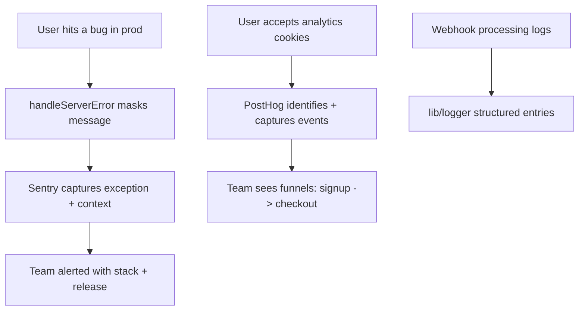

# Instruction: Observability & analytics

## Feature

- **Summary**: Add the day-one production stack the audit found missing: Sentry (errors, server+client+edge), PostHog (product analytics, consent-gated), and a minimal structured logger replacing scattered `console.error`/`console.warn`.
- **Stack**: @sentry/nextjs (latest), posthog-js + posthog-node (latest), Next.js 16.1 instrumentation hooks
- **Branch name**: `feat/observability`
- **Parent Plan**: `./2026_07_05-audit-boilerplate-yc-master.md`
- **Sequence**: 3 of 6
- Confidence: 9/10
- Time to implement: 1–2 days

## Architecture projection

### Files to modify

- `next.config.ts` - `withSentryConfig` (source maps upload)
- `app/global-error.tsx` + `app/error.tsx` - report to Sentry
- `app/providers.tsx` - PostHog provider gated by cookie-consent analytics category
- `features/cookie-consent/**` - wire analytics consent to PostHog opt-in/out
- `lib/safe-action.ts` (`handleServerError`) - capture unexpected errors to Sentry before masking
- `utils/errors/handle-api-error.ts` - same capture for API 500s
- `features/billing/services/stripe/handle-webhook.service.ts`, `lib/auth.ts`, other `console.*` call sites - switch to `logger`
- `lib/env.ts` + `.env.example` - `SENTRY_DSN`, `NEXT_PUBLIC_POSTHOG_KEY` (optional vars: absent = disabled, boilerplate still boots)
- `.github/workflows/ci.yml` - build works without Sentry/PostHog secrets

### Files to create

- `instrumentation.ts` + `instrumentation-client.ts` - Sentry init (server/edge/client, Next 16 pattern)
- `lib/logger.ts` - structured logger (level, context object; console transport in dev, Sentry breadcrumbs in prod)
- `lib/analytics.ts` - typed `capture(event, properties)` wrapper (client + server)
- `__tests__/lib/logger.test.ts` - logger contract

### Files to delete

- none

## Applicable rules

| Tool   | Name       | Path                          | Why it applies                                      |
| ------ | ---------- | ----------------------------- | --------------------------------------------------- |
| claude | cache      | `.claude/rules/cache.md`      | Instrumentation must not break PPR/static rendering |
| claude | action     | `.claude/rules/action.md`     | Error capture hooks into safe-action handler        |
| claude | code-style | `.claude/rules/code-style.md` | All edits                                           |

## User Journey

## Risk register

| Risk                              | Impact                                     | Mitigation                                                                               |
| --------------------------------- | ------------------------------------------ | ---------------------------------------------------------------------------------------- |
| PostHog fired without consent     | GDPR violation (repo ships cookie consent) | Init only after analytics consent; opt-out default; test the gate                        |
| Sentry env vars required at build | Boilerplate no longer boots from clone     | All observability env vars optional; no-op clients when absent                           |
| CSP nonce blocks vendor scripts   | Silent data loss                           | Extend `proxy.ts` CSP `connect-src`/`script-src` for Sentry/PostHog hosts; verify in dev |
| Bundle weight on public pages     | Slower LCP                                 | Lazy-init PostHog post-hydration; Sentry client config minimal                           |

## Implementation phases

### Phase 1: Sentry

> Server, edge and client errors captured with release + source maps.

#### Tasks

1. Install @sentry/nextjs; `instrumentation.ts` / `instrumentation-client.ts`; `withSentryConfig`
2. Capture in `handleServerError`, `handleApiError`, `global-error.tsx`
3. Optional env vars in `lib/env.ts` + `.env.example`; CSP allowlist
4. Verify a thrown test error appears in Sentry (dev DSN)

#### Acceptance criteria

- [ ] Unexpected action/API/render errors reach Sentry; expected `AppError`s do not
- [ ] Build works with and without `SENTRY_DSN`

### Phase 2: Structured logger

> One logging surface, no stray console calls.

#### Tasks

1. Create `lib/logger.ts` (debug/info/warn/error, context object)
2. Replace `console.error`/`console.warn` call sites in `features/` and `lib/`
3. Contract test

#### Acceptance criteria

- [ ] grep for `console.error|console.warn` outside `lib/logger.ts` returns 0 in features/ lib/
- [ ] Webhook failures produce structured entries + Sentry events

### Phase 3: PostHog behind consent

> Product analytics only after explicit consent.

#### Tasks

1. Install posthog-js/posthog-node; `lib/analytics.ts` typed wrapper
2. Provider in `app/providers.tsx` gated by cookie-consent analytics category; opt-out on revoke
3. Seed core events: signup, org created, checkout started/completed, invitation sent
4. Test consent gating

#### Acceptance criteria

- [ ] No PostHog network calls before consent; events flow after
- [ ] `pnpm build && pnpm test` green with vars absent

## Amendments

🤖 **2026-07-06 — Phase 0 groundwork (dependency-free) implemented.** Per an
explicit constraint from the requester, the observability groundwork was
built with **zero new dependencies** — `package.json` is untouched, no
`@sentry/*` or `posthog-*` packages were installed. This covers the
dependency-free subset of Phase 1 (partial), all of Phase 2, and the
dependency-free subset of Phase 3:

- `lib/logger.ts` — the structured logger (debug/info/warn/error, console
  transport, pretty in dev / single-line JSON in prod). Every
  `console.error`/`console.warn` in `features/`, `lib/`, `utils/` now goes
  through it (verified by the plan's own `success_condition` grep).
- `lib/observability.ts` — `captureException(error, context?)`, the seam
  where `Sentry.captureException` plugs in later. Wired into
  `lib/safe-action.ts` (`handleServerError`) and
  `utils/errors/handle-api-error.ts` (`handleApiError`) for **unexpected**
  errors only — `AppError`/`ZodError` business errors never reach it, tested
  explicitly in `__tests__/lib/safe-action.test.ts` and
  `__tests__/utils/errors/handle-api-error.test.ts`.
- `lib/analytics.ts` — `trackEvent(event, properties?)`, a typed no-op
  tracker over the `AnalyticsEvent` union from Phase 3's task list
  (`user_signed_up`, `organization_created`, `checkout_started`,
  `subscription_activated`, `invitation_sent`, `project_created`). Wired at
  two exemplar sites only (`sign-up.action.ts` → `user_signed_up`,
  `create-checkout.action.ts` → `checkout_started`) to demonstrate the
  pattern without a full funnel instrumentation pass.
- `lib/env.ts` + `.env.example` — `SENTRY_DSN`, `NEXT_PUBLIC_SENTRY_DSN`,
  `NEXT_PUBLIC_POSTHOG_KEY`, `NEXT_PUBLIC_POSTHOG_HOST` declared optional;
  the app boots identically whether they're set or not.
- `docs/OBSERVABILITY.md` — runbook: what's active today, and the exact
  remaining steps (installs, `instrumentation.ts`/`instrumentation-client.ts`,
  `withSentryConfig`, CSP additions in `proxy.ts`, `PostHogProvider` gated by
  cookie consent) to flip Sentry and PostHog on.

**Remaining phases are now scoped down to "install + fill two seams":**

- **Phase 1 (Sentry)** — the `captureException` call sites already exist.
  Remaining: `pnpm add @sentry/nextjs`, `instrumentation.ts` /
  `instrumentation-client.ts`, `withSentryConfig`, fill in the
  `Sentry.captureException(...)` body documented in the JSDoc of
  `lib/observability.ts`, wire `app/global-error.tsx`/`app/error.tsx`, extend
  `proxy.ts` CSP, set `SENTRY_DSN`/`NEXT_PUBLIC_SENTRY_DSN`.
- **Phase 2 (Structured logger)** — complete. No remaining work.
- **Phase 3 (PostHog)** — the `trackEvent` call sites already exist for two
  events. Remaining: `pnpm add posthog-js posthog-node`, fill in the
  `posthogClient.capture(...)` body documented in the JSDoc of
  `lib/analytics.ts`, add the remaining funnel events, add a
  `PostHogProvider` in `app/providers.tsx` gated by the cookie-consent
  analytics category, extend `proxy.ts` CSP, set
  `NEXT_PUBLIC_POSTHOG_KEY`/`NEXT_PUBLIC_POSTHOG_HOST`.

Validation re-run for this amendment: `pnpm test && pnpm typecheck && pnpm lint && pnpm build` all green; `git diff package.json` empty (no dependency added).

## Log

### #1

- Implemented the dependency-free groundwork described in the Amendments
  above: `lib/logger.ts`, `lib/observability.ts`, `lib/analytics.ts`, capture
  wiring in `lib/safe-action.ts`/`utils/errors/handle-api-error.ts`, two
  `trackEvent` exemplar sites, optional env vars in `lib/env.ts` +
  `.env.example`, `docs/OBSERVABILITY.md`, and tests
  (`__tests__/lib/logger.test.ts`, `__tests__/lib/analytics.test.ts`,
  `__tests__/lib/safe-action.test.ts`, extended
  `__tests__/utils/errors/handle-api-error.test.ts`).
- Replaced every `console.error`/`console.warn` in `features/`, `lib/`,
  `utils/` with `logger.*` calls carrying context objects. No exceptions
  found outside `lib/logger.ts` itself (no seed/script console usages exist
  in this repo to exempt).
- Added a narrow `no-console` ESLint override for `lib/logger.ts` (the
  designated transport) and for the two logger/analytics test files that
  spy on `console.log` directly — the repo's existing `no-console: warn`
  rule already allowed `warn`/`error` everywhere, this only silences the
  expected `console.log` usage in those specific files.
- `package.json` and `pnpm-lock.yaml` are unchanged — verified via `git diff
--stat`.

## Validation flow demonstration

1. Clone with no observability env vars → app boots, no errors
2. Add DSN + key, throw test error → visible in Sentry with source maps
3. Accept analytics cookies, sign up → `user_signed_up` in PostHog; revoke → events stop
4. Trigger webhook failure → structured log + Sentry event
