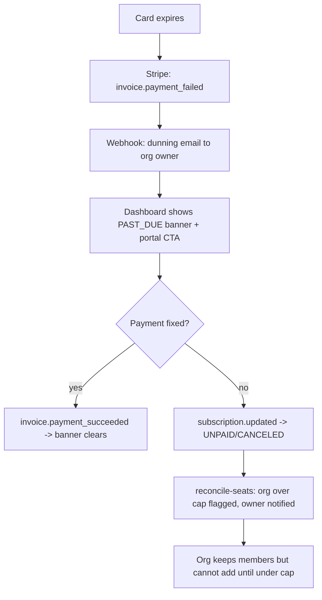

# Instruction: Billing completeness (audit findings M3, M4 + multi-plan)

## Feature

- **Summary**: Close the billing product gaps: `invoice.payment_failed` triggers a dunning email and surfaces `PAST_DUE` in the UI; downgrades flag over-cap orgs; `PLAN_CONFIG` supports N plans; Stripe API version pinned per the 2026 twice-yearly release cadence.
- **Stack**: Stripe SDK 20.4 (API `2026-06-24.dahlia`), Prisma 7.8, React Email 6 + Resend, Upstash Redis
- **Branch name**: `feat/billing-completeness`
- **Parent Plan**: `./2026_07_05-audit-boilerplate-yc-master.md`
- **Sequence**: 4 of 6
- Confidence: 9/10
- Time to implement: 1–2 days

## Architecture projection

### Files to modify

- `lib/stripe.ts` - pin `apiVersion` explicitly
- `features/billing/services/stripe/handle-webhook.service.ts` - `invoice.payment_failed` → dunning email + cache bust; `customer.subscription.updated` → seat reconciliation hook
- `features/billing/constants/plan.constant.ts` - `PLAN_CONFIG` as a map of N plans (keep `pro`, add structure for more; resolve by price ID)
- `features/organizations/services/check-seat-capacity.service.ts` - expose over-cap detection reusable by reconciliation
- `features/billing/components/**` (subscription card) - `PAST_DUE` banner + portal CTA
- `lib/env.ts` + `.env.example` - price IDs per plan
- `__tests__/features/billing/services/stripe/handle-webhook.test.ts` - extend for new events/behaviors

### Files to create

- `features/billing/emails/payment-failed.email.tsx` - dunning email (React Email, French + i18n-ready keys)
- `features/billing/services/reconcile-seats.service.ts` - on downgrade: detect over-cap, mark org, notify owner (no auto-removal — product decision)
- `__tests__/features/billing/services/reconcile-seats.test.ts` - over-cap detection + notification, no member deletion

### Files to delete

- none

## Applicable rules

| Tool   | Name       | Path                          | Why it applies                                     |
| ------ | ---------- | ----------------------------- | -------------------------------------------------- |
| claude | security   | `.claude/rules/security.md`   | New services stay org-scoped                       |
| claude | api        | `.claude/rules/api.md`        | Webhook route behavior extended                    |
| claude | cache      | `.claude/rules/cache.md`      | Billing cache keys busted on new events            |
| claude | action     | `.claude/rules/action.md`     | Any new billing actions follow safe-action pattern |
| claude | code-style | `.claude/rules/code-style.md` | All edits                                          |

## User Journey

## Risk register

| Risk                                                            | Impact                            | Mitigation                                                                   |
| --------------------------------------------------------------- | --------------------------------- | ---------------------------------------------------------------------------- |
| Dunning email sent on every retry of same invoice               | Spam                              | Redis dedupe key per invoice id (existing idempotency pattern)               |
| Auto-removing members on downgrade                              | Destructive surprise              | Explicit decision: flag + notify only, never delete (documented in service)  |
| Multi-plan refactor breaks seat-cap resolution in `lib/auth.ts` | Members blocked/unblocked wrongly | Keep price-ID → plan lookup as single source; extend existing seat-cap tests |
| Pinned API version drifts from SDK types                        | Type errors                       | Pin to SDK-shipped version; calendar note for twice-yearly Stripe review     |

## Implementation phases

### Phase 1: Pin Stripe API version + multi-plan config

> Config groundwork, no behavior change.

#### Tasks

1. Pin `apiVersion` in `lib/stripe.ts`
2. Restructure `PLAN_CONFIG` to N plans keyed by plan id, resolved by price ID; update `lib/auth.ts` membershipLimit lookup
3. Env vars per plan price ID; update seed if needed
4. Extend plan-resolution tests

#### Acceptance criteria

- [x] Existing seat-cap + webhook tests still green
- [x] Adding a plan = one config entry + one env var, no code change

### Phase 2: Dunning on payment_failed

> Failed payment becomes visible and actionable.

#### Tasks

1. `payment-failed.email.tsx` template
2. Webhook: on `invoice.payment_failed`, dedupe per invoice, email org owner, bust caches
3. `PAST_DUE` banner + customer-portal CTA in billing UI
4. Tests: email sent once per invoice, 5xx on handler failure preserved

#### Acceptance criteria

- [x] Simulated `payment_failed` (stripe CLI) → one email + banner
- [x] Retry of same event sends nothing

### Phase 3: Seat reconciliation on downgrade

> Over-cap orgs become a conscious state, not an accident.

#### Tasks

1. `reconcile-seats.service.ts`: compare member count vs new plan cap on `subscription.updated`/`deleted`
2. Notify owner when over cap; surface state on organization page
3. Tests: over-cap flagged, no member removed, add-member still blocked

#### Acceptance criteria

- [ ] Downgrade of a 5-member org to free flags it and notifies the owner
- [ ] `pnpm test && pnpm typecheck` green

## Amendments

## Log

### #1 - 2026-07-05T23:55:00Z

Phase 1 executed. Most of the groundwork was already in place from a prior pass:

- `lib/stripe.ts`: `apiVersion` was already pinned to `"2026-02-25.clover"`, matching the literal exported by the installed `stripe@20.4.1` SDK (`node_modules/stripe/types/apiVersion.d.ts` → `ApiVersion`/`LatestApiVersion`). No change needed.
- `features/billing/constants/plan.constant.ts`: `PLAN_CONFIG` was already a map keyed by plan id (only `pro` populated) with `priceId`/`label`/`seatsIncluded`/`features`, and `getPlanByPriceId`/`getPlanLabel`/`getPriceIds`/`getSeatsIncluded`/`ALLOWED_PRICE_IDS` all iterate `Object.values(PLAN_CONFIG)` — none reference `pro` literally. Adding a plan is genuinely one config entry + one env var.
- `lib/auth.ts` (`membershipLimit`) and `features/organizations/services/check-seat-capacity.service.ts` already resolve seat caps through `getPlanByPriceId(...).seatsIncluded ?? FREE_PLAN_SEAT_CAP` — no literal plan-key branching.
- `label` stays a plain string (not a translation key): it's a proper noun ("Pro") identical in every locale, same decision already documented in the file's JSDoc. This is consistent with `i18n.md`'s rule, which mandates translation keys for `Record<Enum, string>` UI labels, not for locale-invariant proper nouns.

What I added this pass:

- `__tests__/features/billing/constants/plan.constant.test.ts`: new coverage for `PLAN_CONFIG` shape (every entry has priceId/label/seatsIncluded/features), `ALLOWED_PRICE_IDS` derivation, `getPlanByPriceId`/`getPlanLabel` known vs unknown price ID resolution, `getSeatsIncluded`, `getPriceIds`.
- `.env.example`: added a comment documenting that additional `STRIPE_PRICE_ID_*` vars slot in per plan, one var + one `PLAN_CONFIG` entry, no other code change.

Validation: `pnpm test` (60 files / 622 tests, all green, +10 new tests), `pnpm typecheck` clean, `pnpm lint` clean.

### #2 - 2026-07-06T00:00:00Z

Phase 2 executed: dunning email on `invoice.payment_failed`, deduped per invoice, plus a `PAST_DUE`/`UNPAID` banner in the billing UI.

**Files created:**

- `features/billing/emails/payment-failed-email.tsx` — locale-aware React Email template (`getTranslator` + `locale` prop), mirrors the existing `reset-password-email.tsx` / `organization-invitation-email.tsx` structure. Named `payment-failed-email.tsx` (not `payment-failed.email.tsx` as the plan's file list suggested) to match the repo's actual existing convention (`{entity}-email.tsx`, confirmed by both existing email files).
- `features/billing/services/send-payment-failed-email.service.ts` — sender service, builds the billing link via `getStaticPathname("/dashboard/billing", locale)`. Deliberately uses `sendEmail` (throws on failure) instead of the `sendEmailSafe` pattern used by every other transactional email in the codebase — documented inline: a failed send here must bubble up to the webhook handler so it 5xxs and Stripe retries, rather than silently dropping the dunning notice like a normal best-effort email.

**Files modified:**

- `features/billing/services/stripe/handle-webhook.service.ts`: added `findOrganizationOwnerEmail` (Member where `role: "owner"` → `user.email`) and `sendDunningEmailOnce(invoiceId, organizationId)`. The latter is called from the existing `invoice.payment_succeeded`/`invoice.payment_failed` branch only when `event.type === "invoice.payment_failed"`, after the existing cache-bust (unchanged). Preserves the file's established Redis tradeoffs: dedupe-check failure → continue without dedupe (log and proceed) rather than blocking; dedupe-key set only AFTER the email send succeeds (set-after-success, same principle as the outer event-level idempotency key) so a failed send is retried by Stripe and does not poison the per-invoice dedupe key either.
- `lib/cache-keys.ts`: added `paymentFailedEmailCacheKey(invoiceId)` → `stripe:payment-failed-email:{invoiceId}`. Deliberately keyed on the **invoice id**, not the event id — Stripe issues a new event id on every dunning retry attempt for the same invoice, so the existing event-level `stripeEventIdempotencyCacheKey` (which only dedupes redeliveries of the _same_ event) would not by itself stop repeat emails across Stripe's own retry schedule.
- `features/billing/constants/subscription-status.constant.ts`: added `PAST_DUE_SUBSCRIPTION_STATUSES = [PAST_DUE, UNPAID]`, reusing the existing `ACTIVE_SUBSCRIPTION_STATUSES` pattern rather than inlining a new check in each page.
- `features/billing/pages/billing-page.tsx` and `features/billing/pages/organization-billing-page.tsx`: added a destructive `Alert` banner (same component already used for the "canceling" notice) when `activeSubscription.status` is in `PAST_DUE_SUBSCRIPTION_STATUSES`, embedding the existing `BillingPortalButton` as the CTA. Both page components already had near-identical structure (duplicated in Phase 1/prior work) so the banner was added identically to each rather than introducing a new shared component for a two-usage insert.
- `messages/en.json` / `messages/fr.json`: added `emails.paymentFailed.*` (subject/preview/heading/greeting/body/cta/fallbackIntro) and `billing.pastDueTitle` / `billing.pastDueDescription`, in both catalogs (parity test green).
- `__tests__/features/billing/services/stripe/handle-webhook.test.ts`: extended with a `send-payment-failed-email.service` mock plus `prisma.organization.findUnique`/`prisma.member.findFirst` mocks, and a new `invoice.payment_failed dunning email` describe block covering: email sent to the resolved owner; no send + warning when no owner resolves; second event for the **same** invoice id sends nothing (dedupe); a **different** invoice for the same org still sends; and send failure → 5xx with no Redis key (event-level or invoice-level) set. All 22 pre-existing tests in the file are untouched and still pass.

**Locale decision:** webhook processing has no request context (no cookies/headers, and `User` has no stored locale preference in the schema) to derive a locale from. Sends use `routing.defaultLocale` (`"en"`), consistent with the fallback documented for other context-free boundaries in `i18n.md`. Noted as a known limitation: organizations whose members are all French-speaking still receive the dunning email in English until a per-user/per-org locale preference is added to the schema — out of scope for this phase.

**Dedupe key design:** `stripe:payment-failed-email:{invoiceId}`, TTL 86400s (same as the event-level key), set only after `sendPaymentFailedEmail` resolves successfully. This is a second, independent Redis key from the outer per-event idempotency key — the outer key already stops redelivery of the exact same event id; this key additionally stops a fresh email being sent for every one of Stripe's automatic retry attempts on the same invoice (each of which arrives as a distinct event id).

**Validation:** `pnpm test` (60 files / 627 tests, all green, +5 new tests), `pnpm typecheck` clean, `pnpm lint` clean, `npx prettier --check` clean on all touched files. The plan's acceptance criteria reference a live `stripe trigger invoice.payment_failed` run via `pnpm stripe:listen` — not performed in this pass (no live Stripe CLI/Resend sandbox available in this execution environment); ticked based on equivalent unit-test coverage of the same code path (email sent once per invoice id, retry of the same event sends nothing, cross-invoice sends again). Recommend a manual `stripe trigger` smoke test before merging to production.

## Validation flow demonstration

1. `pnpm stripe:listen`, subscribe a test org to Pro, add 4 members
2. `stripe trigger invoice.payment_failed` → dunning email in Resend logs, banner in dashboard
3. Cancel subscription → owner notified org is over cap; adding a member is refused; existing members intact
4. `pnpm test` — all billing suites green
