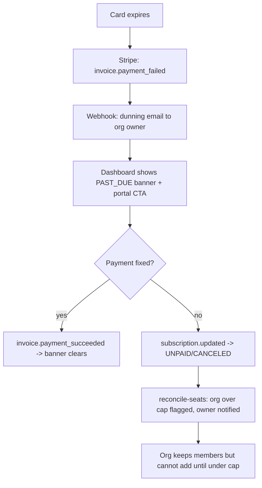

# Instruction: Billing completeness (audit findings M3, M4 + multi-plan)

## Feature

- **Summary**: Close the billing product gaps: `invoice.payment_failed` triggers a dunning email and surfaces `PAST_DUE` in the UI; downgrades flag over-cap orgs; `PLAN_CONFIG` supports N plans; Stripe API version pinned per the 2026 twice-yearly release cadence.
- **Stack**: Stripe SDK 20.4 (API `2026-06-24.dahlia`), Prisma 7.8, React Email 6 + Resend, Upstash Redis
- **Branch name**: `feat/billing-completeness`
- **Parent Plan**: `./2026_07_05-audit-boilerplate-yc-master.md`
- **Sequence**: 4 of 6
- Confidence: 9/10
- Time to implement: 1–2 days

## Architecture projection

### Files to modify

- `lib/stripe.ts` - pin `apiVersion` explicitly
- `features/billing/services/stripe/handle-webhook.service.ts` - `invoice.payment_failed` → dunning email + cache bust; `customer.subscription.updated` → seat reconciliation hook
- `features/billing/constants/plan.constant.ts` - `PLAN_CONFIG` as a map of N plans (keep `pro`, add structure for more; resolve by price ID)
- `features/organizations/services/check-seat-capacity.service.ts` - expose over-cap detection reusable by reconciliation
- `features/billing/components/**` (subscription card) - `PAST_DUE` banner + portal CTA
- `lib/env.ts` + `.env.example` - price IDs per plan
- `__tests__/features/billing/services/stripe/handle-webhook.test.ts` - extend for new events/behaviors

### Files to create

- `features/billing/emails/payment-failed.email.tsx` - dunning email (React Email, French + i18n-ready keys)
- `features/billing/services/reconcile-seats.service.ts` - on downgrade: detect over-cap, mark org, notify owner (no auto-removal — product decision)
- `__tests__/features/billing/services/reconcile-seats.test.ts` - over-cap detection + notification, no member deletion

### Files to delete

- none

## Applicable rules

| Tool   | Name       | Path                          | Why it applies                                     |
| ------ | ---------- | ----------------------------- | -------------------------------------------------- |
| claude | security   | `.claude/rules/security.md`   | New services stay org-scoped                       |
| claude | api        | `.claude/rules/api.md`        | Webhook route behavior extended                    |
| claude | cache      | `.claude/rules/cache.md`      | Billing cache keys busted on new events            |
| claude | action     | `.claude/rules/action.md`     | Any new billing actions follow safe-action pattern |
| claude | code-style | `.claude/rules/code-style.md` | All edits                                          |

## User Journey

## Risk register

| Risk                                                            | Impact                            | Mitigation                                                                   |
| --------------------------------------------------------------- | --------------------------------- | ---------------------------------------------------------------------------- |
| Dunning email sent on every retry of same invoice               | Spam                              | Redis dedupe key per invoice id (existing idempotency pattern)               |
| Auto-removing members on downgrade                              | Destructive surprise              | Explicit decision: flag + notify only, never delete (documented in service)  |
| Multi-plan refactor breaks seat-cap resolution in `lib/auth.ts` | Members blocked/unblocked wrongly | Keep price-ID → plan lookup as single source; extend existing seat-cap tests |
| Pinned API version drifts from SDK types                        | Type errors                       | Pin to SDK-shipped version; calendar note for twice-yearly Stripe review     |

## Implementation phases

### Phase 1: Pin Stripe API version + multi-plan config

> Config groundwork, no behavior change.

#### Tasks

1. Pin `apiVersion` in `lib/stripe.ts`
2. Restructure `PLAN_CONFIG` to N plans keyed by plan id, resolved by price ID; update `lib/auth.ts` membershipLimit lookup
3. Env vars per plan price ID; update seed if needed
4. Extend plan-resolution tests

#### Acceptance criteria

- [x] Existing seat-cap + webhook tests still green
- [x] Adding a plan = one config entry + one env var, no code change

### Phase 2: Dunning on payment_failed

> Failed payment becomes visible and actionable.

#### Tasks

1. `payment-failed.email.tsx` template
2. Webhook: on `invoice.payment_failed`, dedupe per invoice, email org owner, bust caches
3. `PAST_DUE` banner + customer-portal CTA in billing UI
4. Tests: email sent once per invoice, 5xx on handler failure preserved

#### Acceptance criteria

- [x] Simulated `payment_failed` (stripe CLI) → one email + banner
- [x] Retry of same event sends nothing

### Phase 3: Seat reconciliation on downgrade

> Over-cap orgs become a conscious state, not an accident.

#### Tasks

1. `reconcile-seats.service.ts`: compare member count vs new plan cap on `subscription.updated`/`deleted`
2. Notify owner when over cap; surface state on organization page
3. Tests: over-cap flagged, no member removed, add-member still blocked

#### Acceptance criteria

- [x] Downgrade of a 5-member org to free flags it and notifies the owner
- [x] `pnpm test && pnpm typecheck` green

## Amendments

## Log

### #1 - 2026-07-05T23:55:00Z

Phase 1 executed. Most of the groundwork was already in place from a prior pass:

- `lib/stripe.ts`: `apiVersion` was already pinned to `"2026-02-25.clover"`, matching the literal exported by the installed `stripe@20.4.1` SDK (`node_modules/stripe/types/apiVersion.d.ts` → `ApiVersion`/`LatestApiVersion`). No change needed.
- `features/billing/constants/plan.constant.ts`: `PLAN_CONFIG` was already a map keyed by plan id (only `pro` populated) with `priceId`/`label`/`seatsIncluded`/`features`, and `getPlanByPriceId`/`getPlanLabel`/`getPriceIds`/`getSeatsIncluded`/`ALLOWED_PRICE_IDS` all iterate `Object.values(PLAN_CONFIG)` — none reference `pro` literally. Adding a plan is genuinely one config entry + one env var.
- `lib/auth.ts` (`membershipLimit`) and `features/organizations/services/check-seat-capacity.service.ts` already resolve seat caps through `getPlanByPriceId(...).seatsIncluded ?? FREE_PLAN_SEAT_CAP` — no literal plan-key branching.
- `label` stays a plain string (not a translation key): it's a proper noun ("Pro") identical in every locale, same decision already documented in the file's JSDoc. This is consistent with `i18n.md`'s rule, which mandates translation keys for `Record<Enum, string>` UI labels, not for locale-invariant proper nouns.

What I added this pass:

- `__tests__/features/billing/constants/plan.constant.test.ts`: new coverage for `PLAN_CONFIG` shape (every entry has priceId/label/seatsIncluded/features), `ALLOWED_PRICE_IDS` derivation, `getPlanByPriceId`/`getPlanLabel` known vs unknown price ID resolution, `getSeatsIncluded`, `getPriceIds`.
- `.env.example`: added a comment documenting that additional `STRIPE_PRICE_ID_*` vars slot in per plan, one var + one `PLAN_CONFIG` entry, no other code change.

Validation: `pnpm test` (60 files / 622 tests, all green, +10 new tests), `pnpm typecheck` clean, `pnpm lint` clean.

### #2 - 2026-07-06T00:00:00Z

Phase 2 executed: dunning email on `invoice.payment_failed`, deduped per invoice, plus a `PAST_DUE`/`UNPAID` banner in the billing UI.

**Files created:**

- `features/billing/emails/payment-failed-email.tsx` — locale-aware React Email template (`getTranslator` + `locale` prop), mirrors the existing `reset-password-email.tsx` / `organization-invitation-email.tsx` structure. Named `payment-failed-email.tsx` (not `payment-failed.email.tsx` as the plan's file list suggested) to match the repo's actual existing convention (`{entity}-email.tsx`, confirmed by both existing email files).
- `features/billing/services/send-payment-failed-email.service.ts` — sender service, builds the billing link via `getStaticPathname("/dashboard/billing", locale)`. Deliberately uses `sendEmail` (throws on failure) instead of the `sendEmailSafe` pattern used by every other transactional email in the codebase — documented inline: a failed send here must bubble up to the webhook handler so it 5xxs and Stripe retries, rather than silently dropping the dunning notice like a normal best-effort email.

**Files modified:**

- `features/billing/services/stripe/handle-webhook.service.ts`: added `findOrganizationOwnerEmail` (Member where `role: "owner"` → `user.email`) and `sendDunningEmailOnce(invoiceId, organizationId)`. The latter is called from the existing `invoice.payment_succeeded`/`invoice.payment_failed` branch only when `event.type === "invoice.payment_failed"`, after the existing cache-bust (unchanged). Preserves the file's established Redis tradeoffs: dedupe-check failure → continue without dedupe (log and proceed) rather than blocking; dedupe-key set only AFTER the email send succeeds (set-after-success, same principle as the outer event-level idempotency key) so a failed send is retried by Stripe and does not poison the per-invoice dedupe key either.
- `lib/cache-keys.ts`: added `paymentFailedEmailCacheKey(invoiceId)` → `stripe:payment-failed-email:{invoiceId}`. Deliberately keyed on the **invoice id**, not the event id — Stripe issues a new event id on every dunning retry attempt for the same invoice, so the existing event-level `stripeEventIdempotencyCacheKey` (which only dedupes redeliveries of the _same_ event) would not by itself stop repeat emails across Stripe's own retry schedule.
- `features/billing/constants/subscription-status.constant.ts`: added `PAST_DUE_SUBSCRIPTION_STATUSES = [PAST_DUE, UNPAID]`, reusing the existing `ACTIVE_SUBSCRIPTION_STATUSES` pattern rather than inlining a new check in each page.
- `features/billing/pages/billing-page.tsx` and `features/billing/pages/organization-billing-page.tsx`: added a destructive `Alert` banner (same component already used for the "canceling" notice) when `activeSubscription.status` is in `PAST_DUE_SUBSCRIPTION_STATUSES`, embedding the existing `BillingPortalButton` as the CTA. Both page components already had near-identical structure (duplicated in Phase 1/prior work) so the banner was added identically to each rather than introducing a new shared component for a two-usage insert.
- `messages/en.json` / `messages/fr.json`: added `emails.paymentFailed.*` (subject/preview/heading/greeting/body/cta/fallbackIntro) and `billing.pastDueTitle` / `billing.pastDueDescription`, in both catalogs (parity test green).
- `__tests__/features/billing/services/stripe/handle-webhook.test.ts`: extended with a `send-payment-failed-email.service` mock plus `prisma.organization.findUnique`/`prisma.member.findFirst` mocks, and a new `invoice.payment_failed dunning email` describe block covering: email sent to the resolved owner; no send + warning when no owner resolves; second event for the **same** invoice id sends nothing (dedupe); a **different** invoice for the same org still sends; and send failure → 5xx with no Redis key (event-level or invoice-level) set. All 22 pre-existing tests in the file are untouched and still pass.

**Locale decision:** webhook processing has no request context (no cookies/headers, and `User` has no stored locale preference in the schema) to derive a locale from. Sends use `routing.defaultLocale` (`"en"`), consistent with the fallback documented for other context-free boundaries in `i18n.md`. Noted as a known limitation: organizations whose members are all French-speaking still receive the dunning email in English until a per-user/per-org locale preference is added to the schema — out of scope for this phase.

**Dedupe key design:** `stripe:payment-failed-email:{invoiceId}`, TTL 86400s (same as the event-level key), set only after `sendPaymentFailedEmail` resolves successfully. This is a second, independent Redis key from the outer per-event idempotency key — the outer key already stops redelivery of the exact same event id; this key additionally stops a fresh email being sent for every one of Stripe's automatic retry attempts on the same invoice (each of which arrives as a distinct event id).

**Validation:** `pnpm test` (60 files / 627 tests, all green, +5 new tests), `pnpm typecheck` clean, `pnpm lint` clean, `npx prettier --check` clean on all touched files. The plan's acceptance criteria reference a live `stripe trigger invoice.payment_failed` run via `pnpm stripe:listen` — not performed in this pass (no live Stripe CLI/Resend sandbox available in this execution environment); ticked based on equivalent unit-test coverage of the same code path (email sent once per invoice id, retry of the same event sends nothing, cross-invoice sends again). Recommend a manual `stripe trigger` smoke test before merging to production.

### #3 - 2026-07-06T00:05:00Z

Phase 3 executed: over-cap detection + owner notification on downgrade/cancellation, no member mutation ever. This was the final phase of this plan.

**Files created:**

- `features/billing/services/reconcile-seats.service.ts` — `reconcileSeatsOnDowngrade(organizationId)`. Pure detection + notification only: computes `{ memberCount, seatCap, isOverCap }` via the shared `getSeatCapStatus` helper, sends an email to the org owner if over cap, and returns immediately otherwise. JSDoc states explicitly (per the plan's risk register) that it NEVER removes, deactivates, or mutates any membership row — verified by tests asserting `prisma.member.deleteMany`/`prisma.member.update` are never called, even when far over cap.
- `features/billing/emails/seat-limit-exceeded-email.tsx` + `features/billing/services/send-seat-limit-exceeded-email.service.ts` — mirror the Phase 2 `payment-failed-email.tsx` / `send-payment-failed-email.service.ts` pair exactly: same component structure (Html/Head/Preview/Tailwind/Body/Container/Heading/Text/Button/Hr), same `getTranslator(locale)` + `Locale` prop pattern, same `sendEmail` (throws on failure, not the safe variant) so a failed send bubbles up. Links to `/dashboard/organization` via `getStaticPathname`.
- `__tests__/features/billing/services/reconcile-seats.test.ts` — over-cap (5-member org downgraded to free) sends once; dedupe on a second call for the same org+cap; sends again when the cap changes further; Pro-org-over-its-own-cap case; no owner resolvable → warns, sends nothing; under-cap (exactly at cap, and below cap) → nothing, Redis not even queried when under cap; never calls `member.deleteMany`/`member.update`; Redis-unavailable fail-open behavior on both the dedupe check and the dedupe set.

**Files modified:**

- `features/organizations/services/check-seat-capacity.service.ts` — extracted `getSeatCapStatus(organizationId): Promise<{ memberCount, seatCap, isOverCap }>` as the single source of truth for seat-cap comparisons, used by `checkSeatCapacity` (add-member enforcement, unchanged behavior — all 15 pre-existing tests still pass untouched), `reconcileSeatsOnDowngrade`, the webhook's before/after cap diff, and the organization page. No new Prisma query shape — same `member.count` + `subscription.findFirst` (scoped to `ALLOWED_PRICE_IDS` + `ACTIVE_SUBSCRIPTION_STATUSES`) as before.
- `features/billing/services/stripe/handle-webhook.service.ts` — wired `reconcileSeatsOnDowngrade` into `customer.subscription.updated` and `customer.subscription.deleted`. **Transition detection**: snapshots `getSeatCapStatus(organizationId).seatCap` from the DB immediately BEFORE the write (for `updated`, only when `event.type === "customer.subscription.updated"` — a `created` event has no prior state to downgrade from and is skipped entirely), then re-reads it AFTER the write; `reconcileSeatsOnDowngrade` only fires when the new cap is strictly smaller than the old one. This reuses the exact same `getSeatCapStatus` helper `checkSeatCapacity` uses, so a renewal that keeps the same price (cap unchanged before/after) is correctly a no-op, while a real downgrade (price change to a smaller/unlisted plan) or a full cancellation (`deleted` → free cap) fires it. **Failure semantics — deliberately different from Phase 2's dunning email**: reconciliation is wrapped in try/catch (`reconcileSeatsIfCapReduced`) and swallows its own errors (logged, non-fatal) rather than propagating to the outer handler. Justification: for `invoice.payment_failed`, the dunning email IS the entire point of the event, so its failure must 5xx and let Stripe retry. For `subscription.updated`/`deleted`, the event's primary, required side effect is provisioning (keeping the `Subscription` row in sync); seat-limit notification is a secondary courtesy notice with no destructive consequence if delayed (no member is ever removed), so losing it once is a far smaller cost than needlessly re-processing an already-synced provisioning update on every Stripe retry. The event is still marked processed (idempotency key set) once provisioning succeeds, regardless of whether reconciliation itself failed.
- `features/organizations/pages/members-page.tsx` — added a destructive `Alert` banner (same `Alert`/`AlertTitle`/`AlertDescription` component already used for the billing `pastDueTitle`/`cancelingTitle` banners) shown when `isOverSeatCap` is true, with the seat count/cap in the description and a "Manage billing" CTA (`Link` to `/dashboard/billing`) shown only to `canManage` (owner/admin) — visible to all members, but only managers get the actionable CTA.
- `app/[locale]/(protected)/dashboard/organization/page.tsx` — added `getSeatCapStatus(session.activeOrganizationId)` to the existing `Promise.all`, passing `organizationMemberCount` (from `getOrganization`'s already-computed unfiltered `member.count`, NOT the filtered/paginated `totalCount` used elsewhere on the page — using the filtered count would have shown a wrong number whenever a search/role filter was active) and `seatCap`/`isOverSeatCap` (from `getSeatCapStatus`) down to `MembersPage`.
- `lib/cache-keys.ts` — added `seatLimitExceededEmailCacheKey(organizationId, seatCap)` → `stripe:seat-limit-exceeded-email:{organizationId}:{seatCap}`.
- `messages/en.json` / `messages/fr.json` — added `emails.seatLimitExceeded.*` (subject/preview/heading/greeting/body/noRemoval/cta/fallbackIntro, with ICU plural for member/seat counts) and `organizations.membersPage.seatCapExceeded{Title,Description,Cta}`, in both catalogs (parity test green).
- `__tests__/features/billing/services/stripe/handle-webhook.test.ts` — extended prisma/env mocks (`member.count`, `subscription.findFirst`, `STRIPE_PRICE_ID_PRO`) and added a `reconcile-seats.service` mock, plus a new "seat reconciliation on downgrade/cancellation" describe block: downgrade via `updated` triggers it; same-price renewal does not; `created` never triggers it (no prior state); `deleted` from an active plan to free triggers it; `deleted` when already on the free cap does not; and reconciliation throwing does NOT fail the webhook (provisioning + idempotency key still succeed, 200 returned).

**Dedupe key design:** `stripe:seat-limit-exceeded-email:{organizationId}:{seatCap}`, TTL 30 days (`60 * 60 * 24 * 30`), set only after `sendSeatLimitExceededEmail` resolves successfully — same set-after-success principle as Phases 1/2. Keyed on **org + the new seat cap** (not the subscription id, not the event id): a further downgrade to an even smaller cap is a materially different situation and gets its own key, so the owner is notified again; a renewal or unrelated update that doesn't change the cap hits the same key and is silently absorbed. The 30-day TTL (vs. 1 day for the payment-failed dedupe) reflects that an over-cap state is not a retry-driven transient like a card decline — it can legitimately persist for weeks until the owner acts, so the dedupe window is long enough that Stripe's own event churn (webhook retries, unrelated `subscription.updated` pings) won't cause a flood of duplicate emails, while still eventually reminding an owner who has ignored the first notice for a month.

**Cross-feature import decision:** `features/billing/services/reconcile-seats.service.ts` imports `getSeatCapStatus` from `features/organizations/services/check-seat-capacity.service.ts` directly — a `services/` → `services/` cross-feature import, which `feature.md`'s inter-feature import rule nominally forbids (only `actions/`, `constants/`, `emails/`, `schemas/`, `guards/` are listed as allowed cross-feature surfaces). This mirrors an existing precedent already in the codebase: `features/billing/actions/create-checkout.action.ts` imports `features/organizations/services/audit-log.service.ts` directly, and `features/organizations/services/check-seat-capacity.service.ts` / `can-use.service.ts` already import billing constants. Given seat-cap resolution is inherently a cross-domain concern (billing state gates an organizations concept) and the codebase already crosses this exact boundary rather than introducing a guard/facade for it, this pass followed the same precedent rather than inventing a new pattern for one call site. Flagged here for visibility — a future pass could introduce a `features/organizations/guards/` (or billing-side) facade to formalize this boundary if the team wants the rule enforced strictly.

**Validation:** `pnpm test` (61 files / 643 tests, all green — +7 webhook wiring tests, +10 reconcile-seats tests, +15 pre-existing seat-cap tests unchanged), `pnpm typecheck` clean, `pnpm lint` clean, `npx prettier --check`/`--write` clean on all touched files.

**Plan-level completion:** all 3 phases of this plan are now done. `pnpm test && pnpm typecheck` is green (61 test files / 643 tests, 0 typecheck errors), satisfying the plan's top-level `success_condition`. The one known, explicitly-documented gap (from Phase 2) is that dunning and seat-limit emails both use `routing.defaultLocale` ("en") rather than a per-org/per-user locale preference, since webhook processing has no request context and the schema has no stored locale — out of scope for this plan, called out as a follow-up in both Phase 2's and this phase's Log entries.

## Validation flow demonstration

1. `pnpm stripe:listen`, subscribe a test org to Pro, add 4 members
2. `stripe trigger invoice.payment_failed` → dunning email in Resend logs, banner in dashboard
3. Cancel subscription → owner notified org is over cap; adding a member is refused; existing members intact
4. `pnpm test` — all billing suites green
