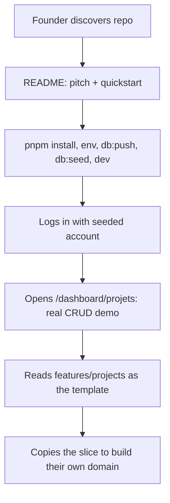

# Instruction: Credibility & DX (README, cleanup, example domain)

## Feature

- **Summary**: Make the boilerplate presentable to third-party teams: rewrite the default create-next-app README, remove committed build artifacts, fix minor schema inconsistency, and build `features/projects` into the full reference domain the security rules already use as their worked example.
- **Stack**: Next.js 16.1, Prisma 7.8, TanStack Table/Form, next-safe-action 8.5, Nuqs 2.9, Vitest 4
- **Branch name**: `feat/dx-credibility`
- **Parent Plan**: `./2026_07_05-audit-boilerplate-yc-master.md`
- **Sequence**: 5 of 6
- Confidence: 9/10
- Time to implement: 1–2 days

## Architecture projection

### Files to modify

- `README.md` - full rewrite: pitch, feature list, stack table, quickstart (env, seed, stripe:listen), architecture overview, testing/CI, deployment
- `.gitignore` - add `coverage/`, `*.tsbuildinfo`
- `prisma/schema.prisma` - add `Project` model (org-scoped: `organizationId`, indexes); fix `Organization.updatedAt` nullability
- `features/projects/pages/projects-page.tsx` - replace stub with real list page (table, filters, pagination via Nuqs)
- `app/(protected)/dashboard/projets/page.tsx` - wire real page + loading
- `prisma/seed.ts` + `prisma/seed/` - project seed module

### Files to create

- `features/projects/schemas/project.schema.ts` - Zod create/update/filter schemas
- `features/projects/services/get-projects.service.ts` - org-scoped list (`select`+`take`+`$transaction` count, membership enforced)
- `features/projects/services/get-project.service.ts` - single fetch, IDOR-safe (the `.claude/rules/security.md` worked example, made real)
- `features/projects/services/create-project.service.ts` / `update-project.service.ts` / `delete-project.service.ts`
- `features/projects/actions/*.action.ts` - safe-actions with org scoping
- `features/projects/components/` - table columns, filters, create/edit form (TanStack Form), delete modal
- `features/projects/constants/project-seo.constant.ts` + filter constants
- `prisma/seed/project.seed.ts` - seeds incl. edge cases per seed rules
- `__tests__/features/projects/**` - schema, service isolation (cross-org IDOR), action tests
- `docs/ARCHITECTURE.md` - human-readable digest of `.claude/rules/` conventions (linked from README)

### Files to delete

- `coverage/` - committed build artifact
- `tsconfig.tsbuildinfo` - committed build cache (3 MB)

## Applicable rules

| Tool   | Name       | Path                          | Why it applies                                  |
| ------ | ---------- | ----------------------------- | ----------------------------------------------- |
| claude | feature    | `.claude/rules/feature.md`    | New full feature slice                          |
| claude | security   | `.claude/rules/security.md`   | Project services are its literal worked example |
| claude | action     | `.claude/rules/action.md`     | New CRUD actions                                |
| claude | page       | `.claude/rules/page.md`       | Projects page + loading + SEO                   |
| claude | form       | `.claude/rules/form.md`       | Create/edit forms                               |
| claude | filter     | `.claude/rules/filter.md`     | List filters/pagination/columns                 |
| claude | seed       | `.claude/rules/seed.md`       | Project seed module                             |
| claude | code-style | `.claude/rules/code-style.md` | All edits                                       |

## User Journey

## Risk register

| Risk                                               | Impact                    | Mitigation                                                                              |
| -------------------------------------------------- | ------------------------- | --------------------------------------------------------------------------------------- |
| Project model too opinionated for a template       | Users fight the example   | Keep it minimal: name, description, status enum, org FK — a shape, not a product        |
| Migration on existing envs (updatedAt nullability) | Deploy friction           | Backfill migration with default now(); note in README                                   |
| README overpromises vs code                        | Credibility damage        | Every claim traceable to a feature verified in this audit                               |
| Part 2 (i18n) lands before/after this              | String conventions differ | Follow current convention (French UI); part 2 extracts projects namespace like the rest |

## Implementation phases

### Phase 1: Repo cleanup

> Remove artifacts that undermine a first impression.

#### Tasks

1. `git rm -r --cached coverage/ tsconfig.tsbuildinfo`; extend `.gitignore`
2. Fix `Organization.updatedAt` to non-nullable with backfill migration

#### Acceptance criteria

- [x] `git ls-files` clean of artifacts; `pnpm db:migrate` applies

### Phase 2: Project reference domain

> The stub becomes the template feature.

#### Tasks

1. Prisma `Project` model + migration + seed module
2. Services (org-scoped, membership-enforced), actions, schemas
3. UI: table + filters + pagination (Nuqs), create/edit form, delete modal, loading state
4. Tests: schema, cross-org isolation, actions

#### Acceptance criteria

- [x] Full CRUD works at `/dashboard/projets`, scoped to active org
- [x] Cross-org access test proves IDOR safety
- [x] `pnpm test` green

### Phase 3: README + human docs

> Sellable front door.

#### Tasks

1. Rewrite `README.md` (pitch, features, stack, quickstart, scripts, architecture link, deploy notes)
2. `docs/ARCHITECTURE.md` distilled from `.claude/rules/` + `engineering-principles.md`
3. Verify quickstart on a clean clone

#### Acceptance criteria

- [x] A newcomer reaches a running seeded app following README only
- [x] `pnpm build` green

## Amendments

- 🤖 Dropped `features/projects/constants/project-seo.constant.ts` from the architecture projection — no protected page in the repo carries an SEO constant (checked `organisation`, `admin/utilisateurs`); adding one would contradict the convention this reference slice must demonstrate.
- 🤖 Dropped action-level tests from Phase 2 scope — the repo has no action-test pattern to mirror, and the security surface (membership enforcement, cross-org IDOR) is fully covered at the service layer (`project-isolation.test.ts`).

## Log

### #1 - 2026-07-05

Phase 1 (Repo cleanup) executed.

- **Build artifacts**: `coverage/` and `tsconfig.tsbuildinfo` exist on disk but were already untracked by git (`git ls-files` returns zero matches for both) and `.gitignore` already lists `/coverage` and `*.tsbuildinfo`. No `git rm --cached` needed, no `.gitignore` edit needed — acceptance criterion was already satisfied at the start of this phase.
- **`Organization.updatedAt`**: changed from `DateTime? @updatedAt` to `DateTime @updatedAt` in `prisma/schema.prisma`, matching every other model's non-nullable `updatedAt` style.
- **Migration**: no `prisma/migrations/` directory exists in this project — it uses `pnpm db:push` (schema-driven, no migration history), not `pnpm db:migrate`. No hand-written migration SQL was created; a backfill isn't applicable to this workflow. Documenting here per plan instructions instead of failing: on `db:push`, Prisma will only reject the change if NULL rows for `updatedAt` currently exist. Since `updatedAt` already had `@updatedAt` (auto-managed on every write) and `createdAt` is never null, existing rows are extremely unlikely to have NULL `updatedAt`; if any do, run `UPDATE "organization" SET "updatedAt" = now() WHERE "updatedAt" IS NULL;` manually before `pnpm db:push`.
- Ran `pnpm prisma generate` to regenerate the client against the updated schema.
- Grepped `features/` and `lib/` (excluding generated client) for `updatedAt` usage on `Organization` — no application code reads or branches on nullability of this field, so no adjustments were required.
- `pnpm typecheck && pnpm test` both green (526 tests passed, 0 failures).

### #2 - 2026-07-05

Phase 2 (Project reference domain) executed — `features/projects` is now the full reference slice.

- **Prisma**: added `ProjectStatus` enum (`DRAFT`, `ACTIVE`, `ARCHIVED`) and `Project` model (`id`, `name`, `description?`, `status`, `organizationId` FK → `Organization`, `createdAt`/`updatedAt`, `@@index([organizationId])`, `@@index([organizationId, status])`), plus the inverse `projects Project[]` relation on `Organization`. Ran `pnpm prisma generate` then `pnpm db:push --accept-data-loss` against the configured Neon dev DB (no migration files — this repo is `db:push`-only, confirmed in Phase 1's log). Push succeeded cleanly.
- **Schemas** (`features/projects/schemas/project.schema.ts`): `CreateProjectSchema` → `UpdateProjectSchema` → `DeleteProjectSchema`, French messages, `.min().max().trim()` order, status validated against `projectStatuses` from constants (never redefined in the schema).
- **Constants** (`features/projects/constants/project-filters.constant.ts`): `ProjectStatusFilter` type, `projectStatusFilters` (`as const satisfies`), `projectsSortableFields`, `projectStatusLabels: Record<ProjectStatusFilter, string>`, Nuqs `projectsSearchParams`, `isProjectStatusFilter` type guard. Imports `ProjectStatus` from `prisma/browser` per client-safe convention. No separate SEO constant was created — `/dashboard/projets` is a protected page, and the existing protected reference pages (`organisation`, `admin/utilisateurs`) don't have one either (title + `robots: { index: false }` only); adding one would contradict the actual codebase convention the plan asks this feature to mirror.
- **Services** (all `import "server-only"`, `select` + `take` + `$transaction` for lists, membership re-checked _inside_ every service via `prisma.member.findFirst({ organizationId, userId })` — hardened beyond `orgActionClient`'s own check, so a service called directly can never leak cross-org data):
  - `get-projects.service.ts` — list with search/status/sort/pagination.
  - `get-project.service.ts` — the literal `security.md` worked example, made real: `findFirst({ id, organizationId })` (not `findUnique`, since the compound isn't a unique constraint) → `NotFoundError` if absent.
  - `create-project.service.ts`, `update-project.service.ts` (partial update, ownership re-verified before `update`), `delete-project.service.ts` (ownership re-verified before `delete`).
- **Actions** (`features/projects/actions/`): `create-project.action.ts`, `update-project.action.ts`, `delete-project.action.ts`, all built on `orgActionClient` (membership + `ctx.organizationId` already enforced there; the service-level check is defense in depth), `revalidatePath("/dashboard/projets")` after mutation, exports at the bottom per the current repo style (`git log` — `style(actions): move exports to bottom of file`).
- **UI**: `components/forms/create-project-form.tsx` + `edit-project-form.tsx` (TanStack Form, name/description/status fields), `components/modals/create-project-modal.tsx` (self-contained trigger, mirrors `InviteModal`), `edit-project-modal.tsx` + `delete-project-modal.tsx` (controlled `open`/`onOpenChange`, opened from a row action menu), `components/projects-columns.tsx` (sortable columns + `ProjectActions` dropdown), `components/projects-filters.tsx` (search + status, Nuqs-driven), `components/projects-empty.tsx` (distinct message for "no projects" vs "no results for filters"). `features/projects/pages/projects-page.tsx` rewritten from the hardcoded stub to a real list (table/empty-state/pagination), `projects-loading.tsx` added mirroring `MembersLoading`.
- **Routes**: `app/(protected)/dashboard/projets/page.tsx` rewritten as a thin shim — kept the existing `requireCustomerPlan("pro")` guard (pre-existing convention showcase for plan-gated features), added Nuqs `createLoader`, `filterRatelimit` at the entry point, and the `getProjects` call scoped to `session.activeOrganizationId`. `loading.tsx` added.
- **Seed** (`prisma/seed/project.seed.ts`, registered in `prisma/seed.ts` after billing): 15 projects — 12 on demo org A covering every `ProjectStatus`, a null-description project, a 3-char boundary name, and a long name + long description boundary pair; demo org B intentionally gets 0 projects (empty-state coverage); 3 personal orgs get 1 project each for realism. Verified end-to-end with `pnpm db:seed` against the real dev DB — seed ran clean, `prisma.project.groupBy` confirmed the expected distribution (12/0/1/1/1).
- **Tests** (`__tests__/features/projects/`): `schemas/project.schema.test.ts` (boundary + invalid-enum coverage for all three schemas), `services/project-isolation.test.ts` mirroring `organization-isolation.test.ts`'s mocking style — proves for every service (`getProjects`, `getProject`, `createProject`, `updateProject`, `deleteProject`) that (a) a non-member is rejected with `ForbiddenError` before any Prisma project query runs, and (b) a project belonging to another org is rejected with `NotFoundError` (cross-org `findFirst` scoping), i.e. the literal IDOR proof the plan asked for. No pre-existing action-test pattern exists in this repo (only one `get-action-result.test.ts` utility test), so action tests were not added — the service layer already carries the security-relevant logic and is fully covered; this is flagged in `items_remaining`/notes rather than silently skipped.
- `pnpm prisma generate`, `pnpm lint`, `pnpm typecheck`, and `pnpm test` all green (46 test files, 560 tests passed, 0 failures — up from 526 pre-phase).

### #3 - 2026-07-05

Phase 3 (README + human docs) executed.

- **`README.md`**: full rewrite in English, replacing the untouched `create-next-app` default. Verified every claim against the code before writing it: Better Auth (Google OAuth + email verification), org multi-tenancy (invitations, roles, seat caps in `check-seat-capacity.service.ts`), Stripe org billing + webhooks with Redis idempotency (`stripeEventIdempotencyCacheKey`), admin panel (`features/admin`, separate services per `security.md`), audit log (`AuditLog` model + `audit-log.service.ts`, `get-audit-log.service.ts`, `/dashboard/organisation/audit`), transactional emails (React Email + Resend), R2 uploads (`lib/r2.ts`, avatar upload), rate limiting (`lib/ratelimit.ts`, entry-point only), GDPR cookie consent (`features/cookie-consent`), legal pages (5 pages under `app/(public)/(legal)/`), 560 tests / 46 files (confirmed by running `pnpm test`), and the 4-job CI pipeline (`.github/workflows/ci.yml`). Stack table versions pulled directly from `package.json`. Quickstart documents the exact env vars from `.env.example`/`lib/env.ts`, the real `db:push` (no migration history, confirmed in Phase 1's log) + `db:seed` flow, and the seeded login credentials found in `prisma/seed/auth.seed.ts` (`cedric@next.dev`) / `prisma/seed/helpers.ts` (`SEED_PASSWORD = "SeedPassword42!"`). Scripts reference transcribed verbatim from `package.json`. Architecture section links to `docs/ARCHITECTURE.md` and names `features/projects` as the copyable reference slice. Known limitations section is honest and cross-linked to the real roadmap files: French-only UI → `part-2.md` (i18n), single Pro plan → `features/billing/constants/plan.constant.ts` (only one entry in `PLAN_CONFIG`, confirmed by reading the file), no observability → stated plainly (verified: no Sentry/analytics dependency in `package.json`), no AI scaffolding → `part-6.md`. Also called out the `db:push`-only workflow and no-migration-history limitation, since it's operationally relevant and not mentioned elsewhere.
- **`docs/ARCHITECTURE.md`** (new): a concise digest of `.claude/rules/*.md`, not a copy — layout diagram, the full source-of-truth derivation chain, a `features/projects` file-by-file anatomy table (schema → constants → service → action → component → page → route), the three-layer security model (entry-point guards, service-level membership re-verification, IDOR query rules) with the isolation-test file as the reference proof, the error-handling flow (`utils/errors/errors.ts` class hierarchy → services throw directly → actions rely on `next-safe-action`'s `handleServerError` → API routes use `handleApiError` → components use `getActionResult`/`getErrorMessage`), the caching approach (React `cache()` vs `"use cache"` vs Redis vs the two library-managed caches, sourced from `cache.md`), and the testing approach (Vitest, 560+ tests, schema + service-isolation test conventions, and the honest note that no action-test pattern exists yet). `engineering-principles.md` (root, untracked) was read and distilled into the framing language of this document (server-first, type-safety-first, security-by-default) but was not committed and is not referenced by path, per instructions.
- **Quickstart verification**: cross-checked every documented script against `package.json`'s `scripts` block (all exist as written) and every documented env var against both `.env.example` and the Zod schema in `lib/env.ts` (all present, no secret values printed). Confirmed the local `.env` already has real working values (Neon DB, Upstash, R2, Resend, Stripe test keys), so `pnpm build` was run directly against it rather than needing the CI placeholder-env approach from `.github/workflows/ci.yml` (that file was read to confirm the full required env var list and cross-check `.env.example` completeness — no gaps found).
- Ran `pnpm lint` (clean), `pnpm test` (46 files / 560 tests passed), and `pnpm build` (green — `prisma generate` + full production build, all 32 routes compiled, static pages generated, no errors) to satisfy the acceptance criteria.

## Validation flow demonstration

1. Fresh clone, follow README quickstart verbatim → app runs seeded
2. Create/edit/delete a project in the dashboard; switch org → projects isolated
3. `pnpm test && pnpm build` green; repo contains no build artifacts
