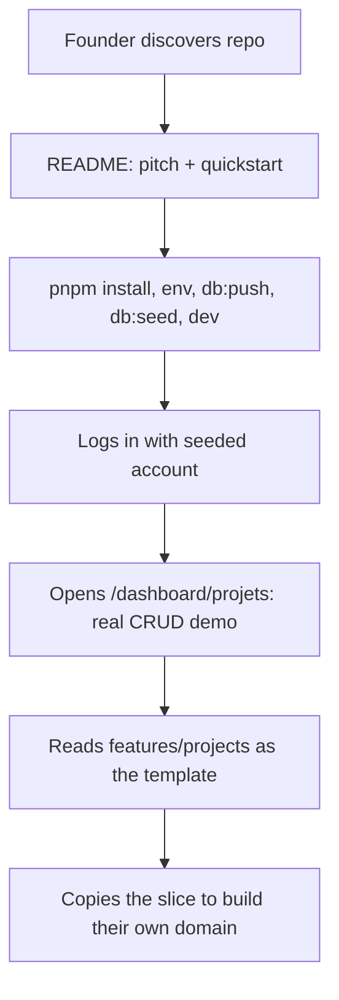

# Instruction: Credibility & DX (README, cleanup, example domain)

## Feature

- **Summary**: Make the boilerplate presentable to third-party teams: rewrite the default create-next-app README, remove committed build artifacts, fix minor schema inconsistency, and build `features/projects` into the full reference domain the security rules already use as their worked example.
- **Stack**: Next.js 16.1, Prisma 7.8, TanStack Table/Form, next-safe-action 8.5, Nuqs 2.9, Vitest 4
- **Branch name**: `feat/dx-credibility`
- **Parent Plan**: `./2026_07_05-audit-boilerplate-yc-master.md`
- **Sequence**: 5 of 6
- Confidence: 9/10
- Time to implement: 1–2 days

## Architecture projection

### Files to modify

- `README.md` - full rewrite: pitch, feature list, stack table, quickstart (env, seed, stripe:listen), architecture overview, testing/CI, deployment
- `.gitignore` - add `coverage/`, `*.tsbuildinfo`
- `prisma/schema.prisma` - add `Project` model (org-scoped: `organizationId`, indexes); fix `Organization.updatedAt` nullability
- `features/projects/pages/projects-page.tsx` - replace stub with real list page (table, filters, pagination via Nuqs)
- `app/(protected)/dashboard/projets/page.tsx` - wire real page + loading
- `prisma/seed.ts` + `prisma/seed/` - project seed module

### Files to create

- `features/projects/schemas/project.schema.ts` - Zod create/update/filter schemas
- `features/projects/services/get-projects.service.ts` - org-scoped list (`select`+`take`+`$transaction` count, membership enforced)
- `features/projects/services/get-project.service.ts` - single fetch, IDOR-safe (the `.claude/rules/security.md` worked example, made real)
- `features/projects/services/create-project.service.ts` / `update-project.service.ts` / `delete-project.service.ts`
- `features/projects/actions/*.action.ts` - safe-actions with org scoping
- `features/projects/components/` - table columns, filters, create/edit form (TanStack Form), delete modal
- `features/projects/constants/project-seo.constant.ts` + filter constants
- `prisma/seed/project.seed.ts` - seeds incl. edge cases per seed rules
- `__tests__/features/projects/**` - schema, service isolation (cross-org IDOR), action tests
- `docs/ARCHITECTURE.md` - human-readable digest of `.claude/rules/` conventions (linked from README)

### Files to delete

- `coverage/` - committed build artifact
- `tsconfig.tsbuildinfo` - committed build cache (3 MB)

## Applicable rules

| Tool   | Name       | Path                          | Why it applies                                  |
| ------ | ---------- | ----------------------------- | ----------------------------------------------- |
| claude | feature    | `.claude/rules/feature.md`    | New full feature slice                          |
| claude | security   | `.claude/rules/security.md`   | Project services are its literal worked example |
| claude | action     | `.claude/rules/action.md`     | New CRUD actions                                |
| claude | page       | `.claude/rules/page.md`       | Projects page + loading + SEO                   |
| claude | form       | `.claude/rules/form.md`       | Create/edit forms                               |
| claude | filter     | `.claude/rules/filter.md`     | List filters/pagination/columns                 |
| claude | seed       | `.claude/rules/seed.md`       | Project seed module                             |
| claude | code-style | `.claude/rules/code-style.md` | All edits                                       |

## User Journey

## Risk register

| Risk                                               | Impact                    | Mitigation                                                                              |
| -------------------------------------------------- | ------------------------- | --------------------------------------------------------------------------------------- |
| Project model too opinionated for a template       | Users fight the example   | Keep it minimal: name, description, status enum, org FK — a shape, not a product        |
| Migration on existing envs (updatedAt nullability) | Deploy friction           | Backfill migration with default now(); note in README                                   |
| README overpromises vs code                        | Credibility damage        | Every claim traceable to a feature verified in this audit                               |
| Part 2 (i18n) lands before/after this              | String conventions differ | Follow current convention (French UI); part 2 extracts projects namespace like the rest |

## Implementation phases

### Phase 1: Repo cleanup

> Remove artifacts that undermine a first impression.

#### Tasks

1. `git rm -r --cached coverage/ tsconfig.tsbuildinfo`; extend `.gitignore`
2. Fix `Organization.updatedAt` to non-nullable with backfill migration

#### Acceptance criteria

- [x] `git ls-files` clean of artifacts; `pnpm db:migrate` applies

### Phase 2: Project reference domain

> The stub becomes the template feature.

#### Tasks

1. Prisma `Project` model + migration + seed module
2. Services (org-scoped, membership-enforced), actions, schemas
3. UI: table + filters + pagination (Nuqs), create/edit form, delete modal, loading state
4. Tests: schema, cross-org isolation, actions

#### Acceptance criteria

- [ ] Full CRUD works at `/dashboard/projets`, scoped to active org
- [ ] Cross-org access test proves IDOR safety
- [ ] `pnpm test` green

### Phase 3: README + human docs

> Sellable front door.

#### Tasks

1. Rewrite `README.md` (pitch, features, stack, quickstart, scripts, architecture link, deploy notes)
2. `docs/ARCHITECTURE.md` distilled from `.claude/rules/` + `engineering-principles.md`
3. Verify quickstart on a clean clone

#### Acceptance criteria

- [ ] A newcomer reaches a running seeded app following README only
- [ ] `pnpm build` green

## Amendments

## Log

### #1 - 2026-07-05

Phase 1 (Repo cleanup) executed.

- **Build artifacts**: `coverage/` and `tsconfig.tsbuildinfo` exist on disk but were already untracked by git (`git ls-files` returns zero matches for both) and `.gitignore` already lists `/coverage` and `*.tsbuildinfo`. No `git rm --cached` needed, no `.gitignore` edit needed — acceptance criterion was already satisfied at the start of this phase.
- **`Organization.updatedAt`**: changed from `DateTime? @updatedAt` to `DateTime @updatedAt` in `prisma/schema.prisma`, matching every other model's non-nullable `updatedAt` style.
- **Migration**: no `prisma/migrations/` directory exists in this project — it uses `pnpm db:push` (schema-driven, no migration history), not `pnpm db:migrate`. No hand-written migration SQL was created; a backfill isn't applicable to this workflow. Documenting here per plan instructions instead of failing: on `db:push`, Prisma will only reject the change if NULL rows for `updatedAt` currently exist. Since `updatedAt` already had `@updatedAt` (auto-managed on every write) and `createdAt` is never null, existing rows are extremely unlikely to have NULL `updatedAt`; if any do, run `UPDATE "organization" SET "updatedAt" = now() WHERE "updatedAt" IS NULL;` manually before `pnpm db:push`.
- Ran `pnpm prisma generate` to regenerate the client against the updated schema.
- Grepped `features/` and `lib/` (excluding generated client) for `updatedAt` usage on `Organization` — no application code reads or branches on nullability of this field, so no adjustments were required.
- `pnpm typecheck && pnpm test` both green (526 tests passed, 0 failures).

## Validation flow demonstration

1. Fresh clone, follow README quickstart verbatim → app runs seeded
2. Create/edit/delete a project in the dashboard; switch org → projects isolated
3. `pnpm test && pnpm build` green; repo contains no build artifacts
