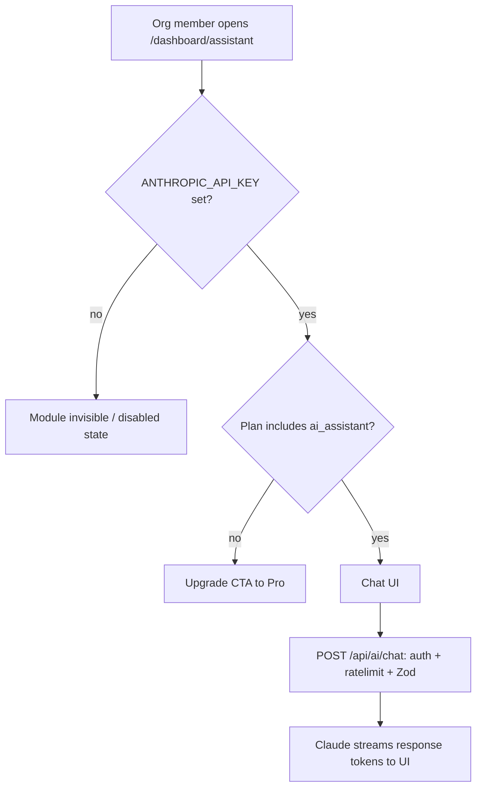

# Instruction: Opt-in AI module

## Feature

- **Summary**: Answer the 2026 market reality (~60% of YC batches are AI-native) with an optional `features/ai/` slice: Anthropic client, streaming chat endpoint + minimal UI, token-aware rate limiting, gated behind the existing plan feature-flag system. Zero footprint when unconfigured.
- **Stack**: @anthropic-ai/sdk (latest, claude-sonnet-5 default), Next.js 16.1 route handler streaming, Upstash ratelimit, existing feature-gating (`can-use.service.ts`)
- **Branch name**: `feat/ai-module`
- **Parent Plan**: `./2026_07_05-audit-boilerplate-yc-master.md`
- **Sequence**: 6 of 6
- Confidence: 9/10
- Time to implement: 2–3 days

## Architecture projection

### Files to modify

- `lib/env.ts` + `.env.example` - optional `ANTHROPIC_API_KEY`, `AI_MODEL` (defaults to claude-sonnet-5)
- `features/organizations/constants/feature-config.constant.ts` - add `ai_assistant` gated feature per plan
- `lib/ratelimit.ts` - `aiRatelimit` (per-user, stricter)
- `app/(protected)/dashboard/` - add `/dashboard/assistant` route (page + loading), hidden when module disabled
- `proxy.ts` - CSP `connect-src` for streaming if needed

### Files to create

- `lib/ai.ts` - Anthropic client factory; returns disabled sentinel when key absent
- `features/ai/services/is-ai-enabled.service.ts` - key present AND org plan includes `ai_assistant`
- `features/ai/services/create-chat-completion.service.ts` - streaming completion, org-scoped, token limits
- `app/api/ai/chat/route.ts` - streaming route handler (auth + plan gate + ratelimit + Zod validation, `handleApiError`)
- `features/ai/schemas/chat.schema.ts` - message payload validation (max length, role whitelist)
- `features/ai/components/chat/` - minimal streaming chat UI (client component, useChat-style hook)
- `features/ai/pages/assistant-page.tsx` - feature page with disabled/upgrade empty states
- `__tests__/features/ai/**` - guard tests: no key → 404/disabled, free plan → upgrade error, ratelimit, schema

### Files to delete

- none

## Applicable rules

| Tool   | Name       | Path                          | Why it applies                          |
| ------ | ---------- | ----------------------------- | --------------------------------------- |
| claude | api        | `.claude/rules/api.md`        | New streaming API route                 |
| claude | feature    | `.claude/rules/feature.md`    | New feature slice                       |
| claude | security   | `.claude/rules/security.md`   | Org scoping + entry-point rate limiting |
| claude | action     | `.claude/rules/action.md`     | Guard placement conventions             |
| claude | page       | `.claude/rules/page.md`       | Assistant page + loading                |
| claude | code-style | `.claude/rules/code-style.md` | All edits                               |

## User Journey

## Risk register

| Risk                                    | Impact                     | Mitigation                                                                           |
| --------------------------------------- | -------------------------- | ------------------------------------------------------------------------------------ |
| Uncapped LLM spend                      | Surprise API bills         | Per-user `aiRatelimit` + max-tokens cap + plan gating; document cost model in README |
| Prompt injection via chat               | Data exfiltration attempts | No tool use in v1; system prompt isolated; no org data injected by default           |
| Key leaks client-side                   | Credential exposure        | Server-only client (`lib/ai.ts`), never `NEXT_PUBLIC`                                |
| Module bloats non-AI users' boilerplate | Perception of bloat        | Fully dormant without key; one folder to delete; documented as opt-in                |

## Implementation phases

### Phase 1: Foundation

> Client, env, gating — dormant by default.

#### Tasks

1. Add optional env vars; `lib/ai.ts` factory with disabled sentinel
2. `ai_assistant` in `FEATURE_CONFIG` (pro plan); `is-ai-enabled.service.ts`
3. `aiRatelimit` in `lib/ratelimit.ts`
4. Tests: enabled/disabled matrix (key × plan)

#### Acceptance criteria

- [ ] Build + tests green with and without `ANTHROPIC_API_KEY`

### Phase 2: Streaming chat API

> Secure server endpoint.

#### Tasks

1. `chat.schema.ts` validation; `create-chat-completion.service.ts` with streaming + max tokens
2. `app/api/ai/chat/route.ts`: session guard, plan gate, ratelimit, `handleApiError`
3. Tests: 401 unauthenticated, 403 free plan, 429 throttled, 200 streams

#### Acceptance criteria

- [ ] Endpoint streams; every guard has a failing-path test

### Phase 3: UI

> Minimal, deletable chat surface.

#### Tasks

1. Chat components (streaming hook, message list, input) — client components only where needed
2. `assistant-page.tsx` with disabled/upgrade/active states; route + loading; nav entry hidden when disabled
3. French UI strings (i18n keys if part 2 already landed)

#### Acceptance criteria

- [ ] Pro user chats with streamed responses; free user sees upgrade CTA; unconfigured install shows nothing
- [ ] `pnpm test && pnpm typecheck && pnpm build` green

## Amendments

## Log

## Validation flow demonstration

1. No key configured → no assistant nav entry, `/api/ai/chat` returns disabled error
2. Add key, org on free plan → upgrade CTA; API returns 403
3. Upgrade to Pro → chat streams a Claude response
4. Spam requests → 429; `pnpm test` green in both env configurations
