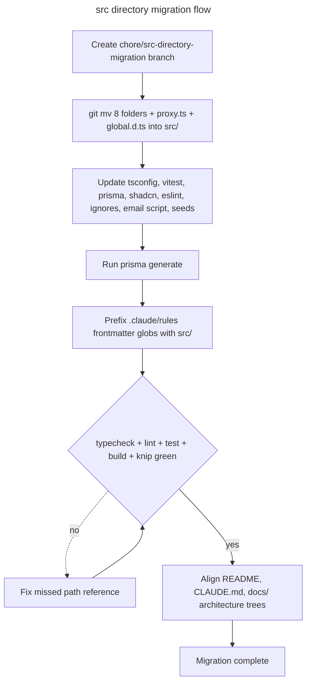

# Instruction: src directory migration

## Feature

- **Summary**: Separate application code from tooling by moving all source folders into `src/`. The root keeps only configuration, `prisma/`, `public/`, `__tests__/`, and docs. Because every import goes through the `@/` alias, the migration is a pure move plus a bounded set of config edits — no application code changes except six intentional relative imports in Prisma seeds.
- **Stack**: `Next.js 16 (App Router), TypeScript strict, Prisma 7, next-intl, Tailwind CSS 4 + shadcn/ui, Vitest, ESLint flat config, knip, pnpm`
- **Branch name**: `chore/src-directory-migration`
- **Parent Plan**: `none`
- **Sequence**: `standalone`
- Confidence: 9/10
- Time to implement: ~1-2h (including full verification)

## Architecture projection

<!-- Validated with the user on 2026-07-13. -->

### Files to move (git mv, single atomic commit)

- `app/` `components/` `features/` `hooks/` `i18n/` `lib/` `messages/` `utils/` → `src/<same-name>/` - all application source
- `proxy.ts` → `src/proxy.ts` - Next.js resolves the proxy file at root or `src/`; required in `src/` once the app dir moves
- `global.d.ts` → `src/global.d.ts` - next-intl `AppConfig` augmentation; covered by tsconfig `include`, no internal edit

### Files to modify

- `tsconfig.json` - alias `"@/*": ["./*"]` → `["./src/*"]` (pivot change; `include` already recursive, untouched)
- `vitest.config.ts` - alias `"@"` → `path.resolve(__dirname, "src")`; prefix all 16 `coverage.include`/`exclude` source paths with `src/`
- `prisma/schema.prisma` - generator `output = "../src/lib/generated/prisma"`, then re-run `prisma generate`
- `components.json` - `tailwind.css: "src/app/globals.css"` (shadcn CLI breaks otherwise)
- `eslint.config.mjs` - 5 root-relative globs: `lib/generated/**` ignore, `lib/**` files + `lib/auth.ts` ignore (features-import ban), `components/ui/data-table.tsx`, `lib/logger.ts`
- `.gitignore` - `/lib/generated/prisma` → `/src/lib/generated/prisma` (root-anchored; prevents committing the generated client)
- `.prettierignore` - `lib/generated` → `src/lib/generated`
- `package.json` - `email:dev` script `--dir features` → `--dir src/features`
- `prisma/seed/{auth,billing,client,organization,project,verification}.seed.ts` - the only breaking source code: intentional relative imports → `../../src/lib/generated/prisma/client`
- `.claude/rules/{action,api,cache,feature,filter,form,page,security}.md` - prefix every frontmatter `paths:` glob with `src/` (rules silently stop auto-attaching otherwise); `seed.md` globs stay (`prisma/` does not move)
- `README.md`, `.claude/CLAUDE.md`, `docs/ARCHITECTURE.md`, `docs/OBSERVABILITY.md`, `.claude/rules/i18n.md`, `.claude/rules/seed.md` (L40, L210) + prose of the 8 rules above - architecture trees and path references (stale, non-breaking)

### Files to create

- `knip.json` - CONDITIONAL: only if `pnpm check:unused` reports false positives after the move (knip may not recognize `src/proxy.ts` as an entry point)

### Files to delete

- none (moves are handled by `git mv`; `aidd_docs/tasks/` archives stay untouched per user decision)

## Applicable rules

| Tool   | Name       | Path                          | Why it applies                                                                      |
| ------ | ---------- | ----------------------------- | ----------------------------------------------------------------------------------- |
| claude | seed       | `.claude/rules/seed.md`       | The 6 modified seed files are in its scope; it documents the relative import to fix |
| claude | code-style | `.claude/rules/code-style.md` | Applies to every TS edit (configs, seeds)                                           |
| claude | i18n       | `.claude/rules/i18n.md`       | Migration moves `i18n/`, `messages/`, `proxy.ts`; its invariants must survive       |

## User Journey

## Risk register

| Risk                                                        | Impact                                                                 | Mitigation                                                                                           |
| ----------------------------------------------------------- | ---------------------------------------------------------------------- | ---------------------------------------------------------------------------------------------------- |
| Partial move: `app/` remains at root while `src/app` exists | Next.js silently ignores `src/app`; whole site 404s                    | Single atomic commit; `success_condition` asserts `test ! -d app && test -d src/app`                 |
| Prisma client regenerated at the old path                   | Every `@/lib/generated/prisma` import breaks; stale client committed   | Schema `output` + `.gitignore` updated in the same commit; `pnpm build` runs `prisma generate` first |
| Vitest alias forgotten                                      | Entire test suite fails on unresolved `@/` imports                     | Explicit Phase 2 task; `success_condition` runs `pnpm test`                                          |
| Rules `paths:` globs stale                                  | Claude rules silently stop auto-attaching; conventions drift over time | Dedicated Phase 3; spot-check attach on one file per rule                                            |
| knip false positives on `src/proxy.ts`                      | `check:unused` noise, CI friction                                      | Run post-move; add minimal `knip.json` only if needed (no config "just in case")                     |
| Stale build caches (`.next/`, `tsconfig.tsbuildinfo`)       | Phantom type errors, confusing DX after the move                       | Delete both after the move; restart TS server                                                        |

## Implementation phases

### Phase 1: Atomic move

> Move all source into `src/` with history preserved. Nothing else.

#### Tasks

1. Create branch `chore/src-directory-migration`
2. `mkdir src` and `git mv` the 8 folders: `app components features hooks i18n lib messages utils`
3. `git mv proxy.ts global.d.ts` into `src/`
4. Confirm `git status` reports renames (R), not delete+add

#### Acceptance criteria

- [ ] `src/` contains exactly: 8 source folders + `proxy.ts` + `global.d.ts`
- [ ] No source folder remains at root (`app/`, `components/`, `features/`, `hooks/`, `i18n/`, `lib/`, `messages/`, `utils/`)
- [ ] `git status` shows 100% renames

### Phase 2: Config synchronization

> Repoint every path-literal config at `src/`; regenerate the Prisma client.

#### Tasks

1. `tsconfig.json`: `"@/*": ["./src/*"]`
2. `vitest.config.ts`: alias to `src`; prefix `coverage.include` + `coverage.exclude` source entries with `src/`
3. `prisma/schema.prisma`: `output = "../src/lib/generated/prisma"`
4. `.gitignore`: `/src/lib/generated/prisma`; `.prettierignore`: `src/lib/generated`
5. `components.json`: `"css": "src/app/globals.css"`
6. `eslint.config.mjs`: prefix the 5 root-relative globs with `src/`
7. `package.json`: `email:dev` → `--dir src/features`
8. Fix the 6 relative imports in `prisma/seed/*.seed.ts` → `../../src/lib/generated/prisma/client`
9. Delete `.next/` and `tsconfig.tsbuildinfo`, run `pnpm prisma generate`

#### Acceptance criteria

- [ ] `pnpm typecheck` exits 0
- [ ] `pnpm test` exits 0 (proves vitest alias + messages parity + seed mocks)
- [ ] `pnpm lint` exits 0 and does not lint `src/lib/generated/**`
- [ ] `pnpm build` exits 0 (proves prisma output + next-intl auto-detection of `src/i18n/request.ts`)
- [ ] `git status` shows no generated client at the old `lib/generated` path

### Phase 3: AI tooling alignment

> Keep Claude rules auto-attaching on the new tree.

#### Tasks

1. Prefix every frontmatter `paths:` glob with `src/` in: `action.md`, `api.md`, `cache.md`, `feature.md`, `filter.md`, `form.md`, `page.md`, `security.md`
2. Leave `seed.md` globs untouched (`prisma/` stays at root)

#### Acceptance criteria

- [ ] No `paths:` glob in `.claude/rules/` targets a moved folder without the `src/` prefix
- [ ] `seed.md` frontmatter unchanged

### Phase 4: Full verification

> Prove the migration end-to-end, not just statically.

#### Tasks

1. Run the `success_condition` command
2. Run `pnpm check:unused`; if `src/proxy.ts` (or others) produce false positives, add a minimal `knip.json` and document why
3. Smoke test `pnpm dev`: load `/en` and `/fr` home, one public page (pricing), sign-in page; confirm locale routing (proxy) and no "No intl context found" errors
4. Smoke test `pnpm email:dev` finds templates under `src/features`

#### Acceptance criteria

- [ ] `success_condition` passes
- [ ] `check:unused` clean, or `knip.json` created with a documented reason
- [ ] Dev server renders localized routes; proxy redirects work
- [ ] React Email dev server lists the feature templates

### Phase 5: Documentation alignment

> Living docs describe the new tree; archives stay frozen.

#### Tasks

1. `README.md`: architecture tree + inline path references
2. `.claude/CLAUDE.md`: architecture tree + source-of-truth hierarchy paths
3. `docs/ARCHITECTURE.md` and `docs/OBSERVABILITY.md`: trees, tables, inline refs
4. `.claude/rules/`: prose path references (`i18n.md`, `seed.md` L40/L210 relative-import doc, and the 8 glob-updated rules)
5. Do NOT touch `aidd_docs/tasks/` and `aidd_docs/internal/` archives (user decision 2026-07-13)

#### Acceptance criteria

- [ ] `grep -rn "features/\|lib/\|app/\[locale\]" README.md .claude/ docs/` returns only `src/`-prefixed or `prisma/`-, `__tests__/`-scoped hits
- [ ] `aidd_docs/` archives untouched (`git status` clean for that folder)

## Confidence assessment

**9/10**

- ✓ Inventory produced by an exhaustive 37-step codebase sweep, not from memory; every breaking reference is listed file:line
- ✓ Assumptions verified against official docs: Next.js `src/` folder conventions (proxy location, `public/` stays, root `app/` shadowing) and next-intl auto-detection of `src/i18n/request.ts`
- ✓ All application imports go through the `@/` alias — zero code churn outside 6 seed files; blast radius is configs only
- ✓ Fully reversible before merge (`git reset`); moves preserve history via `git mv`
- ✗ knip behavior on `src/proxy.ts` unverifiable until executed (mitigated: conditional `knip.json` task in Phase 4)
- ✗ Residual risk of a runtime-only path reference no static sweep can catch (mitigated: dev-server + email smoke tests in Phase 4)

## Amendments

<!-- AI-initiated changes during implementation. Each entry is prefixed with 🤖. -->

- 🤖 **Phase 4 / knip: no `knip.json` created.** Rationale: `pnpm check:unused` fails on `main` too. Verified against an isolated `main` worktree baseline — identical finding set (9 unused files, 52 unused exports, 76 unused exported types; byte-identical identifier lists after stripping the `src/` path prefix). The move introduced zero new findings and `proxy.ts` is not flagged, so the anticipated proxy-entry-point risk did not materialize. Suppressing pre-existing tech debt is out of scope for a directory move. `check:unused` is not part of `success_condition`.
- 🤖 **Phase 4 / dev-server smoke test deferred to the user.** Rationale: the implement skill forbids running dev mode. `pnpm build` already proves the equivalent — all localized routes (`/en`, `/fr`) compiled, `ƒ Proxy (Middleware)` was detected at `src/proxy.ts`, and next-intl auto-resolved `src/i18n/request.ts` (no "No intl context found"). Manual `pnpm dev` / `pnpm email:dev` confirmation is listed as a handoff step, not a blocker.

## Log

<!-- APPEND ONLY. One entry per step attempt. Never rewrite. -->

### #1 - 2026-07-13T17:10Z

> Phase 1 (atomic move) + Phase 2 (config sync) — git mv 10 items into src/, repoint tsconfig/vitest/prisma/components/eslint/ignores/email, fix 6 seed relative imports, regenerate Prisma client.
> = ✓ typecheck 0, lint 0, test 673/673, build EXIT 0 (proxy + /en+/fr routes emitted), generated client correctly re-ignored at src path.
> → Phase 3.

### #2 - 2026-07-13T17:11Z

> Phase 3 (rules) — prefix frontmatter `paths:` globs with `src/` in 8 rules; seed.md left at prisma/.
> = ✓ no glob targets an un-prefixed moved folder; seed.md frontmatter unchanged.
> → Phase 4.

### #3 - 2026-07-13T17:12Z

> Phase 4 (verification) — directory assertions + knip investigation.
> = ✓ src/app exists, root app/ gone. knip fails but proven pre-existing via main baseline diff (see Amendments). success_condition (no knip) green.
> → Phase 5.

### #4 - 2026-07-13T17:29Z

> Phase 5 (docs) — delegated to implementer; 14 files re-prefixed (README, CLAUDE.md, docs/ARCHITECTURE, docs/OBSERVABILITY, 10 rule prose bodies). Independently verified with a straggler sweep.
> = ✓ zero real stragglers (remaining hits are English prose "hooks/events" or feature-relative table paths); aidd_docs untouched; @/ aliases preserved.
> → Final gate.

### #5 - 2026-07-13T17:30Z

> Full success_condition end-to-end.
> = ✓ EXIT 0 — typecheck, lint, 673/673 tests, build (86 pages, /en+/fr, Proxy middleware). MIGRATION COMPLETE.
> → Done. Awaiting user commit + optional manual dev/email smoke.

## Validation flow demonstration

1. `pnpm install` on the branch — `postinstall` regenerates the Prisma client under `src/lib/generated/prisma`
2. `pnpm dev` — open `http://localhost:3000` → redirected to `/en` (proxy alive), switch to `/fr` → localized pricing page renders (next-intl request config auto-detected in `src/`)
3. Sign in with the demo account → dashboard renders (protected routing, Better Auth, generated client all resolve)
4. `pnpm test` — full suite green, including `messages-parity` (proves `@/messages` alias) and service/action tests (proves vitest alias + setup mocks)
5. `pnpm build` — production build green: the definitive proof that every config points at the new tree
